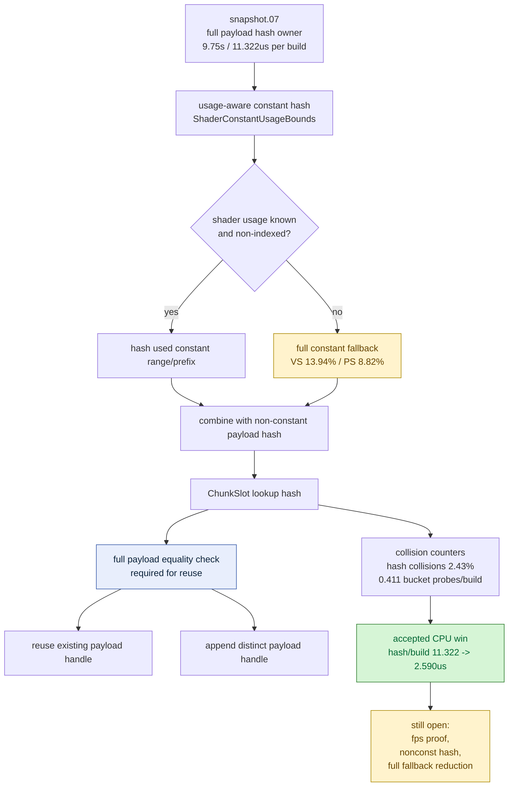

# Snapshot Usage-Aware Uniform Payload Hash

**Question / hypothesis.** [snapshot-cache-snapshot.07](snapshot-cache-snapshot.07.md) proved that the
remaining payload-build owner was the first full `hashDrawUniformPayload()` pass:
`9752.759ms`, or `11.322us` per build call. Replace that full hot-path hash with
a narrower lookup hash based on shader constant usage/ranges while keeping full
payload equality as the correctness guard.

**Implementation.**

- `makeDrawUniformPayloadFromState()` now receives the current
  `DrawShaderLayoutContext` in production cache/submission paths.
- `hashDrawUniformPayload()` hashes VS/PS constants through
  `ShaderConstantUsageBounds`: known non-indexed shaders hash only the used
  prefix/range; unknown or indexed usage falls back to the full constant struct.
- Non-constant payload fields still participate in the hash
  (`worldViewProj`, FFP world-view/normal data, material/lights, texture
  transforms, blend WVP, clip planes).
- `ChunkSlot::findDrawUniformPayload()` still requires
  `record.payload == payload` before reusing a handle, so a narrowed hash cannot
  silently alias different uniform payloads.
- New counters split hash time into VS const, PS const, non-const, and payload
  combine phases, plus full-fallback byte/count and lookup collision telemetry.
- Native coverage pins the two invariants: unused constants do not change the
  usage-aware hash, and forced hash collisions still keep distinct payload
  handles.

**Method.**

```bash
bash scripts/tools/run_3dmark05_perf_probe.sh \
  --suffix snapshot-usage-hash-r1 \
  --frame 50 \
  --no-gputrace \
  --no-encoder-breakdown \
  --timeout 180

python3 scripts/tools/compare_3dmark05_perf_counters.py \
  experiments/output/app-d3d9-3dmark05-snapshot-payload-split-r1 \
  experiments/output/app-d3d9-3dmark05-snapshot-usage-hash-r1 \
  --before-label snapshot-payload-split \
  --after-label snapshot-usage-hash \
  --output experiments/output/app-d3d9-3dmark05-snapshot-usage-hash-r1/dxmt9-perf-counter-comparison-vs-payload-split.md
```

The wrapper hit the expected watchdog status `124` after writing artifacts.
The perf summary reports `partial-log` because `result.json` was missing and
the counter table was synthesized from `dxmt9.log`. This is still usable for
run-level CPU counter comparison, but not a throughput/fps proof.

`actual.png` is a normal visible GT1 frame with the robot, flare, and HUD
visible (`FPS: 16`, `Time: 0:55.91`, `Frame: 1005`).

**Run shape caveat.** The usage-hash run processed more work before watchdog:
`present_encoded` `1560 -> 1740` (`+11.54%`) and draw calls
`1,144,618 -> 1,273,364` (`+11.25%`). The stable shape checks are normalized:
`draws_per_present` `733.729 -> 731.818` (`-0.26%`),
`passes_per_present` `11.738 -> 11.733` (`-0.04%`), and
`completion_wait_ms_per_present` `22.371 -> 22.419` (`+0.22%`). Read CPU
buckets per build or per present.

**Main result.**

| Metric | Payload split | Usage-aware hash | Reading |
|---|---:|---:|---|
| `d3d9_snapshot_uniform_build_calls` | 861,377 | 957,177 | after run processed more work |
| `d3d9_snapshot_uniform_build_hash_cpu_ms` | 9,752.759 ms | 2,479.248 ms | raw `-74.58%` despite more calls |
| hash CPU per build | 11.322 us | 2.590 us | accepted hot-path win |
| combined parent payload build | 11,373.540 ms | 4,184.557 ms | raw `-63.21%` |
| parent build per call | 13.204 us | 4.372 us | accepted payload-build win |
| snapshot draw submission per present | 8.692 ms | 4.339 ms | normalized `-50.08%` |
| cache lookup per present | 7.896 ms | 3.548 ms | normalized `-55.07%` |
| `encode_draw_cpu_ms` per present | 10.255 ms | 10.167 ms | flat (`-0.86%`) |
| `completion_wait_ms` per present | 22.371 ms | 22.419 ms | flat (`+0.22%`) |
| `gpu_command_buffer_time_ms` per present | 3.030 ms | 2.998 ms | flat/no GPU claim |

**Hash subphase split.**

| Subphase | Total | Per build call |
|---|---:|---:|
| VS constant hash | 885.113 ms | 0.925 us |
| PS constant hash | 527.259 ms | 0.551 us |
| Non-constant payload hash | 744.871 ms | 0.778 us |
| Final payload hash combine | 48.082 ms | 0.050 us |
| VS full fallback | 133,387 calls | 13.94% of builds |
| PS full fallback | 84,380 calls | 8.82% of builds |
| VS const bytes hashed | 669,950,560 B | 699.9 B/build |
| PS const bytes hashed | 384,219,408 B | 401.4 B/build |

The result confirms the previous owner and removes most of it. The remaining
local hash budget is now split between non-constant payload hashing and VS/PS
constant ranges that still fall back to full hashing or hash non-trivial used
prefixes.

**Lookup/collision behavior.**

| Counter | Value | Reading |
|---|---:|---|
| `draw_uniform_payload_lookup_last_hits` | 15,712 | small temporal reuse path |
| `draw_uniform_payload_lookup_bucket_hits` | 40,784 | direct bucket hits |
| `draw_uniform_payload_lookup_bucket_misses` | 899,991 | most unique payloads append |
| `draw_uniform_payload_lookup_bucket_probes` | 393,143 | 0.411 probes/build |
| `draw_uniform_payload_lookup_bucket_collisions` | 329,135 | direct bucket mismatch pressure exists |
| `draw_uniform_payload_lookup_hash_collisions` | 23,224 | 2.43% of build calls |
| `draw_uniform_payload_lookup_linear_hits` | 0 | no catastrophic fallback hit pattern |
| `draw_uniform_payload_appends` | 901,730 | aligns with mostly-unique payload population |

Collision telemetry does not show a correctness or runaway-search problem for
this GT1 run. Hash collisions are real but protected by full payload equality,
and the direct-map bucket probe rate stays below one probe per build.



**Verdict.** Accepted CPU win. Usage-aware uniform payload hashing removes the
dominant full-hash cost found in [snapshot-cache-snapshot.07](snapshot-cache-snapshot.07.md) and cuts the
combined parent payload-build cost from `13.204us` to `4.372us` per build.
Correctness is still guarded by full payload equality, and the added native
tests cover both unused-constant hash stability and forced collision behavior.

This is not a GPU or vsync-on fps win by itself. `encode_draw_cpu_ms`,
`gpu_command_buffer_time_ms`, and `completion_wait_ms` are flat per present, so
the next proof still needs a fixed-workload wallclock gate.

**Next.** The local residual targets are smaller and more specific now:
`d3d9_snapshot_uniform_build_nonconst_hash_cpu_ms=744.871ms`, the VS/PS full
fallback counts, and any remaining named encode/snapshot bucket. There is no
Xcode reason to spend `.gputrace` budget from this CPU-only result alone.

**Related.** [snapshot-cache](../snapshot-cache.md) · [snapshot-cache-snapshot.05](snapshot-cache-snapshot.05.md) ·
[snapshot-cache-snapshot.07](snapshot-cache-snapshot.07.md) · [present-pacing](../present-pacing.md) · [state-churn-encode](../state-churn-encode.md).
