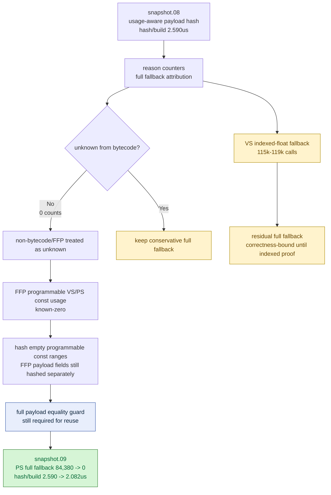

# Snapshot FFP Known-Zero Constant Usage

> **Outdated — every artifact this leaf cites in `source:` is gone from disk.** The numbers below cannot be re-derived or re-checked. Kept as history; do not cite it as current evidence.

**Question / hypothesis.** [snapshot-cache-snapshot.08](snapshot-cache-snapshot.08.md) accepted
shader-usage/range-aware uniform payload hashing, but still left full constant
hash fallback work: VS full fallback around 13-14% of builds and PS full
fallback around 9% of builds. Split the fallback reason first. If non-bytecode
fixed-function shaders are the owner, treat their programmable VS/PS constant
usage as known-zero instead of unknown; FFP constants live in the FFP payload
fields, not the programmable `VsConsts` / `PsConsts` payload fields.

**Reason split.** The reason2 run proves the shader bytecode scanner is not the
failure:

| Counter | Reason2 value | Reading |
|---|---:|---|
| `d3d9_snapshot_uniform_build_vs_const_hash_full` | 128,969 | full VS fallback remains |
| `d3d9_snapshot_uniform_build_ps_const_hash_full` | 82,864 | full PS fallback remains |
| `*_full_no_usage` | 0 | production callers pass shader usage metadata |
| `*_full_unknown_bytecode` | 0 | bytecode scanner is not producing unknown usage here |
| `vs_const_hash_full_unknown_non_bytecode` | 13,488 | fixed-function/non-bytecode VS was being treated as unknown |
| `ps_const_hash_full_unknown_non_bytecode` | 82,864 | fixed-function/non-bytecode PS owned all PS full fallback |
| `vs_const_hash_full_indexed_float` | 115,481 | real correctness-bound VS relative constant indexing |

The safe implementation target is therefore non-bytecode usage classification,
not another bytecode parser change. Residual VS indexed-float fallback must
remain full unless a separate indexed-constant proof exists.

**Implementation.**

- `scanShaderConstantUsage()` now returns known-zero usage for
  `ShaderRef::Kind` values that are not bytecode.
- Short or malformed bytecode still returns unknown usage, so invalid bytecode
  keeps the conservative full fallback.
- `DrawUniformPayloadHashOptions` carries whether the usage came from bytecode,
  and the perf counters split unknown full fallback into bytecode vs
  non-bytecode causes.
- `makeFlatDrawStateKey()` uses the same usage-aware programmable constant hash
  policy as production snapshot payloads. Native coverage now asserts that
  fixed-function programmable constant changes do not change the flat key,
  while a bytecode shader reading `c0` still changes it.

**Method.**

```bash
bash scripts/tools/run_3dmark05_perf_probe.sh \
  --suffix snapshot-usage-hash-reason2-r1 \
  --frame 50 \
  --no-gputrace \
  --no-encoder-breakdown \
  --timeout 180

bash scripts/tools/run_3dmark05_perf_probe.sh \
  --suffix snapshot-ffp-zero-usage-r1 \
  --frame 50 \
  --no-gputrace \
  --no-encoder-breakdown \
  --timeout 180

python3 scripts/tools/compare_3dmark05_perf_counters.py \
  experiments/output/app-d3d9-3dmark05-snapshot-usage-hash-r1 \
  experiments/output/app-d3d9-3dmark05-snapshot-ffp-zero-usage-r1 \
  --before-label snapshot-usage-hash \
  --after-label snapshot-ffp-zero-usage \
  --output experiments/output/app-d3d9-3dmark05-snapshot-ffp-zero-usage-r1/dxmt9-perf-counter-comparison-vs-usage-hash.md

python3 scripts/tools/compare_3dmark05_perf_counters.py \
  experiments/output/app-d3d9-3dmark05-snapshot-usage-hash-reason2-r1 \
  experiments/output/app-d3d9-3dmark05-snapshot-ffp-zero-usage-r1 \
  --before-label snapshot-usage-hash-reason2 \
  --after-label snapshot-ffp-zero-usage \
  --output experiments/output/app-d3d9-3dmark05-snapshot-ffp-zero-usage-r1/dxmt9-perf-counter-comparison-vs-reason2.md
```

The FFP known-zero run hit the expected watchdog status `124` after writing
artifacts. `actual.png` is a normal visible GT1 frame (`FPS: 17`,
`Time: 0:55.85`, `Frame: 1007`).

**Validation.**

```bash
meson compile -C build-x86_64-builtin
meson test -C build-x86_64-builtin \
  dxmt9-state-draw-transform-spec \
  dxmt9-dod-replay-observer-spec \
  dxmt9-draw-uniforms-layout-spec \
  dxmt9-core-stateblock-restore-spec \
  dxmt9-shader-argbuf-binding-value-spec \
  dxmt9-draw-uniforms-dirty-spec \
  dxmt9-argbuf-populator-spec
python3 scripts/check/audit_perf_counter_table.py
python3 scripts/check/audit_perf_counter_callsites.py
python3 tests/scripts/test_summarize_3dmark05_perf.py
python3 tests/scripts/test_3dmark05_probe_scripts.py
python3 scripts/check/audit_perf_docs_sources.py
python3 tests/scripts/test_audit_perf_docs_sources.py
git diff --check
```

**Run shape caveat.** Use `snapshot-usage-hash-r1` for the performance A/B
because both runs reached `1740` presents. Use `snapshot-usage-hash-reason2-r1`
for fallback attribution only; it reached `1680` presents, so raw totals there
include a `+3.57%` work-count delta in the after run.

**Main result, same-present A/B.**

| Metric | Usage-aware hash | FFP known-zero usage | Reading |
|---|---:|---:|---|
| `present_encoded` | 1,740 | 1,740 | same present count |
| `draw_calls` | 1,273,364 | 1,273,299 | stable (`-0.01%`) |
| `d3d9_snapshot_uniform_build_calls` | 957,177 | 957,324 | stable (`+0.02%`) |
| `d3d9_snapshot_uniform_build_hash_cpu_ms` | 2,479.248 ms | 1,992.855 ms | `-19.62%` |
| hash CPU per build | 2.590 us | 2.082 us | accepted local win |
| combined parent payload build | 4,184.557 ms | 3,697.823 ms | `-11.63%` |
| parent build per call | 4.372 us | 3.863 us | accepted local win |
| `d3d9_snapshot_uniform_build_ps_const_hash_cpu_ms` | 527.259 ms | 114.281 ms | `-78.33%` |
| `d3d9_snapshot_uniform_build_ps_const_hash_full` | 84,380 | 0 | PS full fallback removed |
| `d3d9_snapshot_uniform_build_ps_const_hash_bytes` | 384,219,408 B | 58,841,808 B | `-84.69%` |
| `d3d9_snapshot_uniform_build_vs_const_hash_full` | 133,387 | 119,430 | non-bytecode unknown removed; indexed fallback remains |
| `d3d9_snapshot_uniform_build_vs_const_hash_bytes` | 669,950,560 B | 608,988,000 B | `-9.10%` |
| `encode_draw_argbuf_cbuf_cached_repoint_bytes` | 918,105,888 B | 612,627,760 B | `-33.27%` associated cbuf byte reduction |
| `transient_upload_bytes` | 566,431,828 B | 503,727,652 B | `-11.07%` associated transient byte reduction |

The reason2 comparison confirms that all unknown/non-bytecode full fallback is
gone after the implementation:

| Counter | Reason2 | FFP known-zero | Reading |
|---|---:|---:|---|
| `vs_const_hash_full_unknown_non_bytecode` | 13,488 | 0 | removed |
| `ps_const_hash_full_unknown_non_bytecode` | 82,864 | 0 | removed |
| `vs_const_hash_full_unknown_bytecode` | 0 | 0 | bytecode scanner still clean |
| `ps_const_hash_full_unknown_bytecode` | 0 | 0 | bytecode scanner still clean |
| `vs_const_hash_full_indexed_float` | 115,481 | 119,430 | remaining correctness-bound full fallback |
| `ps_const_hash_full_indexed_float` | 0 | 0 | no PS indexed fallback in this run |

**Pacing / GPU reading.**

| Metric | Usage-aware hash | FFP known-zero usage | Reading |
|---|---:|---:|---|
| `encode_draw_cpu_ms` per present | 10.167 ms | 10.179 ms | flat (`+0.12%`) |
| `gpu_command_buffer_time_ms` per present | 2.998 ms | 3.009 ms | flat/no GPU claim |
| `completion_wait_ms` per present | 22.419 ms | 22.976 ms | worse/no fps claim |

This is another CPU/hash cleanup, not a GPU or vsync-on fps proof.



**Verdict.** Accepted CPU win. Treating non-bytecode/FFP programmable constant
usage as known-zero removes the PS full fallback entirely and cuts the
remaining hot hash pass by another `19.62%` over [snapshot-cache-snapshot.08](snapshot-cache-snapshot.08.md).
The residual local hash cost is now mostly non-constant payload hashing
(`743.344ms`) plus real VS indexed-float fallback (`119,430` calls).

**Next.** Do not chase bytecode unknown usage for this workload; the counters
show it is already `0`. The remaining snapshot-cache work is either a smaller
non-constant payload hash reduction, a correctness proof for VS indexed
constant ranges, or a different named CPU bucket. No new Xcode capture is
justified from this CPU-only result.

**Related.** [snapshot-cache](index.md) · [snapshot-cache-snapshot.07](snapshot-cache-snapshot.07.md) ·
[snapshot-cache-snapshot.08](snapshot-cache-snapshot.08.md) · [present-pacing](../present-pacing/index.md) · [state-churn-encode](../state-churn-encode/index.md).
