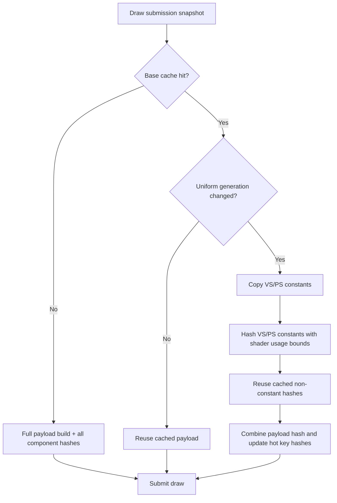

# Uniform Refresh Shader-Constant Fast Path

**Question / hypothesis.** After [state-churn-encode-encode-phase.28](../state-churn-encode/state-churn-encode-encode-phase.28.md)
rejected broad redundant draw-packet invalidation, the remaining uniform-refresh
cost looked like real payload work. The cache-hit refresh path is narrower than
a full state miss: `mutableShaderConstantsState()` changes VS/PS constants
without changing `drawStateGeneration_` / `drawStableStateGeneration_`. Therefore
the cache can reuse previously built non-constant payload fields and their
component hashes, then refresh only shader constants and the final payload hash.

**Implementation.**

- Move `DrawUniformPayloadHashes` into the shared snapshot header so
  `CachedBaseDrawState` can retain non-constant component hashes next to the
  cached payload.
- Split payload hashing into shader-constant, non-constant, and final-combine
  helpers.
- On cache miss, keep the full `makeDrawUniformPayloadFromState()` path.
- On cache hit with only `drawUniformGeneration_` changed, copy VS/PS constants,
  rehash those two components using the cached `DrawShaderLayoutContext`, and
  combine with cached matrix/material/light/texture-transform/clip hashes.



**Run.**

```sh
bash scripts/tools/run_3dmark05_perf_probe.sh \
  --suffix uniform-refresh-fast-20260612 \
  --frame 50 \
  --no-gputrace \
  --no-encoder-breakdown \
  --frame-sampling \
  --timeout 180
```

Status: pass. `actual.png` is a normal GT1 frame. It is not the rifle muzzle
oracle frame, but it rejects black/yellow/obvious geometry regression for this
probe. Follow-up interactive observation confirmed muzzle flash, particle, and
fog effects render normally with this iteration.

Note: this historical scout used an explicit `--timeout 180`. Future
no-gputrace scouts now use the standard `120s` timeout unless a longer budget is
documented.

**Result vs baseline.**

Both runs encoded `1,680` presents, so raw totals are directly comparable.

| Counter | Baseline | Fast refresh | Change |
|---|---:|---:|---:|
| `sampled_avg_fps` | `15.717` | `15.752` | flat (`+0.22%`) |
| `d3d9_snapshot_draw_submission_cpu_ms` | `7622.807` | `6495.069` | `-14.79%` |
| `d3d9_snapshot_cache_lookup_cpu_ms` | `6293.019` | `5168.510` | `-17.87%` |
| `d3d9_snapshot_cache_uniform_refresh_cpu_ms` | `2014.263` | `814.507` | `-59.56%` |
| `d3d9_snapshot_cache_uniform_build_cpu_ms` | `1914.946` | `715.319` | `-62.65%` |
| `d3d9_snapshot_uniform_build_calls` | `927,937` | `930,425` | stable (`+0.27%`) |
| `d3d9_snapshot_uniform_build_hash_cpu_ms` | `2641.211` | `2000.637` | `-24.25%` |
| `d3d9_snapshot_uniform_build_nonconst_hash_cpu_ms` | `1431.001` | `783.573` | `-45.24%` |
| `d3d9_snapshot_uniform_build_ffp_matrix_cpu_ms` | `247.729` | `118.492` | `-52.17%` |
| `d3d9_snapshot_uniform_build_texture_transform_cpu_ms` | `99.930` | `55.139` | `-44.82%` |
| `encode_draw_cpu_ms` | `16473.565` | `16520.675` | flat/noisy |
| `gpu_command_buffer_time_ms` | `5025.207` | `5164.292` | flat/noisy |
| `completion_wait_ms` | `38598.921` | `39290.753` | flat/noisy |

**Decision.** Accept as a local CPU win. The mechanism is exactly the intended
one: uniform-refresh and non-constant payload/hash work drop sharply while draw
counts and cache miss counts remain comparable. It does not move the FPS gate;
backend encode, GPU command-buffer time, and completion wait remain dominant or
noisy at the run level.

**Next target.**

| Candidate | Reason |
|---|---|
| Snapshot miss hot-build | `d3d9_snapshot_cache_miss_hot_build_cpu_ms=1573.980ms` remains unchanged |
| VS indexed-float fallback | `d3d9_snapshot_uniform_build_vs_const_hash_full_indexed_float=115,933` still forces full VS constant hashing |
| Queue append state/uniform path | [state-churn-encode-encode-phase.29](../state-churn-encode/state-churn-encode-encode-phase.29.md) rejects raw payload copy as owner; state append and uniform lookup/append dominate the batch append child |
| Backend encode buckets | `encode_draw_argbuf_setup_cpu_ms=3357.980ms`, `encode_draw_binding_packet_cpu_ms=2705.893ms`, and stream/index bind remain larger than this residual snapshot win |

**Related.** [snapshot-cache](index.md) · [state-churn-encode](../state-churn-encode/index.md) ·
[state-churn-encode-encode-phase.28](../state-churn-encode/state-churn-encode-encode-phase.28.md).
