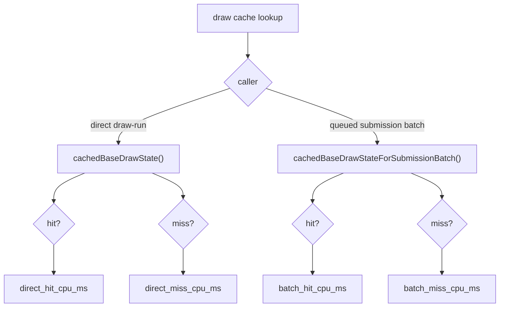

# Direct vs Batch Snapshot Cache Split

**Question / hypothesis.** The phase46 carrier cleanup left
`d3d9_snapshot_cache_lookup_cpu_ms` at roughly `3.3ms/present`, but the older
global hit/miss timers mixed two callers:

- direct `cachedBaseDrawState()`, used by direct/draw-run submission paths;
- batch `cachedBaseDrawStateForSubmissionBatch()`, used by queued
  draw-submission snapshots.

Because both no-index direct lookups and binding-agnostic batch lookups reported
through `_hit_no_index` / `_miss_no_index`, the counters could not say whether
the remaining snapshot-submission parent was really owned by the batch lane.

**Implementation.**

- Add cache lookup count split:
  `d3d9_draw_state_cache_direct_{hits,misses}`,
  `d3d9_draw_state_cache_direct_{hit,miss}_{with,no}_index`, and
  `d3d9_draw_state_cache_batch_{hits,misses}`.
- Add nested CPU-time split:
  `d3d9_snapshot_cache_direct_{hit,miss}_cpu_ms` and
  `d3d9_snapshot_cache_batch_{hit,miss}_cpu_ms`.
- Keep the old aggregate counters unchanged for historical comparison.



**Run.**

```sh
bash scripts/tools/run_3dmark05_perf_probe.sh \
  --suffix snapshot-cache-split-r1 \
  --frame 60 \
  --no-gputrace \
  --no-encoder-breakdown \
  --frame-sampling \
  --timeout 120
```

Status: pass. `actual.png` is a normal GT1 frame with machine-gun muzzle bloom;
it rejects black/yellow/obvious texture or geometry failure for this probe.
Frame sampling is in the current low-overhead range: mean `18.555fps`, p50
`18.336fps`, p95 `26.757fps`, max `30.598fps`, last `25.120fps`.

**Result.**

| Counter | Total | Per present |
|---|---:|---:|
| `present_encoded` | `1,800` | - |
| `gpu_command_buffer_time_ms` | `5,422.040` | `3.012ms` |
| `completion_wait_ms` | `45,106.846` | `25.059ms` |
| `encode_draw_cpu_ms` | `16,121.014` | `8.956ms` |
| `commit_chunk_replay_cpu_ms` | `19,263.804` | `10.702ms` |
| `d3d9_snapshot_draw_submission_cpu_ms` | `7,186.532` | `3.993ms` |
| `d3d9_snapshot_cache_lookup_cpu_ms` | `5,892.464` | `3.274ms` |
| `d3d9_snapshot_cache_direct_hit_cpu_ms` | `0.019` | `0.000ms` |
| `d3d9_snapshot_cache_direct_miss_cpu_ms` | `1,283.032` | `0.713ms` |
| `d3d9_snapshot_cache_batch_hit_cpu_ms` | `964.565` | `0.536ms` |
| `d3d9_snapshot_cache_batch_miss_cpu_ms` | `4,727.436` | `2.626ms` |
| `d3d9_snapshot_cache_uniform_refresh_cpu_ms` | `852.393` | `0.474ms` |
| `d3d9_snapshot_cache_miss_shader_layout_cpu_ms` | `760.374` | `0.422ms` |
| `d3d9_snapshot_cache_miss_uniform_build_cpu_ms` | `2,568.196` | `1.427ms` |
| `d3d9_snapshot_cache_miss_hot_build_cpu_ms` | `2,337.342` | `1.299ms` |

| Count | Value |
|---|---:|
| `d3d9_draw_state_cache_direct_hits` | `13` |
| `d3d9_draw_state_cache_direct_misses` | `116,516` |
| `d3d9_draw_state_cache_direct_miss_with_index` | `103,923` |
| `d3d9_draw_state_cache_direct_miss_no_index` | `12,593` |
| `d3d9_draw_state_cache_batch_hits` | `461,340` |
| `d3d9_draw_state_cache_batch_misses` | `417,364` |
| `d3d9_snapshot_uniform_build_vs_const_hash_full_indexed_float` | `123,878` |
| `d3d9_snapshot_uniform_build_vs_const_hash_bytes` | `631,694,096` |

**Decision.** Accept as attribution. The queued draw-submission batch lane owns
the current snapshot parent:

- `batch_hit + batch_miss = 5,692.001ms`, close to
  `d3d9_snapshot_cache_lookup_cpu_ms=5,892.464ms`;
- `batch_miss=4,727.436ms` is the dominant local child;
- `direct_miss=1,283.032ms` is real but belongs to direct/draw-run callers and
  should not be subtracted from the queued snapshot parent.

The result explains why the previous aggregate `hit + miss` timers were awkward:
they were correct global counters, but not a clean ownership proof for
`snapshotDrawSubmissionFromCurrentState()`.

**Next target.**

| Candidate | Reason |
|---|---|
| Batch-miss child split | Current miss children are still aggregate direct+batch; split `miss_uniform_build`, `miss_hot_build`, and `miss_shader_layout` by caller before choosing an implementation. |
| VS indexed-float proof | `123,878` indexed-float fallback calls hash `631.694MB` of VS constants; correctness proof is still required before narrowing. |
| Batch hot-build compaction | `miss_hot_build_cpu_ms=2,337.342ms` remains large and likely batch-heavy, but needs caller split before editing. |
| CPU/pipeline overlap | FPS remains governed by `completion_wait_ms=25.059ms/present` plus CPU cadence; this counter split alone is not an FPS fix. |

**Related.** [[snapshot-cache]] · [[snapshot-cache-snapshot.10]] ·
[[state-churn-encode-encode-phase.46]].
