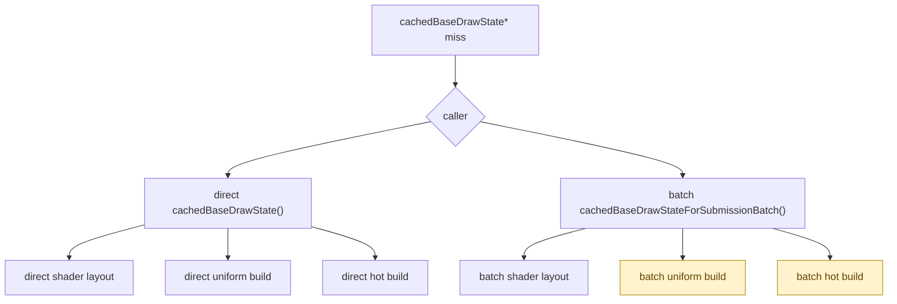

# Batch Miss Child Split

**Question / hypothesis.** [[snapshot-cache-snapshot.11]] showed that the
current snapshot lookup residual belongs to the queued draw-submission batch
lane. The remaining aggregate child counters still mixed direct and batch miss
work, so they could not identify whether the batch lane is dominated by shader
layout rebuild, uniform payload build, or hot-state build.

**Implementation.**

- Keep the existing aggregate miss child timers unchanged:
  `d3d9_snapshot_cache_miss_{shader_layout,uniform_build,hot_build}_cpu_ms`.
- Add direct miss child timers:
  `d3d9_snapshot_cache_direct_miss_{shader_layout,uniform_build,hot_build}_cpu_ms`.
- Add batch miss child timers:
  `d3d9_snapshot_cache_batch_miss_{shader_layout,uniform_build,hot_build}_cpu_ms`.



**Run.**

```sh
bash scripts/tools/run_3dmark05_perf_probe.sh \
  --suffix snapshot-cache-child-split-r1 \
  --frame 60 \
  --no-gputrace \
  --no-encoder-breakdown \
  --frame-sampling \
  --timeout 120
```

Status: pass. `actual.png` is a normal GT1 machine-gun muzzle bloom frame; it
rejects black/yellow/obvious texture or geometry failure for this probe. Frame
sampling remained in the current low-overhead range: mean `18.437fps`, p50
`18.209fps`, p95 `26.630fps`, max `30.580fps`, last `25.066fps`.

**Result.**

| Counter | Total | Per present |
|---|---:|---:|
| `present_encoded` | `1,740` | - |
| `gpu_command_buffer_time_ms` | `5,366.674` | `3.084ms` |
| `completion_wait_ms` | `44,074.139` | `25.330ms` |
| `encode_draw_cpu_ms` | `15,647.073` | `8.993ms` |
| `commit_chunk_replay_cpu_ms` | `19,098.717` | `10.976ms` |
| `d3d9_snapshot_draw_submission_cpu_ms` | `7,198.715` | `4.137ms` |
| `d3d9_snapshot_cache_lookup_cpu_ms` | `5,915.702` | `3.400ms` |
| `d3d9_snapshot_cache_direct_miss_cpu_ms` | `1,282.683` | `0.737ms` |
| `d3d9_snapshot_cache_batch_hit_cpu_ms` | `955.336` | `0.549ms` |
| `d3d9_snapshot_cache_batch_miss_cpu_ms` | `4,756.913` | `2.734ms` |

| Miss child | Aggregate | Direct miss | Batch miss |
|---|---:|---:|---:|
| Shader layout | `768.434ms` | `102.740ms` | `607.942ms` |
| Uniform build | `2,597.523ms` | `458.417ms` | `2,083.529ms` |
| Hot build | `2,330.659ms` | `500.752ms` | `1,774.774ms` |

| Count | Value |
|---|---:|
| `d3d9_draw_state_cache_direct_misses` | `112,820` |
| `d3d9_draw_state_cache_batch_hits` | `449,103` |
| `d3d9_draw_state_cache_batch_misses` | `407,079` |
| `d3d9_snapshot_uniform_build_calls` | `966,887` |
| `d3d9_snapshot_uniform_build_vs_const_hash_full_indexed_float` | `120,393` |
| `d3d9_snapshot_uniform_build_vs_const_hash_bytes` | `614,456,592` |

**Decision.** Accept as attribution. The batch miss lane is dominated by
`uniform_build` and `hot_build`, not shader layout:

- batch uniform build is `2,083.529ms` (`43.80%` of batch miss);
- batch hot build is `1,774.774ms` (`37.31%` of batch miss);
- batch shader layout is `607.942ms` (`12.78%` of batch miss).

The next implementation should not start with shader-layout micro-optimizations.
It should either reduce batch uniform-build work or reduce batch hot-build work,
with another split if needed before changing semantics.

**Next target.**

| Candidate | Reason |
|---|---|
| Batch uniform-build sub-split | Largest batch miss child. Existing global splits show VS indexed-float fallback and non-constant hash are still large, but batch ownership is not yet split inside `makeDrawUniformPayloadFromState()`. |
| Batch hot-build sub-split | Second-largest batch miss child. Needs a split inside `makeFlatDrawStateRecordFromState()` or a stronger cache/interning proof before editing. |
| VS indexed-float proof | `120,393` calls still force full VS constant hashing and scan `614.457MB`; correctness proof remains required before narrowing. |
| CPU/pipeline overlap | FPS remains governed by `completion_wait_ms=25.330ms/present` plus CPU cadence. This split identifies CPU work but is not itself an FPS fix. |

**Related.** [[snapshot-cache]] · [[snapshot-cache-snapshot.11]] ·
[[state-churn-encode-encode-phase.46]].
