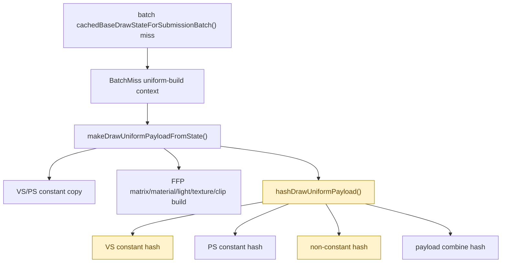

# Batch Miss Uniform Build Split

**Question / hypothesis.** [snapshot-cache-snapshot.12](snapshot-cache-snapshot.12.md) named batch miss
`uniform_build` as the largest local child inside the queued
`cachedBaseDrawStateForSubmissionBatch()` miss path. The previous uniform-build
sub-counters were global, so direct miss, batch miss, and hit-refresh work were
mixed together. This run asks which component owns the batch-miss uniform build
itself.

**Implementation.**

- Add a scoped `D3D9SnapshotUniformBuildContext::BatchMiss` around only the
  batch miss `makeDrawUniformPayloadFromState()` call.
- Mirror the existing uniform-build sub-counters while that context is active:
  copy, FFP matrix/material/texture/clip construction, hash, shader-constant
  hash, non-constant hash fields, payload combine hash, full-hash fallback
  reasons, and hashed byte counts.
- Keep the existing global `d3d9_snapshot_uniform_build_*` counters unchanged,
  so the batch-specific totals can be checked against the mixed aggregate.



**Run.**

```sh
bash scripts/tools/run_3dmark05_perf_probe.sh \
  --suffix snapshot-cache-batch-uniform-split-r1 \
  --frame 60 \
  --no-gputrace \
  --no-encoder-breakdown \
  --frame-sampling \
  --timeout 120
```

Status: pass. `actual.png` is a normal GT1 frame; it rejects black-screen,
yellow-screen, or obvious texture/geometry failure for this probe. The sampled
average FPS was noisy/lower (`16.425fps`), so this run is attribution-only and
not an FPS claim.

**Result.**

| Counter | Total | Share of batch uniform build |
|---|---:|---:|
| `present_encoded` | `1,740` | - |
| `d3d9_snapshot_draw_submission_cpu_ms` | `7,263.982ms` | - |
| `d3d9_snapshot_cache_batch_miss_cpu_ms` | `4,832.707ms` | - |
| `d3d9_snapshot_cache_batch_miss_uniform_build_cpu_ms` | `2,175.433ms` | `100.00%` |
| `d3d9_snapshot_cache_batch_miss_uniform_build_hash_cpu_ms` | `1,413.471ms` | `64.97%` |
| `d3d9_snapshot_cache_batch_miss_uniform_build_vs_const_hash_cpu_ms` | `490.107ms` | `22.53%` |
| `d3d9_snapshot_cache_batch_miss_uniform_build_nonconst_hash_cpu_ms` | `677.447ms` | `31.14%` |
| `d3d9_snapshot_cache_batch_miss_uniform_build_ps_const_hash_cpu_ms` | `68.320ms` | `3.14%` |
| `d3d9_snapshot_cache_batch_miss_uniform_build_vs_const_copy_cpu_ms` | `70.935ms` | `3.26%` |
| `d3d9_snapshot_cache_batch_miss_uniform_build_ps_const_copy_cpu_ms` | `61.862ms` | `2.84%` |
| `d3d9_snapshot_cache_batch_miss_uniform_build_ffp_matrix_cpu_ms` | `88.944ms` | `4.09%` |
| `d3d9_snapshot_cache_batch_miss_uniform_build_texture_transform_cpu_ms` | `45.189ms` | `2.08%` |

| Hash detail | Value |
|---|---:|
| `d3d9_snapshot_cache_batch_miss_uniform_build_calls` | `406,765` |
| `d3d9_snapshot_cache_batch_miss_uniform_build_vs_const_hash_full` | `73,676` |
| `d3d9_snapshot_cache_batch_miss_uniform_build_vs_const_hash_full_indexed_float` | `73,676` |
| `d3d9_snapshot_cache_batch_miss_uniform_build_vs_const_hash_bytes` | `366,470,976` |
| `d3d9_snapshot_cache_batch_miss_uniform_build_ps_const_hash_bytes` | `39,547,248` |

**Decision.** Accept as attribution. Batch miss uniform build is still a hash
problem, not a payload-copy or FFP-construction problem:

- hash is `1,413.471ms`, `64.97%` of batch uniform build;
- non-constant hash is the largest named hash child at `677.447ms`;
- VS constant hash is also large at `490.107ms`, with all `73,676` full VS
  fallbacks coming from indexed-float usage;
- copy and FFP construction children are individually small and should not be
  the first implementation target.

The next safe optimization target is not another broad memcpy reduction inside
uniform build. It is either:

1. a correctness-preserving reuse/intern path for batch-miss non-constant
   component hashes, or
2. a proof that a subset of VS indexed-float shaders can hash narrower ranges
   without changing `DrawUniformPayload` identity.

**Related.** [snapshot-cache](index.md) · [snapshot-cache-snapshot.12](snapshot-cache-snapshot.12.md) ·
[state-churn-encode-encode-phase.46](../state-churn-encode/state-churn-encode-encode-phase.46.md).
