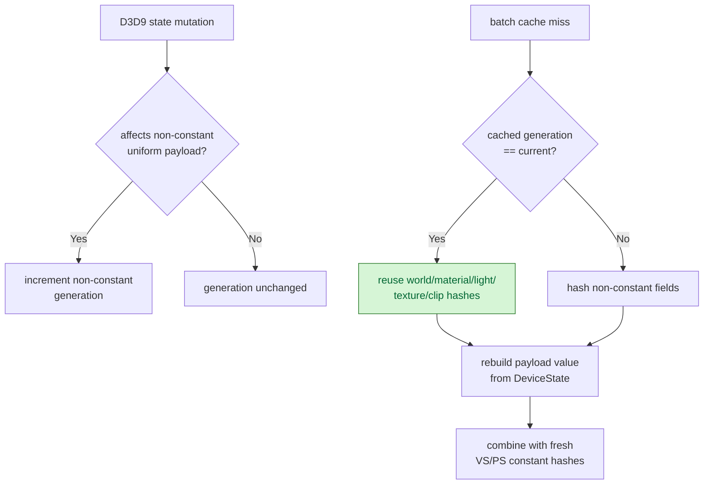

# Batch Miss Non-Constant Hash Reuse

**Question / hypothesis.** [snapshot-cache-snapshot.13](snapshot-cache-snapshot.13.md) named the batch-miss
uniform-build hash as the local owner, led by non-constant component hashing.
Most batch misses come from shader/texture/stream/FVF/binding churn; those
change the stable draw-state key but usually do not change world/view/projection,
material, light, texture-transform, or clip-plane payload values. If a separate
non-constant uniform generation proves those values unchanged, the batch miss can
reuse the previous component hashes while still rebuilding the `DrawUniformPayload`
value.

**Implementation.**

- Add `drawUniformNonConstantGeneration_` and store the matching generation in
  `CachedBaseDrawState`.
- Dirty that generation conservatively on `MutableState`, `RenderState`,
  `FfpState`, `ClipPlane`, `StateBlock`, `Reset`, `SwapChain`, and unknown
  invalidations. `RenderState` is intentionally broad because it includes
  clip-plane enable and FFP render states.
- In `cachedBaseDrawStateForSubmissionBatch()` misses, reuse the cached
  non-constant component hashes only when the cached generation matches the
  current generation. The payload value is still rebuilt from `DeviceState`; only
  the hash work is skipped.
- Add reuse proof counters:
  `d3d9_snapshot_cache_batch_miss_uniform_nonconst_hash_reuse_hits` and
  `_misses`.



**Run.**

```sh
bash scripts/tools/run_3dmark05_perf_probe.sh \
  --suffix snapshot-cache-nonconst-hash-reuse-r1 \
  --frame 60 \
  --no-gputrace \
  --no-encoder-breakdown \
  --frame-sampling \
  --timeout 120
```

Status: pass. `actual.png` shows a normal GT1 frame with machine-gun bloom and
no black-screen, yellow-screen, obvious texture collapse, or geometry collapse.

**Result.** Compared with [snapshot-cache-snapshot.13](snapshot-cache-snapshot.13.md):

| Counter | Before | After | Delta |
|---|---:|---:|---:|
| `present_encoded` | `1,740` | `1,800` | `+3.45%` |
| `sampled_avg_fps` | `16.425` | `16.535` | `+0.67%` |
| `d3d9_snapshot_draw_submission_cpu_ms` | `7,263.982ms` | `6,858.653ms` | `-5.58%` |
| `d3d9_snapshot_cache_batch_miss_cpu_ms` | `4,832.707ms` | `4,352.170ms` | `-9.94%` |
| `d3d9_snapshot_cache_batch_miss_uniform_build_cpu_ms` | `2,175.433ms` | `1,591.208ms` | `-26.86%` |
| `d3d9_snapshot_cache_batch_miss_uniform_build_hash_cpu_ms` | `1,413.471ms` | `807.075ms` | `-42.90%` |
| `d3d9_snapshot_cache_batch_miss_uniform_build_nonconst_hash_cpu_ms` | `677.447ms` | `73.490ms` | `-89.15%` |
| `commit_chunk_queue_draw_submission_cpu_ms` | `8,328.415ms` | `7,953.222ms` | `-4.50%` |
| `encode_draw_cpu_ms` | `15,760.060ms` | `15,847.103ms` | `+0.55%` |
| `gpu_command_buffer_time_ms` | `5,364.072ms` | `5,442.199ms` | `+1.46%` |
| `completion_wait_ms` | `43,566.107ms` | `45,169.363ms` | `+3.68%` |

| Reuse proof | Value |
|---|---:|
| `d3d9_snapshot_cache_batch_miss_uniform_build_calls` | `418,143` |
| `d3d9_snapshot_cache_batch_miss_uniform_nonconst_hash_reuse_hits` | `376,949` |
| `d3d9_snapshot_cache_batch_miss_uniform_nonconst_hash_reuse_misses` | `41,194` |
| Reuse rate | `90.15%` |

**Decision.** Accept as a targeted CPU win. The hypothesis is confirmed: batch
miss non-constant values are stable often enough that generation-gated hash reuse
removes almost all local non-constant hash cost (`-89.15%`) and cuts batch
uniform build by `-26.86%`.

This is not an average-FPS fix. Sampled FPS is flat/noisy, GPU command-buffer
time is flat, and completion wait regresses within run variance. The next
snapshot-cache work should not chase more copy/FFP construction micro-optimizing
inside this child unless a fresh split exposes a new non-zero local owner. The
remaining local uniform hash target is VS indexed-float fallback; the broader
frame-rate target remains CPU cadence / present completion overlap and backend
encode work, not this non-constant hash path.

**Related.** [snapshot-cache](index.md) · [snapshot-cache-snapshot.13](snapshot-cache-snapshot.13.md) ·
[overview-3dmark05-gt1](../overview-3dmark05-gt1.md).
