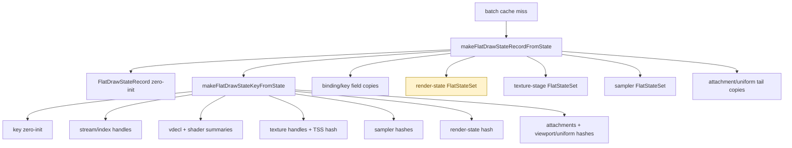

# Batch Miss Hot-Build Split

**Question / hypothesis.** [snapshot-cache-snapshot.14](snapshot-cache-snapshot.14.md) closed the
non-constant uniform-hash child but left batch miss hot-build open. The open
question is whether `makeFlatDrawStateRecordFromState()` is owned by key/hash
construction, zero-init/copy width, or the `FlatStateSet` materialization for
render/TSS/sampler state.

**Implementation.** Add batch-miss-only counters under the existing hot-build
timer. General cache callers still use the default no-extra-timer path.

- `d3d9_snapshot_cache_batch_miss_hot_build_zero_init_cpu_ms`
- `d3d9_snapshot_cache_batch_miss_hot_build_key_*_cpu_ms`
- `d3d9_snapshot_cache_batch_miss_hot_build_{binding_copy,render_state,texture_stage_state,sampler_state,tail_copy}_cpu_ms`



**Run.**

```sh
bash scripts/tools/run_3dmark05_perf_probe.sh \
  --suffix snapshot-cache-hot-build-split-r1-20260614 \
  --frame 60 \
  --no-gputrace \
  --no-encoder-breakdown \
  --frame-sampling \
  --timeout 120
```

Status: pass. `result.json` reports `timed_out=true` / return code `143`, which
is expected for the supervised 120s GT1 scout. `actual.png` shows a normal GT1
frame with machine-gun bloom and no black-screen, yellow-screen, texture
collapse, or geometry collapse.

**Result.** This is an attribution run, not an optimization A/B. The added
nested timer scopes inflate the hot-build parent; read sibling ranking and order
of magnitude, not exact closed-sum accounting.

| Counter | Value | Share of instrumented hot-build |
|---|---:|---:|
| `d3d9_snapshot_cache_batch_miss_hot_build_cpu_ms` | `2,512.204ms` | `100.00%` |
| `d3d9_snapshot_cache_batch_miss_hot_build_render_state_cpu_ms` | `1,202.861ms` | `47.88%` |
| `d3d9_snapshot_cache_batch_miss_hot_build_key_cpu_ms` | `485.840ms` | `19.34%` |
| `d3d9_snapshot_cache_batch_miss_hot_build_sampler_state_cpu_ms` | `213.765ms` | `8.51%` |
| `d3d9_snapshot_cache_batch_miss_hot_build_texture_stage_state_cpu_ms` | `204.392ms` | `8.14%` |
| `d3d9_snapshot_cache_batch_miss_hot_build_zero_init_cpu_ms` | `89.520ms` | `3.56%` |
| `d3d9_snapshot_cache_batch_miss_hot_build_binding_copy_cpu_ms` | `27.876ms` | `1.11%` |
| `d3d9_snapshot_cache_batch_miss_hot_build_tail_copy_cpu_ms` | `21.218ms` | `0.84%` |

Key children are individually small:

| Key child | Value |
|---|---:|
| `key_zero_init` | `31.356ms` |
| `key_stream` | `26.696ms` |
| `key_shader` | `34.182ms` |
| `key_constant` | `19.982ms` |
| `key_texture` | `32.987ms` |
| `key_sampler` | `30.026ms` |
| `key_render_state` | `20.162ms` |
| `key_attachment` | `20.906ms` |
| `key_uniform` | `24.447ms` |

Uniform-hash reuse remains effective in this run:

| Counter | Value |
|---|---:|
| `d3d9_snapshot_cache_batch_miss_uniform_build_calls` | `406,552` |
| `d3d9_snapshot_cache_batch_miss_uniform_nonconst_hash_reuse_hits` | `366,056` |
| `d3d9_snapshot_cache_batch_miss_uniform_nonconst_hash_reuse_misses` | `40,496` |
| Reuse rate | `90.04%` |
| `d3d9_snapshot_cache_batch_miss_uniform_build_nonconst_hash_cpu_ms` | `72.287ms` |

Frame-level guardrails stayed normal for a no-gputrace CPU scout:

| Metric | Value |
|---|---:|
| `sampled_avg_fps` | `16.425` |
| `gpu_command_buffer_errors` | `0` |
| `gpu_command_buffer_time_ms` | `5,332.059ms` |
| `completion_wait_ms` | `43,300.524ms` |

**Decision.** Accept as attribution. The dominant hot-build child is not key
hashing or binding/tail copies. It is render-state `FlatStateSet`
materialization (`1.203s`), followed by sampler/TSS set materialization and
only then key construction. Since batch misses are mostly caused by stream,
index-buffer, texture, shader, and FVF churn, rebuilding the same render-state
flat set on those misses is avoidable work.

The next snapshot-cache CPU target should be component-level flat-state reuse:
cache or intern render-state, sampler-state, and texture-stage flat sets behind
their own dirty generations, then compose the `FlatDrawStateRecord` from those
owned components. Do not spend effort on key child micro-optimization first; the
largest child is the repeated state-set materialization.

**Related.** [snapshot-cache](index.md) · [snapshot-cache-snapshot.14](snapshot-cache-snapshot.14.md) ·
[overview-3dmark05-gt1](../overview-3dmark05-gt1.md).
