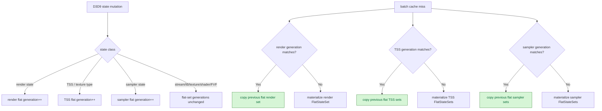

# Batch Miss Flat-State Reuse

> **Outdated — every artifact this leaf cites in `source:` is gone from disk.** The numbers below cannot be re-derived or re-checked. Kept as history; do not cite it as current evidence.

**Question / hypothesis.** [snapshot-cache-snapshot.15](snapshot-cache-snapshot.15.md) showed batch miss
hot-build was dominated by rebuilding flat render/TSS/sampler state sets even
when the miss itself was caused by unrelated stream/IB/texture/shader churn.
If we track exact dirty generations for render-state, texture-stage-state, and
sampler-state tables, then a batch miss can reuse the unchanged flat sets from
the previous binding-agnostic cache entry.

**Implementation.**

- Add internal invalidation bits for texture-stage state and sampler state while
  preserving the existing `TextureStageSampler` aggregate bit for counters.
- Add `drawRenderStateFlatGeneration_`,
  `drawTextureStageStateFlatGeneration_`, and
  `drawSamplerStateFlatGeneration_`.
- Bump render flat generation on render-state/mutable/stateblock/reset/unknown
  invalidation.
- Bump TSS generation on texture-stage-state, texture-type side effects,
  mutable/stateblock/reset/unknown invalidation.
- Bump sampler generation on sampler-state/mutable/stateblock/reset/unknown
  invalidation.
- On batch misses, pass reusable flat render/TSS/sampler sets into
  `makeFlatDrawStateRecordFromState()` when the stored generation still matches.



**Run.**

```sh
bash scripts/tools/run_3dmark05_perf_probe.sh \
  --suffix snapshot-cache-flat-state-reuse-r1-20260614 \
  --frame 60 \
  --no-gputrace \
  --no-encoder-breakdown \
  --frame-sampling \
  --timeout 120
```

Status: pass. `result.json` reports `timed_out=true` / return code `143`, the
expected supervised GT1 timeout shape. `actual.png` shows a normal GT1 frame
with machine-gun bloom, blue projectile, and no black-screen, yellow-screen,
texture collapse, or geometry collapse.

**Result.** Compared with the [snapshot-cache-snapshot.15](snapshot-cache-snapshot.15.md) attribution run.
Because the run lengths differ (`1740` vs `1800` presents), CPU counters are read
per present.

| Counter | Before | After | Delta |
|---|---:|---:|---:|
| `present_encoded` | `1,740` | `1,800` | `+3.45%` |
| `sampled_avg_fps` | `16.425` | `16.648` | `+1.36%` |
| `d3d9_snapshot_draw_submission_cpu_ms/present` | `4.255` | `3.469` | `-18.46%` |
| `d3d9_snapshot_cache_batch_miss_hot_build_cpu_ms/present` | `1.444` | `0.684` | `-52.63%` |
| `d3d9_snapshot_cache_batch_miss_hot_build_render_state_cpu_ms/present` | `0.691` | `0.089` | `-87.12%` |
| `d3d9_snapshot_cache_batch_miss_hot_build_texture_stage_state_cpu_ms/present` | `0.117` | `0.029` | `-75.65%` |
| `d3d9_snapshot_cache_batch_miss_hot_build_sampler_state_cpu_ms/present` | `0.123` | `0.052` | `-57.93%` |
| `commit_chunk_queue_draw_submission_cpu_ms/present` | `4.863` | `4.075` | `-16.21%` |
| `gpu_command_buffer_time_ms/present` | `3.064` | `3.075` | `+0.36%` |
| `completion_wait_ms/present` | `24.885` | `25.014` | `+0.52%` |

Reuse proof:

| Reuse class | Hits | Misses | Hit rate |
|---|---:|---:|---:|
| Render flat set | `377,905` | `41,425` | `90.12%` |
| TSS flat sets | `416,657` | `2,673` | `99.36%` |
| Sampler flat sets | `335,163` | `84,167` | `79.93%` |

The uniform non-constant hash reuse remains stable:

| Counter | Value |
|---|---:|
| `d3d9_snapshot_cache_batch_miss_uniform_build_calls` | `419,330` |
| `d3d9_snapshot_cache_batch_miss_uniform_nonconst_hash_reuse_hits` | `377,905` |
| `d3d9_snapshot_cache_batch_miss_uniform_nonconst_hash_reuse_misses` | `41,425` |
| `d3d9_snapshot_cache_batch_miss_uniform_build_nonconst_hash_cpu_ms` | `74.413ms` |

**Decision.** Accept as a targeted CPU win. This directly validates the
[snapshot-cache-snapshot.15](snapshot-cache-snapshot.15.md) attribution: the dominant hot-build state-set
materialization was avoidable, and generation-gated flat-state reuse cuts the
hot-build parent by roughly half per present while keeping the frame visually
normal.

This is still not a broad average-FPS fix. GPU command-buffer time and
completion wait per present are flat, and sampled FPS only moves within normal
run variance. The next snapshot-cache CPU target is either the remaining VS
indexed-float constant fallback or a deeper direct-construct/interned-state
design. Average FPS still needs pacing/overlap movement or a larger end-to-end
CPU reduction.

**Related.** [snapshot-cache](index.md) · [snapshot-cache-snapshot.15](snapshot-cache-snapshot.15.md) ·
[overview-3dmark05-gt1](../overview-3dmark05-gt1.md).
