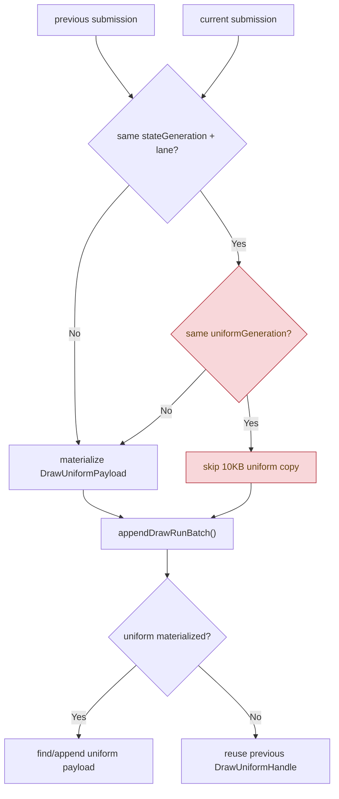

# Uniform Payload N-1 Elision Probe

> **Outdated — every artifact this leaf cites in `source:` is gone from disk.** The numbers below cannot be re-derived or re-checked. Kept as history; do not cite it as current evidence.

**Question / hypothesis.** [state-churn-encode-encode-phase.44](../state-churn-encode/state-churn-encode-encode-phase.44.md) proved that
same `{stateGeneration,stateLane}` non-front draw submissions can avoid copying
the canonical state/layout payload under `DXMT9_DRAWRUN_GROUP_BY_GEN_LANE=1`.
The next possible copy class was `DrawUniformPayload`: if the same adjacent
generation/lane group also has the same `uniformGeneration`, then the non-front
submission can skip the 10KB uniform snapshot and reuse the previous uniform
handle during `ChunkSlot::appendDrawRunBatch()`.

**Implementation.**

- Stamp each `DrawRunSubmission` with `uniformGeneration`.
- Add optional uniform storage plus materialized/elided counters:
  `d3d9_snapshot_uniform_materialized`,
  `d3d9_snapshot_uniform_materialized_bytes`,
  `d3d9_snapshot_uniform_elided`, and
  `d3d9_snapshot_uniform_elided_bytes`.
- Under `DXMT9_DRAWRUN_GROUP_BY_GEN_LANE=1`, elide the uniform copy only when
  both adjacent submissions have the same generation/lane and the same
  `uniformGeneration`.
- In batch append, reuse the previous `DrawUniformHandle` for elided uniform
  submissions. The first submission in a batch must still materialize uniforms.
- Add a native `ChunkSlot` test that verifies an elided non-front uniform resolves
  to the previous draw's uniform payload.



**Run.**

```sh
env DXMT9_DRAWRUN_GROUP_BY_GEN_LANE=1 \
  scripts/tools/run_3dmark05_perf_probe.sh \
    --suffix snapshot-cache-uniform-elision-r1-20260614 \
    --frame 60 \
    --no-gputrace \
    --no-encoder-breakdown \
    --frame-sampling \
    --timeout 120
```

Status: pass. `result.json` reports `timed_out=true` / return code `143`, the
expected supervised timeout. `actual.png` is visually normal for the sampled
frame, with machine-gun bloom and no black/yellow screen or texture collapse.

**Result.** Compared with [snapshot-cache-snapshot.16](snapshot-cache-snapshot.16.md), both runs have
`present_encoded=1,800`, so total counters are directly comparable.

| Counter | Flat-state reuse | Uniform-elision probe | Delta |
|---|---:|---:|---:|
| `sampled_avg_fps` | `16.648` | `16.670` | `+0.13%` |
| `d3d9_snapshot_draw_submission_cpu_ms` | `6244.344` | `5975.431` | `-4.31%` |
| `d3d9_snapshot_state_copy_cpu_ms` | `259.590` | `141.177` | `-45.61%` |
| `d3d9_snapshot_state_elided` | `0` | `411,758` | `+411,758` |
| `d3d9_snapshot_state_elided_bytes` | `0` | `4,213,107,856` | `+4.21GB` |
| `d3d9_snapshot_uniform_copy_cpu_ms` | `245.388` | `247.167` | `+0.72%` |
| `d3d9_snapshot_uniform_materialized` | n/a | `881,537` | - |
| `d3d9_snapshot_uniform_materialized_bytes` | n/a | `9,026,938,880` | - |
| `d3d9_snapshot_uniform_elided` | n/a | `0` | - |
| `d3d9_snapshot_uniform_elided_bytes` | n/a | `0` | - |
| `submit_draw_run_batch_append_uniform_cpu_ms` | `850.245` | `853.835` | `+0.42%` |
| `commit_chunk_queue_draw_submission_cpu_ms` | `7335.624` | `7062.799` | `-3.72%` |
| `gpu_command_buffer_time_ms` | `5535.659` | `5459.660` | `-1.37%` |
| `completion_wait_ms` | `45024.459` | `45389.534` | `+0.81%` |

The important proof is the negative one: state copy elision fires
`411,758` times, but uniform copy elision fires `0` times. Therefore the same
generation/lane groups that can share canonical state do not share
`uniformGeneration` in GT1. Uniform upload/constant updates remain a run breaker
and per-draw payload identity owner.

**Decision.** Reject uniform N-1 elision as a GT1 optimization target. Keep the
implementation and counters as an opt-in proof harness, but do not promote it to
default and do not spend more time on `DrawUniformPayload` carrier elision unless
a new workload shows non-zero `d3d9_snapshot_uniform_elided`.

This result reinforces the current priority: after [snapshot-cache-snapshot.16](snapshot-cache-snapshot.16.md),
snapshot work should target the VS indexed-float constant fallback or a deeper
direct-construct/interned-state design, not adjacent uniform snapshot reuse.

**Related.** [snapshot-cache](index.md) · [snapshot-cache-snapshot.16](snapshot-cache-snapshot.16.md) ·
[state-churn-encode-encode-phase.44](../state-churn-encode/state-churn-encode-encode-phase.44.md) · [overview-3dmark05-gt1](../overview-3dmark05-gt1.md).
