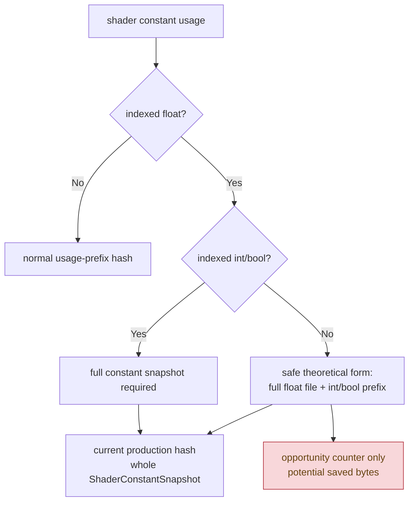

# VS Indexed-Float Partial Hash Opportunity Probe

**Question / hypothesis.** [[snapshot-cache-snapshot.13]] and
[[snapshot-cache-snapshot.17]] left VS indexed-float constant hashing as the
remaining named uniform-hash child. The correctness floor is that an indexed
float register file must still hash all float constants, but if the shader does
not dynamically index int or bool constants, those two tails can remain
usage-prefix bounded. This probe measures that safe sub-case without changing
hash semantics.

**Instrumentation.**

- Keep the existing full-fallback hash path unchanged.
- When the full fallback reason includes `indexedFloat`, record:
  `d3d9_snapshot_*_vs_const_hash_full_indexed_float_min_safe_bytes` and
  `d3d9_snapshot_*_vs_const_hash_full_indexed_float_potential_saved_bytes`.
- Define "minimum safe" as full `float4` register-file bytes plus only the
  usage-bounded int/bool prefix. This is an opportunity counter, not a default
  behavior change.



**Run.**

```sh
scripts/tools/run_3dmark05_perf_probe.sh \
  --suffix snapshot-cache-vs-indexed-float-shape-r1-20260614 \
  --frame 60 \
  --no-gputrace \
  --no-encoder-breakdown \
  --frame-sampling \
  --timeout 120
```

Status: pass. The run timeout-finalized under the 120s wrapper, wrote the
standard summary, and left no Wine/3DMark process behind. `actual.png` is
visually normal for the sampled frame and shows the expected machine-gun bloom.

**Result.**

| Counter | Value |
|---|---:|
| `present_encoded` | `1,800` |
| `sampled_avg_fps` | `16.670` |
| `d3d9_snapshot_cache_batch_miss_uniform_build_vs_const_hash_cpu_ms` | `508.936` |
| `d3d9_snapshot_cache_batch_miss_uniform_build_vs_const_hash_full_indexed_float` | `76,178` |
| `d3d9_snapshot_cache_batch_miss_uniform_build_vs_const_hash_full_indexed_int` | `0` |
| `d3d9_snapshot_cache_batch_miss_uniform_build_vs_const_hash_full_indexed_bool` | `0` |
| `d3d9_snapshot_cache_batch_miss_uniform_build_vs_const_hash_bytes` | `378,702,560` |
| `d3d9_snapshot_cache_batch_miss_uniform_build_vs_const_hash_full_indexed_float_min_safe_bytes` | `312,025,088` |
| `d3d9_snapshot_cache_batch_miss_uniform_build_vs_const_hash_full_indexed_float_potential_saved_bytes` | `20,720,416` |
| `d3d9_snapshot_uniform_build_vs_const_hash_cpu_ms` | `860.037` |
| `d3d9_snapshot_uniform_build_vs_const_hash_full_indexed_float` | `124,206` |
| `d3d9_snapshot_uniform_build_vs_const_hash_bytes` | `633,555,840` |
| `d3d9_snapshot_uniform_build_vs_const_hash_full_indexed_float_potential_saved_bytes` | `33,784,032` |
| `d3d9_snapshot_draw_submission_cpu_ms` | `6,276.506` |
| `commit_chunk_queue_draw_submission_cpu_ms` | `7,366.611` |
| `gpu_command_buffer_time_ms` | `5,457.879` |
| `completion_wait_ms` | `44,912.467` |

The safe theoretical reduction is real but small: the batch-miss path hashes
about `4,971B` per VS indexed-float fallback, while the measured safe floor is
`4,096B`; the avoidable int/bool tail is `272B` per call. That is only
`20.720MB` over the batch-miss path, or `5.47%` of its VS-constant hash bytes.
Globally it is `33.784MB`, or `5.33%` of VS-constant hash bytes.

**Decision.** Reject VS indexed-float partial hashing as the next GT1
optimization target. It is a correctness-preserving micro-cleanup candidate if
we later touch the uniform hash code anyway, but it is too small to explain the
remaining wall-clock or queued-submission cost. The larger copy-policy frontier
remains raw-run / generation-lane state N-1 materialization, direct construction
into queue-owned storage, or interned compact draw-state storage.

**Related.** [[snapshot-cache]] · [[snapshot-cache-snapshot.13]] ·
[[snapshot-cache-snapshot.17]] · [[state-churn-encode-encode-phase.44]] ·
[[overview-3dmark05-gt1]].
