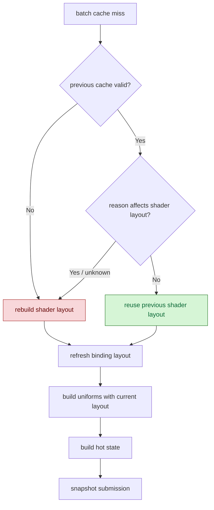

# Batch-Miss Shader Layout Reuse

> **Outdated — every artifact this leaf cites in `source:` is gone from disk.** The numbers below cannot be re-derived or re-checked. Kept as history; do not cite it as current evidence.

**Question / hypothesis.** [snapshot-cache-snapshot.12](snapshot-cache-snapshot.12.md) left batch-miss
shader-layout rebuild as a named but smaller child after uniform and hot-state
work. The risky version of this idea is to reuse a layout whenever the rebuilt
layout is compatible, but texture changes can alter FFP `TSS_TEXTURE_TYPE` and
render/TSS changes can alter FFP shader keys. This experiment first measures
compatibility, then accepts only a conservative reason-mask subset for default
reuse.

**Implementation.**

- Add `d3d9_snapshot_cache_batch_miss_shader_layout_compatible_{hits,misses}`.
- Add `d3d9_snapshot_cache_batch_miss_shader_layout_reuse_{hits,misses}`.
- Reuse the previous batch-cache `DrawShaderLayoutContext` only when the
  invalidation mask cannot affect shader layout:
  render target/depth, viewport/scissor, sampler-only, texture LOD, stream,
  index-buffer, and draw-packet changes are safe; texture, TSS, shader,
  FVF/vdecl, render state, FFP state, clip-plane, stateblock, reset, swapchain,
  and unknown masks rebuild.
- Always refresh binding layout after reuse, so extra stream strides still
  follow the current state.



**Runs.**

```sh
DXMT9_PE_RECORDER_STATS=1 DXMT_LOG_LEVEL=info \
  scripts/tools/run_3dmark05_perf_probe.sh \
  --suffix shader-layout-compat-counter-r1-20260614 \
  --frame 60 \
  --no-gputrace \
  --no-encoder-breakdown \
  --timeout 120

DXMT9_PE_RECORDER_STATS=1 DXMT_LOG_LEVEL=info \
  scripts/tools/run_3dmark05_perf_probe.sh \
  --suffix shader-layout-reuse-r1-20260614 \
  --frame 60 \
  --no-gputrace \
  --no-encoder-breakdown \
  --timeout 120
```

Both runs report `status=pass`; both are 120s wrapper-timeout finalized runs.
The reuse run reports `image_metrics.mean_luma=52.136` and
`variance=5137.313`, with no pipeline skips or GPU command-buffer errors in the
summary.

**Result.**

| Counter | Compatibility counter | Safe reuse |
|---|---:|---:|
| `present_encoded` | `1,500` | `1,680` |
| `d3d9_draw_state_cache_batch_misses` | `380,288` | `390,712` |
| `d3d9_snapshot_cache_batch_miss_shader_layout_compatible_hits` | `154,985` | `170,787` |
| `d3d9_snapshot_cache_batch_miss_shader_layout_compatible_misses` | `225,303` | `219,925` |
| `d3d9_snapshot_cache_batch_miss_shader_layout_reuse_hits` | n/a | `7,565` |
| `d3d9_snapshot_cache_batch_miss_shader_layout_reuse_misses` | n/a | `383,147` |
| `d3d9_snapshot_cache_batch_miss_shader_layout_cpu_ms / present` | `0.3715` | `0.3386` |
| `d3d9_snapshot_cache_batch_miss_cpu_ms / present` | `2.2978` | `2.1291` |
| `d3d9_snapshot_draw_submission_cpu_ms / present` | `3.6139` | `3.4529` |
| `commit_chunk_queue_draw_submission_cpu_ms / present` | `4.2685` | `4.0679` |
| `commit_chunk_replay_cpu_ms / present` | `11.1803` | `10.4335` |
| `encode_draw_cpu_ms / present` | `10.0590` | `9.7394` |
| `completion_wait_ms / present` | `26.8467` | `26.7480` |
| `gpu_command_buffer_time_ms / present` | `3.3147` | `3.0979` |

The compatibility counter shows a tempting ceiling:
`154,985 / 380,288` (`40.75%`) rebuilt layouts are draw-run compatible with the
previous one. The conservative default reuse captures only `7,565 / 390,712`
batch misses (`1.94%`). That is enough to reduce shader-layout rebuild from
`0.3715` to `0.3386ms/present`, but it is not a large GT1 owner.

**Decision.** Accept the conservative reuse as a small CPU cleanup, but reject
shader-layout reuse as the next major target. The broad compatible population is
not safe to reuse from reason mask alone because texture/TSS/render/FFP changes
can alter FFP shader keys. Chasing that larger subset would require a stronger
semantic key or post-build verification path, and the measured safe subset is
too small to move P4/completion wait.

**Related.** [snapshot-cache](index.md) · [snapshot-cache-snapshot.12](snapshot-cache-snapshot.12.md) ·
[snapshot-cache-snapshot.18](snapshot-cache-snapshot.18.md) · [state-churn-encode](../state-churn-encode/index.md) ·
[overview-3dmark05-gt1](../overview-3dmark05-gt1.md).
