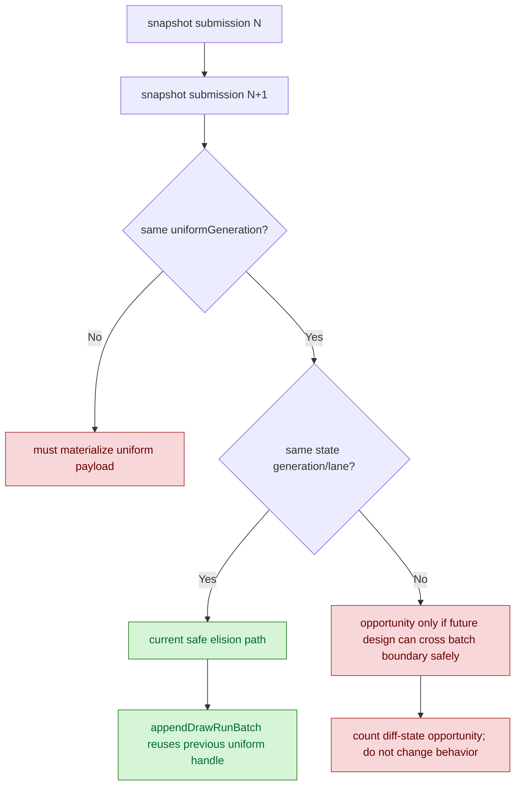

# Adjacent Uniform Generation Opportunity Probe

> **Outdated — every artifact this leaf cites in `source:` is gone from disk.** The numbers below cannot be re-derived or re-checked. Kept as history; do not cite it as current evidence.

**Question / hypothesis.** [snapshot-cache-snapshot.17](snapshot-cache-snapshot.17.md) rejected adjacent
uniform snapshot elision under the safe same-state-generation/lane gate:
`d3d9_snapshot_uniform_elided=0`. One remaining ambiguity was whether the gate
itself was too strict. If many adjacent submissions had the same
`uniformGeneration` but a different state lane, a later design could carry the
previous `DrawUniformHandle` across batch boundaries or re-materialize only
batch-front uniforms.

**Safety constraint.** The current elision is intentionally tied to
same-generation/lane because `appendDrawRunBatch()` resets its previous-uniform
handle at each compatible batch. Eliding a uniform payload across a later batch
split would leave a batch-front submission with no payload to intern.



**Implementation.**

- Add `d3d9_snapshot_uniform_adjacent_same_generation`.
- Split it into
  `d3d9_snapshot_uniform_adjacent_same_generation_same_state_lane` and
  `d3d9_snapshot_uniform_adjacent_same_generation_diff_state_lane`.
- Keep the existing elision predicate unchanged:
  `same state generation/lane && same uniformGeneration`.
- Add the new counters to `summarize_3dmark05_perf.py` so the Markdown summary
  exposes the opportunity result, not just `result.json`.

**Run.**

```sh
DXMT9_PE_RECORDER_STATS=1 DXMT_LOG_LEVEL=info \
  scripts/tools/run_3dmark05_perf_probe.sh \
  --suffix snapshot-uniform-adjacent-same-gen-r1-20260614 \
  --frame 60 \
  --no-gputrace \
  --no-encoder-breakdown \
  --timeout 120
```

The run reports `status=pass`, `present_encoded=1680`, no queue waits, and no
GPU command-buffer errors. It is a no-gputrace CPU opportunity probe; it does
not justify Xcode replay spend by itself.

**Result.**

| Counter | Value |
|---|---:|
| `d3d9_snapshot_uniform_materialized` | `822,498` |
| `d3d9_snapshot_uniform_materialized_bytes` | `8,422,379,520` |
| `d3d9_snapshot_uniform_elided` | `0` |
| `d3d9_snapshot_uniform_elided_bytes` | `0` |
| `d3d9_snapshot_uniform_adjacent_same_generation` | `0` |
| `d3d9_snapshot_uniform_adjacent_same_generation_same_state_lane` | `0` |
| `d3d9_snapshot_uniform_adjacent_same_generation_diff_state_lane` | `0` |
| `d3d9_snapshot_uniform_copy_cpu_ms / present` | `0.1364` |
| `submit_draw_run_batch_append_uniform_cpu_ms / present` | `0.6197` |
| `draw_uniform_payload_append_copy_cpu_ms / present` | `0.3418` |

**Decision.** Reject adjacent uniform snapshot elision as a GT1 target, including
the weaker "same uniform generation but different state lane" variant. There
are no adjacent same-`uniformGeneration` submissions in the sampled run, so a
cross-batch handle-carry design would have no measured opportunity here. The
remaining `submit_draw_run_batch_append_uniform_cpu_ms` belongs to payload
interning/storage and lookup width, not to missing adjacent snapshot elision.

**Related.** [snapshot-cache](index.md) · [snapshot-cache-snapshot.17](snapshot-cache-snapshot.17.md) ·
[snapshot-cache-snapshot.19](snapshot-cache-snapshot.19.md) · [state-churn-encode](../state-churn-encode/index.md) ·
[overview-3dmark05-gt1](../overview-3dmark05-gt1.md).
