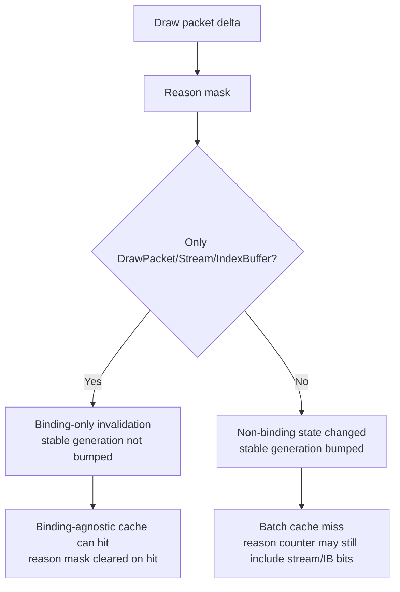

# Binding-Only Miss Reason Recheck

**Question.** The current low-overhead summary still reports very high
`d3d9_draw_state_cache_miss_after_stream` and
`d3d9_draw_state_cache_miss_after_index_buffer` counts. Does that mean stream/IB
binding churn is still breaking the binding-agnostic snapshot cache?

**Observation.** Current counters appear tempting:

| Counter | Value |
|---|---:|
| `d3d9_draw_state_cache_misses` | `530,520` |
| `d3d9_draw_state_cache_batch_misses` | `414,895` |
| `d3d9_draw_state_cache_miss_after_draw_packet` | `530,305` |
| `d3d9_draw_state_cache_miss_after_stream` | `525,403` |
| `d3d9_draw_state_cache_miss_after_index_buffer` | `511,630` |
| `d3d9_draw_state_cache_miss_after_texture` | `336,669` |
| `d3d9_draw_state_cache_miss_after_shader` | `258,486` |
| `d3d9_draw_state_cache_miss_after_fvf_vdecl` | `209,616` |

But those miss-reason counters are bit counts from a cumulative reason mask. A
miss can count stream, index, texture, shader, and FVF together. They do not
prove that stream/IB alone caused the batch cache miss.

**Code check.**

- `drawStateInvalidationIsBindingOnly()` treats only
  `DrawPacket | Stream | IndexBuffer` as binding-only.
- `Device::invalidateDrawStateCache()` always bumps `drawStateGeneration_`, but
  it bumps `drawStableStateGeneration_` only when the reason is not binding-only.
- `cachedBaseDrawStateForSubmissionBatch()` hits on `drawStableStateGeneration_`
  and clears a binding-only reason mask on hit.
- Stream and index setters call `invalidateDrawStateCache(Stream)` and
  `invalidateDrawStateCache(IndexBuffer)`, so pure binding changes are already
  on the non-stable path.

**Decision.** Reject stream/IB-only invalidation as the current snapshot owner.
The historical H3 result explained why the original full snapshot cache missed,
but the current binding-agnostic lane has already removed pure stream/IB churn
from stable-state invalidation. The high stream/IB miss counters now mean
"stream/IB co-occurs with other state changes" in miss rows, not "stream/IB alone
forces the miss."

The next snapshot targets should stay on the measured current owners:
uniform/constant churn, batch miss uniform hash/build, hot-build state storage,
and queue-owned/interned state storage. Do not add another stream/IB generation
or second vertex-declaration hash experiment without a new counter that proves a
pure binding-only stable-generation miss.

**Related.** [[snapshot-cache]] · [[snapshot-cache-snapshot.03]] ·
[[snapshot-cache-snapshot.20]] · [[state-churn-encode]] ·
[[present-pacing-lowoverhead-serial.24]].
