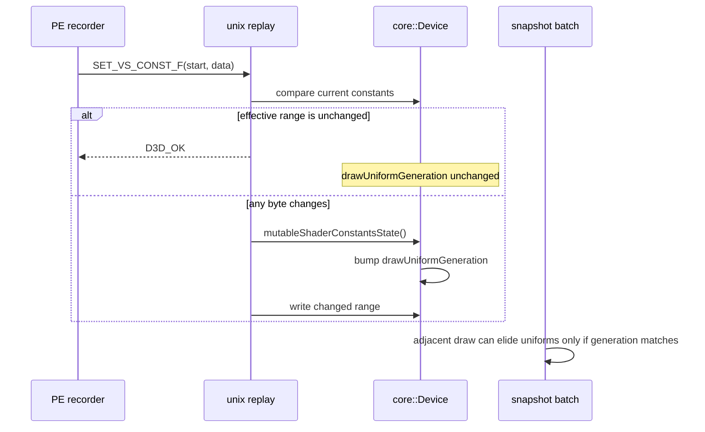

# Redundant Shader Constant No-Op Invalidation

**Question.** snapshot-cache-snapshot.20 found zero adjacent submissions
with the same `uniformGeneration`, so uniform payload copy elision could not
fire even though state-copy elision was active. In the current r3 scout,
constant uploads are still the dominant draw-run break source:

| Counter | r3 value |
|---|---:|
| `commit_chunk_draw_run_break_type_const_upload` | `766,514` |
| `commit_chunk_draw_run_break_type_const_vs_f` | `642,001` |
| `d3d9_draw_state_cache_uniform_refreshes` | `414,498` |
| `d3d9_snapshot_uniform_materialized` | `786,925` |
| `d3d9_snapshot_uniform_elided` | `0` |
| `d3d9_snapshot_uniform_copy_cpu_ms` | `227.150` |
| `d3d9_snapshot_cache_batch_miss_uniform_build_cpu_ms` | `1505.307` |

Does the unix replay side invalidate the uniform cache even when the incoming
shader constant values are bit-identical to the current state?

**Finding.** Yes. The float, int, and bool constant setters all called
`mutableShaderConstantsState()` before comparing or writing any value. That
bumps `drawUniformGeneration_` unconditionally, so a redundant constant record
destroys adjacent uniform-snapshot reuse and forces downstream hash/build/copy
work even if no shader-visible data changed.

**Implementation.**

- `setShaderFloatConst()` now clamps the effective range, byte-compares the
  current `float4` values, and returns without invalidating when the range is
  unchanged. It uses `memcmp`/`memcpy` rather than `float ==` so NaN bit payloads
  and signed-zero encodings remain exact.
- `dxmt9c_device_set_{vs,ps}_const_i()` does the same for `int4`.
- `dxmt9c_device_set_{vs,ps}_const_b()` compares normalized D3D `BOOL` input
  (`data[i] != 0`) against the stored `bool`.
- Out-of-range or zero effective ranges remain no-ops returning `D3D_OK`, now
  without an unnecessary uniform-generation bump.

**Native gate.** `dxmt9-core-device-com-spec` now snapshots a draw, repeats the
same VS float / PS int / VS bool constant set, snapshots the next draw with the
previous submission, and asserts that the second submission does not materialize
a new `DrawUniformPayload`. It also verifies that an actual changed constant
still refreshes uniforms.

**Runtime gate.** `shader-const-noop-r1-20260614` is a 120s no-gputrace,
frame-sampling scout with encoder breakdown disabled. It completed with
`status=pass`, `timed_out=true`, and `returncode=143`, which is the expected
timeout-finalized final-frame shape. It rejects this cleanup as the current GT1
adjacent-uniform owner:

| Counter | Current value | Per present |
|---|---:|---:|
| `present_encoded` | `1,800` | - |
| `sampled_avg_fps` | `16.929` | - |
| `fps p50 / p95 / max` | `18.566 / 27.070 / 32.661` | - |
| `completion_present_wait_ms` | `47,966.523` | `26.648` |
| `gpu_command_buffer_time_ms` | `5,801.359` | `3.223` |
| `commit_chunk_replay_cpu_ms` | `15,053.458` | `8.363` |
| `encode_chunk_cpu_ms` | `20,572.850` | `11.429` |
| `d3d9_draw_state_cache_uniform_refreshes` | `462,119` | `256.733` |
| `d3d9_snapshot_uniform_elided` | `0` | `0.000` |
| `d3d9_snapshot_uniform_adjacent_same_generation` | `0` | `0.000` |
| `d3d9_snapshot_uniform_materialized` | `886,034` | `492.241` |
| `d3d9_snapshot_uniform_copy_cpu_ms` | `248.113` | `0.138` |
| `d3d9_snapshot_cache_batch_miss_uniform_build_cpu_ms` | `1,662.878` | `0.924` |
| `commit_chunk_draw_run_break_type_const_upload` | `863,520` | `479.733` |
| `commit_chunk_draw_run_break_type_const_vs_f` | `719,916` | `399.953` |
| `commit_chunk_draw_run_break_type_const_ps_f` | `143,604` | `79.780` |

The decisive counters are `d3d9_snapshot_uniform_elided=0` and
`d3d9_snapshot_uniform_adjacent_same_generation=0`. Redundant-set invalidation
was a real code smell, but after the guard GT1 still has no adjacent uniform
reuse opportunity. The remaining source is true constant volatility or a
broader constant-record/run-break design, not identical-value invalidation.

The rejected runtime gate was:

| Counter | Expected movement if redundant constants exist |
|---|---|
| `d3d9_draw_state_cache_uniform_refreshes` | down |
| `d3d9_snapshot_uniform_elided` | above zero if adjacent no-op constants were the blocker |
| `d3d9_snapshot_uniform_materialized_bytes` | down |
| `d3d9_snapshot_uniform_copy_cpu_ms` | down |
| `d3d9_snapshot_cache_{uniform_refresh,batch_miss_uniform_build}_cpu_ms` | down if no-op constants were common |
| `commit_chunk_draw_run_break_type_const_upload` | unchanged; records still exist, only no-op invalidation is removed |

**Decision.** Keep this as a correctness-preserving CPU cleanup even before the
runtime A/B: identical D3D9 constant sets should not invalidate the internal
uniform cache. Reject it as the current GT1 P2/P3 owner because the no-gputrace
scout still reports zero adjacent uniform-generation reuse. Do not spend Xcode
or gputrace budget on this branch unless a future counter proves redundant
constant records are common after a separate constant-upload coalescing change.

**Related.** [snapshot-cache](index.md) · snapshot-cache-snapshot.17 ·
snapshot-cache-snapshot.20 · [state-churn-encode](../state-churn-encode/index.md) ·
present-pacing-native-selector-xctrace.31.
