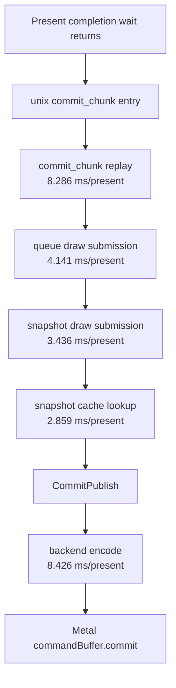

# Direct-Cbuf Residual Snapshot Owner Recheck

**Question.** [state-churn-encode-encode-phase.144](../state-churn-encode/state-churn-encode-encode-phase.144.md) removes the Stage 2
argbuf table/open/cbuf-update path with `DXMT9_ARGBUF_DIRECT_CBUF=1`, but
[present-pacing-direct-cbuf.45](../present-pacing/present-pacing-direct-cbuf.45.md) shows average FPS remains
`under-pipelined-no-enqueue`. After that local encode win, which current CPU
bucket is the next measured owner on the serialized `commit entry -> publish`
side?

**Run context.** This reuses the existing accepted direct-cbuf no-gputrace scout:

```sh
DXMT9_ARGBUF_DIRECT_CBUF=1 bash scripts/tools/run_3dmark05_perf_probe.sh \
  --suffix argbuf-direct-cbuf-r1 \
  --no-gputrace \
  --no-encoder-breakdown \
  --frame-sampling \
  --timeout 120 \
  --capture-delay-sec 45 \
  --wait-unlocked-sec 1 \
  --wait-unlocked-interval-sec 1 \
  --min-free-mb 256
```

The run is visually normal, `draw_skipped_no_pipeline=0`, and
`gpu_command_buffer_errors=0`. It is a no-gputrace FPS/counter scout, not an
Xcode replay counter sample.

## Stage Position

| Counter | Value | Per present |
|---|---:|---:|
| `present_encoded` | `1,800` | - |
| `completion_wait_without_enqueue_ms` | `51,417.444` | `28.565` |
| `completion_wait_with_enqueue_ms` | `1,024.988` | `0.569` |
| `gpu_command_buffer_time_ms` | `5,401.928` | `3.001` |
| `commit_chunk_replay_cpu_ms` | `14,914.455` | `8.286` |
| `commit_chunk_queue_draw_submission_cpu_ms` | `7,453.291` | `4.141` |
| `d3d9_snapshot_draw_submission_cpu_ms` | `6,184.703` | `3.436` |
| `d3d9_snapshot_cache_lookup_cpu_ms` | `5,146.694` | `2.859` |
| `encode_chunk_cpu_ms` | `15,167.240` | `8.426` |
| `encode_draw_cpu_ms` | `10,766.900` | `5.982` |
| `completion_no_enqueue_stage_commit_entry_to_publish_p50_ms` | `17.820` | - |
| `completion_no_enqueue_stage_encode_dequeue_to_command_buffer_commit_p50_ms` | `14.103` | - |

Direct-cbuf makes the backend encode stage much cheaper, but the exposed
no-enqueue window still has two large serialized stages. On the pre-publish side
the largest named child is still queued draw submission, and inside it the
snapshot cache lookup dominates.



## Snapshot Residual

| Counter | Value | Per present |
|---|---:|---:|
| `d3d9_snapshot_cache_lookup_cpu_ms` | `5,146.694` | `2.859` |
| `d3d9_snapshot_cache_miss_cpu_ms` | `5,347.300` | `2.971` |
| `d3d9_snapshot_cache_batch_miss_cpu_ms` | `3,891.240` | `2.162` |
| `d3d9_snapshot_cache_batch_hit_cpu_ms` | `1,047.570` | `0.582` |
| `d3d9_snapshot_cache_uniform_refresh_cpu_ms` | `930.503` | `0.517` |
| `d3d9_snapshot_cache_direct_miss_cpu_ms` | `1,398.020` | `0.777` |
| `d3d9_snapshot_cache_batch_miss_uniform_build_cpu_ms` | `1,588.870` | `0.883` |
| `d3d9_snapshot_cache_batch_miss_hot_build_cpu_ms` | `1,272.950` | `0.707` |
| `d3d9_snapshot_cache_batch_miss_shader_layout_cpu_ms` | `648.131` | `0.360` |

The old direct-vs-batch verdict still holds in current shape: batch miss is the
larger queued-submission owner, but direct miss is not zero. The next local
snapshot proof should therefore be scoped carefully:

- batch-miss uniform build/hash if the target is queue-submission replay;
- batch-miss hot-build/key/state storage if the target is hot-state width;
- direct-miss only if a new counter ties it to the same post-wait stage;
- no adjacent-uniform carry work unless
  `d3d9_snapshot_uniform_adjacent_same_generation` becomes non-zero.

## Batch-Miss Children

| Counter | Value | Per present |
|---|---:|---:|
| `d3d9_snapshot_cache_batch_miss_uniform_build_cpu_ms` | `1,588.870` | `0.883` |
| `d3d9_snapshot_cache_batch_miss_uniform_build_hash_cpu_ms` | `781.225` | `0.434` |
| `d3d9_snapshot_cache_batch_miss_uniform_build_vs_const_hash_cpu_ms` | `489.377` | `0.272` |
| `d3d9_snapshot_cache_batch_miss_hot_build_cpu_ms` | `1,272.950` | `0.707` |
| `d3d9_snapshot_cache_batch_miss_hot_build_key_cpu_ms` | `514.538` | `0.286` |
| `d3d9_snapshot_cache_batch_miss_hot_build_render_state_cpu_ms` | `167.204` | `0.093` |
| `d3d9_snapshot_cache_batch_miss_hot_build_sampler_state_cpu_ms` | `96.043` | `0.053` |
| `d3d9_snapshot_cache_batch_miss_hot_build_zero_init_cpu_ms` | `96.664` | `0.054` |
| `d3d9_snapshot_cache_batch_miss_shader_layout_cpu_ms` | `648.131` | `0.360` |

The strongest current owner is no longer one of the old closed branches
(binding-only invalidation, redundant constants, adjacent uniform elision,
or stream/IB generation). It is normal batch-miss construction: true shader
constant volatility plus hot-state/key rebuild. The VS hash child remains
visible because the run still has `166,164` full indexed-float VS hash calls,
but snapshot-cache-snapshot.18 already sized the safe tail as too small for a
standalone FPS lever.

## Batch-Miss Shape

| Counter | Value |
|---|---:|
| `d3d9_snapshot_cache_batch_miss_uniform_build_calls` | `424,834` |
| `d3d9_snapshot_cache_batch_miss_uniform_nonconst_hash_reuse_hits` | `382,721` |
| `d3d9_snapshot_cache_batch_miss_uniform_nonconst_hash_reuse_misses` | `42,113` |
| `d3d9_snapshot_cache_batch_miss_hot_build_flat_render_reuse_hits` | `382,721` |
| `d3d9_snapshot_cache_batch_miss_hot_build_flat_sampler_reuse_hits` | `338,603` |
| `d3d9_snapshot_cache_batch_miss_hot_build_flat_tss_reuse_hits` | `422,150` |
| `d3d9_snapshot_cache_batch_miss_shader_layout_reuse_hits` | `8,120` |
| `d3d9_snapshot_cache_batch_miss_shader_layout_reuse_misses` | `416,714` |
| `d3d9_snapshot_cache_batch_miss_shader_layout_compatible_hits` | `185,770` |
| `d3d9_snapshot_cache_batch_miss_shader_layout_compatible_misses` | `239,064` |

Most previously added reuse paths are active and still leave a non-trivial
residual. That matters for prioritization: a new small copy guard is unlikely
to move wall-clock unless it removes materialization itself or lets the producer
publish earlier enough to create completion overlap.

## Decision

Accepted as current attribution. After Stage 2b direct-cbuf removes the argbuf
table/open path, the next measured P2/P3 owner is queued draw submission's
snapshot cache lookup, especially batch-miss uniform build/hash and hot-build
key/state construction. This does not make snapshot work a standalone FPS fix:
the run still has `28.565ms/present` of no-enqueue completion wait, so any
candidate must be paired with the present-pacing gates from
[present-pacing-compare-gates.37](../present-pacing/present-pacing-compare-gates.37.md) and
[present-pacing-serial-stage-compare-gates.38](../present-pacing/present-pacing-serial-stage-compare-gates.38.md).

**Next proof gate.** For a snapshot candidate, require all of:

- normal visual smoke and clean skipped/error counters;
- `d3d9_snapshot_cache_lookup_cpu_ms_per_present` down;
- either `commit_chunk_queue_draw_submission_cpu_ms_per_present` or
  `commit_chunk_replay_cpu_ms_per_present` down;
- no regression in `encode_chunk_cpu_ms_per_present`;
- and a P4 check showing either lower
  `completion_wait_without_enqueue_ms_per_present` or higher
  `completion_wait_with_enqueue_ms_per_present`.

Without the last P4 movement, classify the candidate as a local CPU cleanup only.

**Related.** [snapshot-cache](index.md) · snapshot-cache-snapshot.18 ·
snapshot-cache-snapshot.21 · [snapshot-cache-snapshot.22](snapshot-cache-snapshot.22.md) ·
[state-churn-encode-encode-phase.144](../state-churn-encode/state-churn-encode-encode-phase.144.md) · [present-pacing-direct-cbuf.45](../present-pacing/present-pacing-direct-cbuf.45.md).
