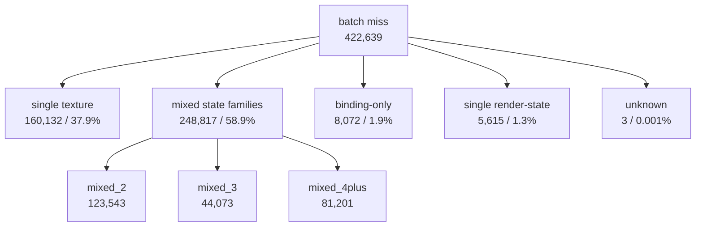

# Batch-Miss Reason Bucket Instrumentation

**Question.** [snapshot-cache-snapshot.23](snapshot-cache-snapshot.23.md) names the current serialized
snapshot owner as the queued draw-submission batch miss lane, especially uniform
build/hash and hot-build key/state construction. Before implementing another
snapshot rewrite, do we know what kind of state delta is causing those batch
misses?

**Initial answer.** Not precisely enough. The existing
`d3d9_draw_state_cache_miss_after_*` counters are global bit counts across all
cache callers and are not exclusive. They proved that stream/IB deltas frequently
co-occur, but [snapshot-cache-snapshot.21](snapshot-cache-snapshot.21.md) already rejected pure binding churn
as the current stable-generation owner. The next run needs batch-only,
exclusive grouped miss reasons.

**Result.** The first low-overhead scout confirms the counters are complete and
changes the prioritization. `single_texture` is the largest individual bucket,
but mixed state churn is larger in aggregate.

## Instrumentation

`cachedBaseDrawStateForSubmissionBatch()` now records one additional bucket for
each batch miss:

| Bucket family | Meaning |
|---|---|
| `binding_only` | reason mask contains only draw-packet, stream, or index-buffer deltas after normalization |
| `single_*` | exactly one non-binding state family caused the batch miss |
| `mixed_2`, `mixed_3`, `mixed_4plus` | multiple non-binding state families changed together |
| `unknown` | empty or unclassified reason mask |

The non-binding families are render state, texture/LOD, FVF/vertex declaration,
shader, RT/depth, viewport/scissor, texture-stage/sampler, FFP/clip, and broad
mutable/state-block/reset/swap-chain invalidation. The summary script now emits
exclusive counters and category-membership counters as
`d3d9_draw_state_cache_batch_miss_reason_*`.

## Run

The no-gputrace scout used the normal low-overhead 120s path:

```sh
DXMT_PERF_COUNTERS=1 \
bash scripts/tools/run_3dmark05_perf_probe.sh \
  --suffix snapshot-batch-miss-reasons-r1 \
  --no-gputrace \
  --no-encoder-breakdown \
  --frame-sampling \
  --timeout 120 \
  --capture-delay-sec 45 \
  --wait-unlocked-sec 1 \
  --wait-unlocked-interval-sec 1 \
  --min-free-mb 256
```

The run was timeout-finalized by policy, status `pass`, visually normal, with
`draw_skipped_no_pipeline=0` and `gpu_command_buffer_errors=0`.

## Batch-Miss Reason Shape

| Bucket | Count | Share |
|---|---:|---:|
| `single_texture` | `160,132` | `37.889%` |
| `mixed_2` | `123,543` | `29.231%` |
| `mixed_4plus` | `81,201` | `19.213%` |
| `mixed_3` | `44,073` | `10.428%` |
| `binding_only` | `8,072` | `1.910%` |
| `single_render_state` | `5,615` | `1.329%` |
| `unknown` | `3` | `0.001%` |
| all other `single_*` buckets | `0` | `0.000%` |

The bucket sum is `422,639`, exactly matching
`d3d9_draw_state_cache_batch_misses` and
`d3d9_snapshot_cache_batch_miss_uniform_build_calls`, so the grouping has no
meaningful loss. `unknown=3` is too small to block interpretation.



## Stage Position

Compared with [snapshot-cache-snapshot.23](snapshot-cache-snapshot.23.md)'s direct-cbuf scout, this run is
the same structural profile, not a new performance mutation:

| Counter | Per present |
|---|---:|
| `sampled_avg_fps` | `16.744` |
| `gpu_command_buffer_time_ms` | `3.190` |
| `completion_wait_without_enqueue_ms` | `27.614` |
| `completion_wait_with_enqueue_ms` | `0.024` |
| `commit_chunk_replay_cpu_ms` | `8.336` |
| `commit_chunk_queue_draw_submission_cpu_ms` | `4.162` |
| `d3d9_snapshot_draw_submission_cpu_ms` | `3.449` |
| `d3d9_snapshot_cache_lookup_cpu_ms` | `2.867` |
| `d3d9_snapshot_cache_batch_miss_cpu_ms` | `2.165` |
| `d3d9_snapshot_cache_batch_miss_uniform_build_cpu_ms` | `0.886` |
| `d3d9_snapshot_cache_batch_miss_hot_build_cpu_ms` | `0.711` |
| `d3d9_snapshot_cache_batch_miss_shader_layout_cpu_ms` | `0.347` |

The P4 owner remains no-enqueue completion wait:
`completion_wait_without_enqueue_ms_per_present=27.614`,
`completion_wait_with_enqueue_ms_per_present=0.024`, and overlap share
`0.087%`.

## Decision

Accepted classification. A second scout adds category-membership counters to
break down the mixed rows:

| Category membership | Count | Share of all batch misses |
|---|---:|---:|
| `has_texture` | `316,829` | `75.006%` |
| `has_shader` | `242,010` | `57.293%` |
| `has_fvf_vdecl` | `198,780` | `47.059%` |
| `has_tss_sampler` | `84,547` | `20.016%` |
| `has_render_state` | `37,688` | `8.922%` |
| `has_viewport_scissor` | `10,579` | `2.504%` |
| `has_rt_depth` | `5,008` | `1.186%` |
| `has_broad` | `1` | `0.000%` |
| `has_ffp_clip` | `0` | `0.000%` |

Derived mixed-row membership:

| Mixed membership | Count | Share of all batch misses | Share of mixed rows |
|---|---:|---:|---:|
| texture in mixed rows | `156,783` | `37.117%` | `63.050%` |
| shader in mixed rows | `242,010` | `57.293%` | `97.331%` |
| FVF/VDecl in mixed rows | `198,780` | `47.059%` | `79.943%` |
| TSS/sampler in mixed rows | `84,547` | `20.016%` | `33.999%` |
| render-state in mixed rows | `32,051` | `7.588%` | `12.890%` |

The third scout adds the tuple/intersection counters needed to decide whether
the mixed rows are one repeated shape or broad noise:

| Tuple/intersection | Count | Share of all batch misses | Share of mixed rows |
|---|---:|---:|---:|
| shader + FVF/VDecl | `202,350` | `46.954%` | `80.117%` |
| texture + shader | `151,541` | `35.164%` | `60.000%` |
| texture + FVF/VDecl | `108,000` | `25.061%` | `42.761%` |
| texture + shader + FVF/VDecl | `108,000` | `25.061%` | `42.761%` |
| texture + TSS/sampler | `84,131` | `19.522%` | `33.310%` |
| texture + shader + TSS/sampler | `84,112` | `19.517%` | `33.303%` |
| texture + shader + FVF/VDecl + TSS/sampler | `70,349` | `16.324%` | `27.854%` |

- `single_texture` is the only large single-family bucket, and texture appears
  in `75.006%` of all batch misses. Texture binding/key churn is therefore a real
  candidate axis, not just noise.
- The mixed rows are not arbitrary: `shader+FVF/VDecl` covers `80.117%` of mixed
  rows, `texture+shader` covers `60.000%`, and
  `texture+shader+FVF/VDecl` covers `42.761%`. A texture-only fast path can at
  most remove the single-texture rows unless it also handles the shader-layout /
  vertex-declaration co-churn. The safer implementation shape is therefore a
  compact/interned draw-state or direct-construction path that amortizes
  texture, shader-layout, and vdecl fields together.
- `binding_only` is small (`1.9%`), so the binding-agnostic generation model
  remains closed as the current owner.
- `unknown` is negligible (`3` rows), so classification quality is sufficient.

This remains a CPU attribution result, not an FPS win. A follow-up patch still
has to move `d3d9_snapshot_cache_lookup_cpu_ms_per_present`, the queued
replay/submission stage, and the P4 completion wait or overlap gate from
[present-pacing-compare-gates.37](../present-pacing/present-pacing-compare-gates.37.md).

**Related.** [snapshot-cache](../snapshot-cache.md) · [snapshot-cache-snapshot.21](snapshot-cache-snapshot.21.md) ·
[snapshot-cache-snapshot.23](snapshot-cache-snapshot.23.md) · [present-pacing-direct-cbuf.45](../present-pacing/present-pacing-direct-cbuf.45.md).
