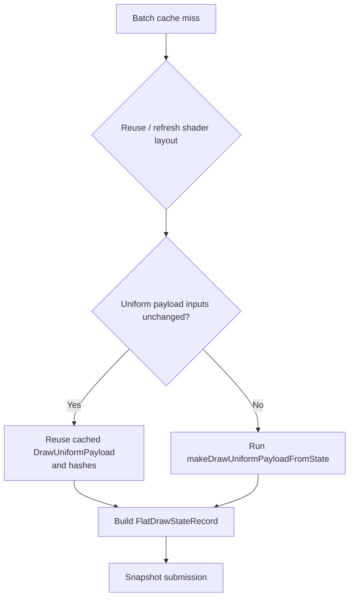

# Batch-Miss Uniform Payload Reuse Gate

**Question.** After [[snapshot-cache-snapshot.24]] classified batch misses, can
the batch-miss path skip `makeDrawUniformPayloadFromState()` when the shader
layout is reused or rebuilt but the uniform payload inputs are still identical?

**Answer.** Yes, but the opportunity is small in current GT1. The reuse gate is
correct as a local cleanup, yet it does not change the next bottleneck ranking.
Batch-miss count/churn, hot-build storage, compact/interned state, and P4
overlap remain larger targets.

## Implementation

`cachedBaseDrawStateForSubmissionBatch()` now keeps enough previous-cache
metadata to decide whether the existing owned `DrawUniformPayload` remains
valid after a batch miss:

- `drawUniformNonConstantGeneration_` must match.
- VS/PS shader-constant generations must match.
- VS/PS constant-usage masks must match after the new shader-layout decision.
- `clipPlaneMask` must match.

When all conditions hold, the batch-miss path reuses `cache.uniforms` and
`cache.uniformHashes` instead of rebuilding the payload. If only one shader
constant side is reusable, the existing component-hash reuse path still feeds
the normal builder.



## Run

The A/B used the current P2/P3 scout as the baseline and a standard
no-gputrace low-overhead probe for the candidate:

```sh
bash scripts/tools/run_3dmark05_perf_probe.sh \
  --suffix snapshot-uniform-payload-reuse-r1 \
  --no-gputrace \
  --no-encoder-breakdown \
  --frame-sampling \
  --timeout 120 \
  --capture-delay-sec 45 \
  --wait-unlocked-sec 1 \
  --wait-unlocked-interval-sec 1 \
  --min-free-mb 256 \
  --compare-baseline-output experiments/output/app-d3d9-3dmark05-current-p2p3-scout-r1 \
  --require-batch-miss-uniform-build-cpu-per-present-decrease \
  --require-snapshot-cache-lookup-cpu-per-present-decrease
```

The run timeout-finalized by policy with status `pass`. The final screenshot is
a normal GT1 frame, and the health counters are clean:
`draw_skipped_no_pipeline=0`, `gpu_command_buffer_errors=0`,
`map_buffer_wait_ms=0`, and `queue_sequence_wait_ms=0`.

## A/B Result

| Metric | Baseline | Candidate | Delta |
|---|---:|---:|---:|
| `present_encoded` | `1,800` | `1,800` | `0` |
| `d3d9_snapshot_cache_batch_miss_uniform_build_calls` | `421,656` | `416,904` | `-4,752` / `-1.13%` |
| `snapshot_cache_batch_miss_uniform_build_cpu_ms_per_present` | `0.884` | `0.877` | `-0.006ms` / `-0.71%` |
| `d3d9_snapshot_cache_lookup_cpu_ms_per_present` | `2.850` | `2.843` | `-0.006ms` / `-0.22%` |
| `d3d9_snapshot_draw_submission_cpu_ms_per_present` | `3.425` | `3.416` | `-0.009ms` / `-0.26%` |
| `commit_chunk_replay_cpu_ms_per_present` | `8.325` | `8.282` | `-0.043ms` / `-0.52%` |
| `encode_chunk_cpu_ms_per_present` | `11.152` | `11.022` | `-0.130ms` / `-1.17%` |
| `completion_wait_without_enqueue_ms_per_present` | `27.475` | `27.286` | `-0.190ms` / `-0.69%` |
| `sampled_avg_fps` | `16.766` | `16.658` | flat / noisy |

The finalizer gates passed, but the size of the win is below the threshold for
a new owner. The candidate removes only about `4.7k` batch-miss uniform builds
over the run, while more than `416k` batch-miss uniform builds remain.

## Decision

Accepted as a low-risk local cleanup. Rejected as the next snapshot owner.

This result specifically says that conservative whole-payload reuse is not
where current GT1 is spending most of the snapshot time. The next snapshot work
should keep following the measured batch-miss shape:

- reduce the number of batch misses caused by texture / shader / FVF-VDecl
  co-churn;
- avoid rebuilding wide hot-state/key data by direct construction or compact
  interned state storage;
- reduce true uniform/constant churn only with a counter that proves a larger
  opportunity than this gate;
- keep FPS claims tied to P4 overlap or a larger end-to-end P2/P3 reduction.

**Related.** [[snapshot-cache]] · [[snapshot-cache-snapshot.23]] ·
[[snapshot-cache-snapshot.24]] · [[present-pacing-current-p2p3.46]].
