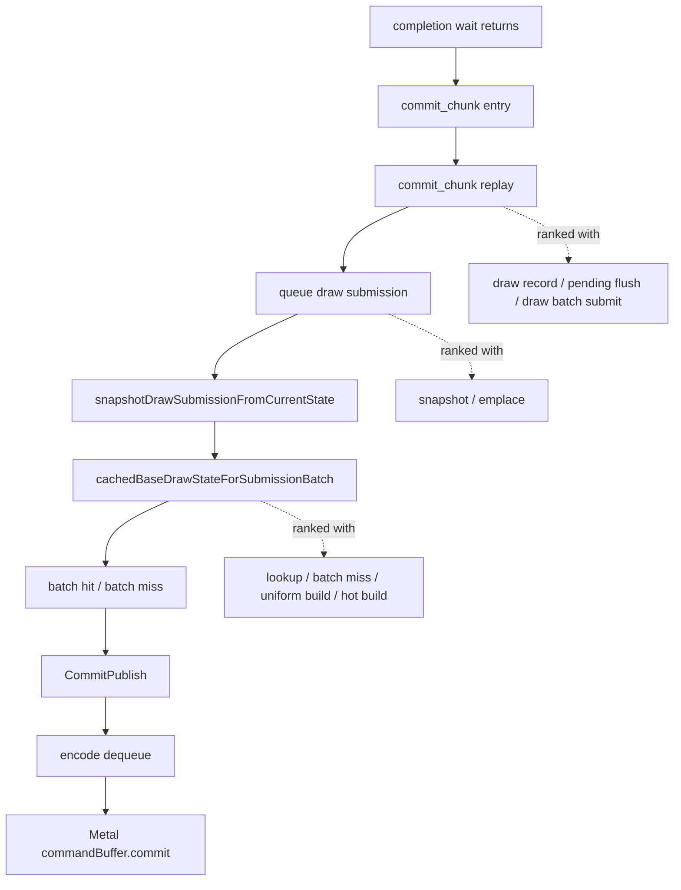

# Replay / Snapshot Derived Ranking Re-centers P2/P3 After Direct Cbuf

**Question / hypothesis.** After `DXMT9_ARGBUF_DIRECT_CBUF=1` removes the
local argbuf table/cbuf-update path from backend encode, does the remaining
current average-FPS owner move to another encode child or back to the
commit/replay/snapshot path?

**Tooling change.** `summarize_3dmark05_perf.py` now emits a
`Replay / Snapshot CPU Derived` block after `Pacing / CPU Stage Derived`.
The block ranks parent and child counters together, intentionally without
summing them, so standalone no-gputrace scouts expose the next P2/P3 owner:

The summary also reports:

- `queue_submission_snapshot_share`
- `snapshot_cache_lookup_share`
- `snapshot_batch_miss_share_of_lookup`
- `pending_flush_share_of_replay`
- `draw_batch_submit_share_of_replay`

**Current low-overhead baseline.**

| Metric | Value |
|---|---:|
| `commit_chunk_replay_cpu_ms_per_present` | `8.395` |
| `commit_chunk_queue_draw_submission_cpu_ms_per_present` | `4.209` |
| `commit_chunk_queue_draw_submission_snapshot_cpu_ms_per_present` | `3.555` |
| `d3d9_snapshot_draw_submission_cpu_ms_per_present` | `3.496` |
| `d3d9_snapshot_cache_lookup_cpu_ms_per_present` | `2.925` |
| `d3d9_snapshot_cache_batch_miss_cpu_ms_per_present` | `2.126` |
| `queue_submission_snapshot_share` | `84.46%` |
| `snapshot_cache_lookup_share` | `83.67%` |
| `snapshot_batch_miss_share_of_lookup` | `72.68%` |

Top current ranking:

| Rank | Counter | ms/present |
|---:|---|---:|
| 1 | `commit_chunk_replay_cpu_ms` | `8.395` |
| 2 | `commit_chunk_replay_draw_record_cpu_ms` | `6.952` |
| 3 | `commit_chunk_queue_draw_submission_cpu_ms` | `4.209` |
| 4 | `commit_chunk_queue_draw_submission_snapshot_cpu_ms` | `3.555` |
| 5 | `d3d9_snapshot_draw_submission_cpu_ms` | `3.496` |
| 6 | `d3d9_snapshot_cache_lookup_cpu_ms` | `2.925` |
| 7 | `d3d9_snapshot_cache_batch_miss_cpu_ms` | `2.126` |

**Direct-cbuf comparison.** The direct-cbuf run keeps the same owner shape:

| Metric | Baseline | Direct cbuf |
|---|---:|---:|
| `commit_chunk_replay_cpu_ms_per_present` | `8.395` | `8.264` |
| `commit_chunk_queue_draw_submission_cpu_ms_per_present` | `4.209` | `4.129` |
| `commit_chunk_queue_draw_submission_snapshot_cpu_ms_per_present` | `3.555` | `3.472` |
| `d3d9_snapshot_draw_submission_cpu_ms_per_present` | `3.496` | `3.410` |
| `d3d9_snapshot_cache_lookup_cpu_ms_per_present` | `2.925` | `2.836` |
| `d3d9_snapshot_cache_batch_miss_cpu_ms_per_present` | `2.126` | `2.142` |
| `snapshot_batch_miss_share_of_lookup` | `72.68%` | `75.52%` |

**Interpretation.**

- The direct-cbuf local encode win is real, but it does not remove the exposed
  average-FPS owner. The remaining serial lane is still replay/draw-record
  processing, queue draw submission, snapshot materialization, and snapshot
  cache lookup.
- Queue submission is mostly snapshot work (`~84%`), and snapshot work is
  mostly cache lookup (`~83%`).
- Batch miss remains the largest actionable snapshot-cache child
  (`~2.1ms/present`, `~73-76%` of lookup). Within that child, the current
  smaller ranked owners are uniform build and hot build, but the larger lever
  remains reducing batch-miss count / co-churn or avoiding full materialization
  on compatible misses.
- Pending flush and draw-batch submit are secondary but still visible at
  about `1.6ms/present` each; they should be tracked when a candidate changes
  chunk or batching shape.

**Verdict.** Accepted. The current no-gputrace summary can now name the
replay/snapshot owner without opening Xcode. The next implementation lane is
not more argbuf-local cleanup by default; it is either batch-miss/co-churn
reduction in the queued draw-submission snapshot path, a lower-width snapshot
representation, or a P4 overlap design that keeps render-pass and
command-buffer locality intact.

**Related.** [snapshot-cache-snapshot.25](snapshot-cache-snapshot.25.md) · present-pacing-current-lowoverhead.52
· [state-churn-encode-encode-phase.146](../state-churn-encode/state-churn-encode-encode-phase.146.md).
