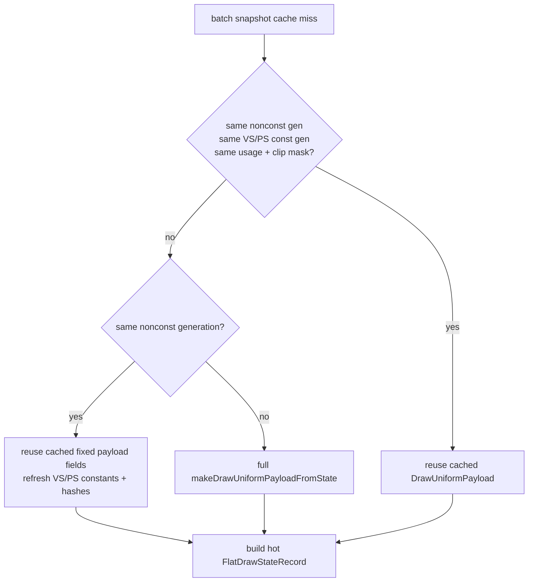

# Batch Miss Reuses Non-constant Uniform Payload Fields

**Question / hypothesis.** After non-constant uniform component hashes were
reused, batch-miss uniform build still rebuilt the non-constant payload fields
themselves. Can the batch miss path keep `cache.uniforms`' fixed-function
payload when `drawUniformNonConstantGeneration_` is unchanged and refresh only
shader constants?

**Change.** `cachedBaseDrawStateForSubmissionBatch()` now has a middle path
between whole-payload reuse and full `makeDrawUniformPayloadFromState()` rebuild:



This is narrower than compacting the submission ABI: it only avoids rebuilding
FFP/non-constant fields inside the cache entry. `DrawRunSubmission` still
materializes a full `DrawUniformPayload`, so the larger compact-uniform storage
opportunity remains open.

**Method.**

```sh
bash scripts/tools/run_3dmark05_perf_probe.sh \
  --suffix snapshot-nonconst-payload-reuse-r1-20260616 \
  --no-gputrace \
  --no-encoder-breakdown \
  --frame-sampling \
  --timeout 120 \
  --wait-unlocked-sec 1 \
  --wait-unlocked-interval-sec 1 \
  --min-free-mb 1024
```

Native gates:

```sh
meson compile -C build-arm64-nowine
meson test -C build-arm64-nowine \
  dxmt9-state-draw-transform-spec \
  dxmt9-core-device-com-spec \
  dxmt9-dod-replay-observer-spec
meson test -C build-arm64-nowine dxmt9-perf-docs-source-audit
git diff --check
```

**Result.**

| Metric | Baseline | Nonconst payload reuse | Delta |
|---|---:|---:|---:|
| Status | `pass` | `pass` | ok |
| `present_encoded` | `1,823` | `1,823` | same |
| `sampled_avg_fps` | `16.666` | `16.662` | flat |
| `commit_chunk_queue_draw_submission_cpu_ms/present` | `4.209` | `3.975` | `-5.55%` |
| `d3d9_snapshot_draw_submission_cpu_ms/present` | `3.496` | `3.246` | `-7.13%` |
| `d3d9_snapshot_cache_lookup_cpu_ms/present` | `2.925` | `2.655` | `-9.22%` |
| `d3d9_snapshot_cache_batch_miss_cpu_ms/present` | `2.126` | `1.945` | `-8.52%` |
| `d3d9_snapshot_cache_batch_miss_uniform_build_cpu_ms/present` | `0.871` | `0.596` | `-31.56%` |

The local child movement matches the intended mechanism:

| Batch-miss uniform child | Baseline total ms | Reuse total ms |
|---|---:|---:|
| FFP matrix | `94.444` | `15.820` |
| FFP material/light | `35.086` | `3.668` |
| Texture transforms | `47.331` | `5.916` |
| Clip planes | `24.883` | `3.383` |
| Hash subtotal | `788.704` | `776.408` |
| VS constant hash | `498.960` | `495.298` |

`d3d9_snapshot_cache_batch_miss_uniform_nonconst_hash_reuse_hits` remains large
(`386,261`) and misses remain small (`42,013`), so the optimized branch covers
the expected case. The hash subtotal barely moves because the accepted branch
still must hash volatile shader constants, especially VS indexed-float constants.

**Interpretation.**

- Accepted CPU win: the change removes unnecessary non-constant payload rebuild
  work from the batch-miss path and reduces the exposed replay/snapshot lane.
- Not an average-FPS win by itself: sampled FPS is flat, and
  `completion_wait_ms` remains much larger than the saved snapshot work.
- The next snapshot-cache work should not keep chasing FFP/non-constant build
  children unless a new counter reopens them. The remaining local owners are
  shader-constant hashing, hot-state/key storage, batch-miss count/co-churn, and
  the broader compact-uniform submission/storage design.

**Verdict.** Accepted as a CPU optimization. It makes the requested bottleneck
state more accurate: the old "uniform build" owner is now narrowed to shader
constant hashing plus full submission materialization, while the FPS owner still
requires larger P2/P3 or P4 movement.

**Related.** [snapshot-cache-snapshot.26](snapshot-cache-snapshot.26.md) ·
[snapshot-cache-snapshot.25](snapshot-cache-snapshot.25.md) · [present-pacing-current-lowoverhead.52](../present-pacing/present-pacing-current-lowoverhead.52.md).
