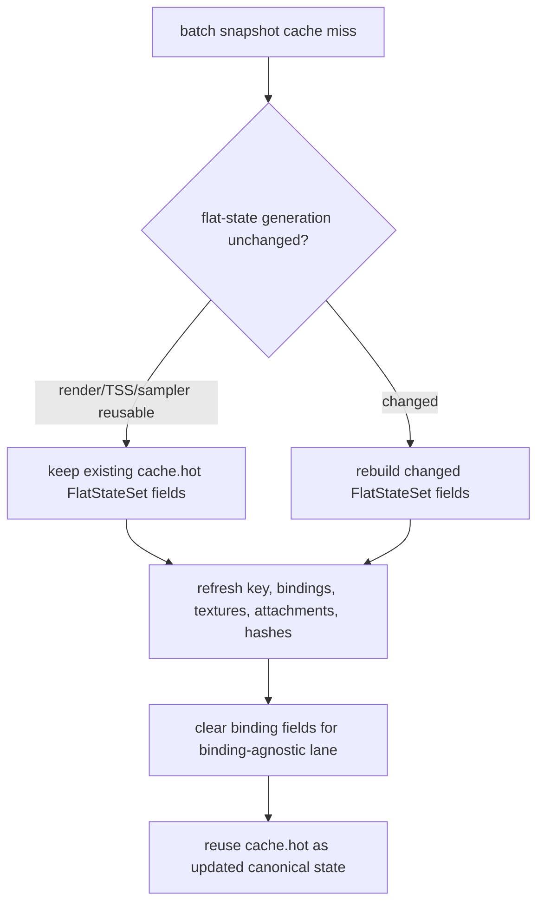

# Batch Miss Refreshes Hot State In Place

> **Outdated — every artifact this leaf cites in `source:` is gone from disk.** The numbers below cannot be re-derived or re-checked. Kept as history; do not cite it as current evidence.

**Question / hypothesis.** After [snapshot-cache-snapshot.27](snapshot-cache-snapshot.27.md) reduces
batch-miss uniform build, the next local child is hot-state rebuild. The batch
miss path already knows when render-state, TSS, and sampler `FlatStateSet`s are
unchanged, but the old code still built a fresh `FlatDrawStateRecord`, copied
the reusable sets into it, then assigned the whole record back to `cache.hot`.
Can the cache refresh `cache.hot` in place and preserve reusable flat-state
sets?

**Change.** Split `makeFlatDrawStateRecordFromState()` into an in-place
`refreshFlatDrawStateRecordFromState()` helper plus the old value-returning
wrapper. The batch-miss cache path now calls the in-place helper with
`preserveReusableFlatStateSets=true`.



This does not change draw compatibility or the binding override mechanism. It
only removes local cache-record churn inside `cachedBaseDrawStateForSubmissionBatch()`.

**Method.**

```sh
bash scripts/tools/run_3dmark05_perf_probe.sh \
  --suffix snapshot-hot-inplace-r1-20260616 \
  --no-gputrace \
  --no-encoder-breakdown \
  --frame-sampling \
  --timeout 120 \
  --wait-unlocked-sec 1 \
  --wait-unlocked-interval-sec 1 \
  --min-free-mb 1024
```

Native gates:

```sh
meson compile -C build-arm64-nowine
meson test -C build-arm64-nowine \
  dxmt9-state-draw-transform-spec \
  dxmt9-core-device-com-spec \
  dxmt9-dod-replay-observer-spec
git diff --check
```

**Result.** Compare against the immediate non-constant payload reuse run:

| Metric | Nonconst payload reuse | Hot in-place | Delta |
|---|---:|---:|---:|
| Status | `pass` | `pass` | ok |
| `present_encoded` | `1,823` | `1,839` | comparable |
| `sampled_avg_fps` | `16.662` | `16.807` | noisy / slight up |
| `commit_chunk_queue_draw_submission_cpu_ms/present` | `3.975` | `3.796` | `-4.50%` |
| `d3d9_snapshot_draw_submission_cpu_ms/present` | `3.246` | `3.066` | `-5.55%` |
| `d3d9_snapshot_cache_lookup_cpu_ms/present` | `2.655` | `2.468` | `-7.05%` |
| `d3d9_snapshot_cache_batch_miss_cpu_ms/present` | `1.945` | `1.752` | `-9.89%` |
| `d3d9_snapshot_cache_batch_miss_hot_build_cpu_ms/present` | `0.729` | `0.571` | `-21.66%` |

The local child movement matches the implementation:

| Batch-miss hot-build child | Nonconst payload reuse | Hot in-place |
|---|---:|---:|
| Zero-init | `99.714ms` | `0.000ms` |
| Key build | `548.919ms` | `542.064ms` |
| Render-state field | `168.815ms` | `156.156ms` |
| TSS field | `53.497ms` | `26.776ms` |
| Sampler field | `97.061ms` | `69.274ms` |
| Tail copy | `23.519ms` | `24.443ms` |

The screenshot is a normal GT1 frame and includes the machine-gun muzzle bloom,
so this scout does not reproduce the earlier black-scene timing/correctness
failure.

**Interpretation.**

- Accepted CPU win: the hot-state cache no longer pays fresh-record zero-init
  and avoids copying reusable flat-state sets into a throwaway record.
- FPS remains noisy rather than proven: sampled FPS moves up slightly, but
  `completion_wait_ms` is still `27.288ms/present`, much larger than the saved
  snapshot work.
- The remaining local snapshot-cache owner is now more clearly shader-constant
  hashing, key construction, batch-miss count/co-churn, and the larger compact
  uniform submission/storage design. Rebuilding non-constant payload fields and
  fresh hot-record storage should be considered closed unless a later counter
  regresses.

**Verdict.** Accepted as a CPU optimization and owner refinement. It moves the
serialized replay/snapshot lane but does not by itself prove that the average
FPS bottleneck has been removed.

**Related.** [snapshot-cache-snapshot.27](snapshot-cache-snapshot.27.md) ·
[snapshot-cache-snapshot.26](snapshot-cache-snapshot.26.md) · [state-churn-encode-encode-phase.146](../state-churn-encode/state-churn-encode-encode-phase.146.md).
