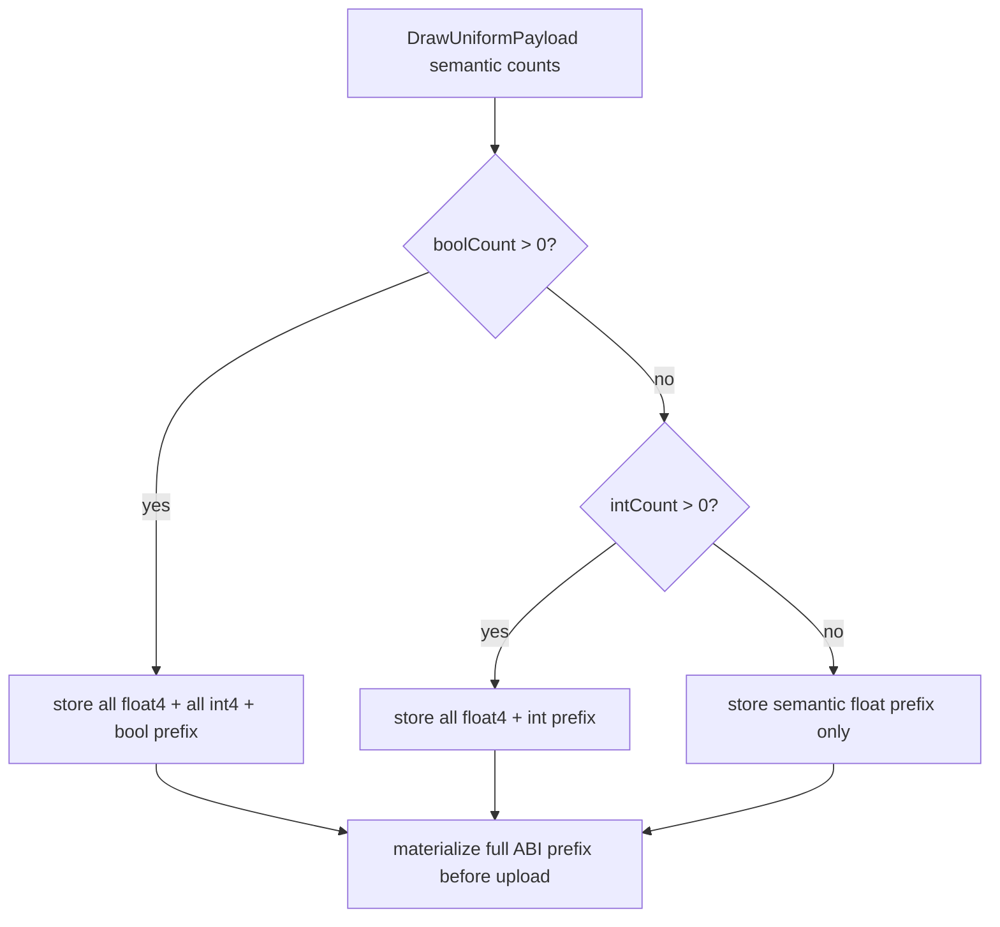

# Snapshot Cache Visual 01 - Compact Uniform Storage Preserves Metal ABI Prefix

**Question / hypothesis.** `v0.0.3` is the last known visual-safe tag. After the
post-tag compact uniform storage work, red-light weapon frames showed black
geometry, transparent guns, and motion-coupled vertex artifacts. Could compact
VS/PS constant storage have dropped bytes that are semantically unused by the
hash, but still required by the Metal-visible constant-buffer ABI?

**Verdict.** Yes. The compact storage path preserved only semantic used counts,
but the live `VsConsts` / `PsConsts` upload ABI is a struct prefix. If an int
constant is uploaded, the preceding float region must still be present in the
materialized payload. If a bool constant is uploaded, both preceding float and
int regions must be present. Zeroing those prefix values can corrupt lighting,
alpha, and material decisions.

## Change

`makeDrawUniformVertexConstantsSpan()` and
`makeDrawUniformPixelConstantsSpan()` now keep float-only constants compact, but
preserve the ABI prefix whenever int or bool constants are stored:



The matching record equality check compares against the expected storage span,
not raw semantic counts, so interned compact records cannot reuse an
insufficiently narrow byte arena.

Native coverage was added to `dxmt9-dod-replay-observer-spec` for both int-only
and bool paths. The tests assert that otherwise-unused prefix float/int values
survive storage and materialization.

## Verification

Native gate:

```sh
meson test -C build-arm64-nowine dxmt9-dod-replay-observer-spec --print-errorlogs
git diff --check
```

Runtime visual/probe gate:

```sh
DXMT_3DMARK05_FOCUS_KEEPALIVE_SEC=140 \
bash scripts/tools/run_3dmark05_perf_probe.sh \
  --suffix visual-uniform-prefix-fix-r1-20260617 \
  --no-gputrace \
  --no-encoder-breakdown \
  --frame-sampling \
  --timeout 120 \
  --wait-unlocked-sec 1 \
  --wait-unlocked-interval-sec 1 \
  --min-free-mb 256 \
  --capture-range 500:850:25 \
  --capture-delay-sec 45
```

Oracle run:

```sh
DXMT9_FORCE_FULL_CBUF_UPLOADS=1 \
DXMT_3DMARK05_FOCUS_KEEPALIVE_SEC=140 \
bash scripts/tools/run_3dmark05_perf_probe.sh \
  --suffix visual-full-cbuf-oracle-r1-20260617 \
  --no-gputrace \
  --no-encoder-breakdown \
  --frame-sampling \
  --timeout 120 \
  --wait-unlocked-sec 1 \
  --wait-unlocked-interval-sec 1 \
  --min-free-mb 256 \
  --capture-range 500:850:25 \
  --capture-delay-sec 45
```

| Metric | Prefix fix | Full-cbuf oracle |
|---|---:|---:|
| Status | `pass` | `pass` |
| `draw_skipped_no_pipeline` | `0` | `0` |
| `gpu_command_buffer_errors` | `0` | `0` |
| `sampled_avg_fps` | `16.510` | `16.269` |
| `completion_wait_ms_per_present` | `27.447` | `28.015` |

The two contact sheets are not same-pixel comparisons because GT1 scene phase
drifts slightly, but both sampled the same frame range and neither shows the
large black triangle / weapon tear artifact. Treat this as visual smoke plus a
deterministic ABI-prefix unit test, not a full oracle replacement.

## Decision

Keep the ABI-prefix widening. Do not use full cbuf uploads as a default visual
workaround; it is only an oracle/diagnostic mode. This fix is correctness work,
not an average-FPS improvement. The current low-overhead baseline after the fix
is [present-pacing-current-lowoverhead.71](../present-pacing/present-pacing-current-lowoverhead.71.md).
