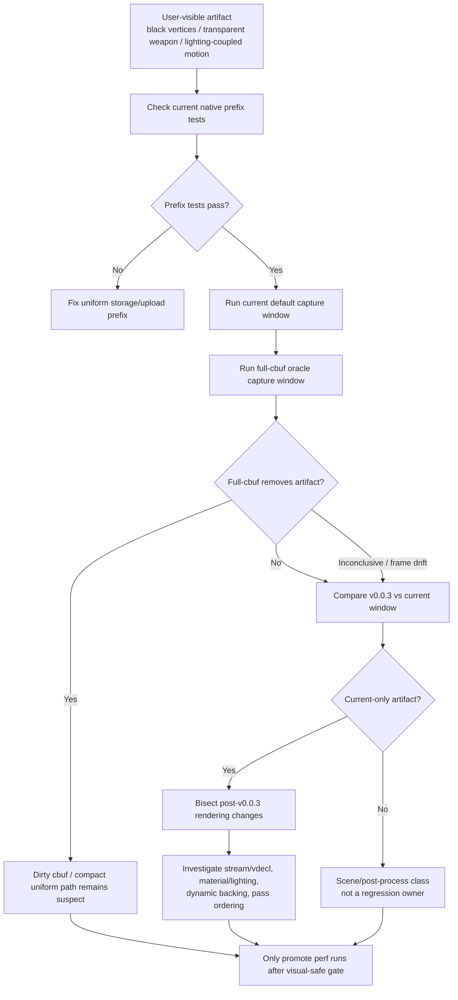

# Snapshot Cache Visual 02 - Current v0.0.3 Visual Gate and Full-Cbuf Triage

**Question.** After `v0.0.3`, a live GT1 run showed black geometry,
transparent weapon parts, and lighting-coupled artifacts. Is this a new
performance wall, a recurrence of the compact-uniform ABI-prefix bug, or an
unreproduced visual regression that must gate further performance conclusions?

**Verdict.** This is not a proof that the optimization work hit a hardware
wall. For the sampled black-foreground firefight window, the cbuf-prefix owner
is rejected and the class is not proven to be a post-`v0.0.3` regression:
[[state-churn-encode-encode-phase.169]] shows full VS/PS cbuf uploads do not
remove the sampled silhouettes, and [[state-churn-encode-encode-phase.172]]
shows the same broad dark-foreground class also exists in the `v0.0.3` visual
anchor. A separate weapon/lighting-coupled artifact can still be real, but it
needs a same-frame or draw-local owner before it should redirect the performance
plan.

## Evidence

Native checks run on the current worktree:

```sh
meson test -C build-arm64-nowine \
  dxmt9-core-device-com-spec \
  dxmt9-backend-key-descriptor-spec \
  dxmt9-draw-uniforms-dirty-spec \
  dxmt9-state-draw-transform-spec
```

All four passed. This covers the known ABI-prefix storage/upload cases:
int-prefix and bool-prefix materialization, dirty upload byte prefixes, and
compact snapshot storage.

Runtime artifacts:

| Run | Reading |
|---|---|
| `app-d3d9-3dmark05-h191-current-black-geometry-window-r1` | current `1060..1100:5` window with dark foreground silhouettes; skipped-pipeline and Metal-error counters are `0` |
| `app-d3d9-3dmark05-h192-full-cbuf-black-geometry-window-r1` | `DXMT9_FORCE_FULL_CBUF_UPLOADS=1` is active and costly, but the offset-paired sheet still shows the dark class; cbuf-prefix is rejected for this window |
| `app-d3d9-3dmark05-h196-v003-tag-release-black-geometry-window-r3` vs `app-d3d9-3dmark05-h199-current-black-geometry-window-r3-f910` | both the safe tag and current run contain the strong bloom/spark/firefight foreground silhouette class; raw diff is large because the scene is not frame-locked |

The older `visual-current-default-r1` / `visual-current-full-cbuf-oracle-r1`
pair is weaker than h191/h192 because its capture window drifts more. Keep it
as broad historical context only; use H169/H172 as the current evidence.

## Interpretation

The current state is:

- `v0.0.3` remains the visual-safe anchor.
- The known compact uniform storage bug is fixed and covered by native tests.
- Full-cbuf fallback remains a useful diagnostic, but H169 rejects it for the
  sampled black-foreground window.
- The sampled dark foreground window exists in the `v0.0.3` anchor, so that
  class is not currently a regression owner.
- Performance numbers from a run with a *new* weapon/lighting artifact remain
  demoted until that artifact is reproduced, classified, or tied to a draw/pass
  owner.

This keeps the next performance direction narrow: continue CPU/P4 work only
after a matching visual smoke passes, and do not promote gputrace/Xcode deltas
from a run with black/transparent geometry.

## Gate

Use a foreground, timeout-supervised no-gputrace pair first. For the already
sampled dark-foreground window, this gate has been run by H169/H172. For a new
weapon/lighting artifact, capture the same window, not only the final
`actual.png`:

```sh
bash scripts/tools/run_3dmark05_perf_probe.sh \
  --suffix visual-current-new-artifact-r1 \
  --no-gputrace --no-encoder-breakdown \
  --frame-sampling --timeout 120 --keep-frontmost \
  --capture-range <START>:<END>:<STEP> --capture-delay-sec 45

DXMT9_FORCE_FULL_CBUF_UPLOADS=1 \
bash scripts/tools/run_3dmark05_perf_probe.sh \
  --suffix visual-current-new-artifact-full-cbuf-r1 \
  --no-gputrace --no-encoder-breakdown \
  --frame-sampling --timeout 120 --keep-frontmost \
  --capture-range <START>:<END>:<STEP> --capture-delay-sec 45
```

Promotion gate:

- both runs must have `gpu_command_buffer_errors=0` and
  `draw_skipped_no_pipeline=0`;
- the default run must be visually coherent against the `v0.0.3` anchor, or the
  regression must be localized to a draw/window;
- if full-cbuf fixes a new artifact, keep debugging the dirty cbuf / compact
  uniform path;
- if full-cbuf does not fix it and `v0.0.3` does not show the same class, move
  to stream/vdecl, lighting/material state, dynamic backing, or render-pass
  ordering;
- if `v0.0.3` shows the same class, do not treat that class as a regression or
  performance-wall proof.

## Flow


