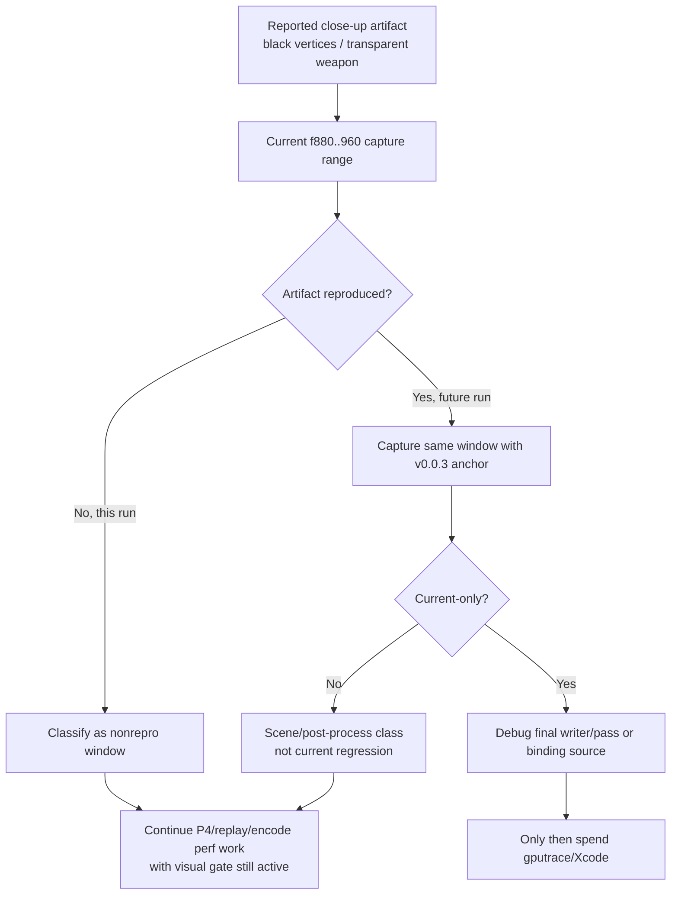

# Snapshot Cache Visual 03 - Current f880-960 Object-Window Visual Smoke

**Question.** After the latest report of black vertices, transparent weapon
parts, and lighting-coupled motion, does a current HEAD object-window capture
around the previously used `f910` class reproduce the artifact strongly enough
to stop the performance investigation?

**Verdict.** No. The current `880..960:10` internal backbuffer capture window is
visually coherent: rifle geometry, character geometry, ricochet particles,
sparks, strong bloom, and muzzle flashes are present in the sampled frames and
the final `actual.png`. This is not a proof that the user-observed close-up
weapon/lighting artifact never exists; it is a non-reproduction for this
window. Perf work can continue on P4/replay/encode candidates, but any run that
visibly shows the close-up artifact still needs a same-window capture-range or
draw-local proof before its FPS or Xcode counter deltas are promoted.

## Method

Current dirty-source runtime was rebuilt and staged through the standard
3DMark05 wrapper. The run was no-gputrace, foreground-kept, timeout-supervised,
and captured internal backbuffers so the evidence is not a single drifting
window screenshot:

```sh
bash scripts/tools/run_3dmark05_perf_probe.sh \
  --suffix visual-object-current-f880-960-r1 \
  --frame 60 \
  --no-gputrace \
  --no-encoder-breakdown \
  --frame-sampling \
  --timeout 120 \
  --keep-frontmost \
  --capture-range 880:960:10 \
  --capture-delay-sec 45
```

The wrapper wrote the capture range to:

```text
traces/app-d3d9-3dmark05-visual-object-current-f880-960-r1/analysis/captures/
```

## Evidence

| Signal | Value |
|---|---:|
| `status` | `pass` |
| `capture_error` | `None` |
| captured internal frames | `880, 890, 900, 910, 920, 930, 940, 950, 960` |
| `present_encoded` | `1,740` |
| `sampled_avg_fps` | `16.232` |
| `draw_skipped_no_pipeline` | `0` |
| `gpu_command_buffer_errors` | `0` |
| `completion_wait_with_enqueue_ms_per_present` | `0.181` |
| `completion_wait_without_enqueue_ms_per_present` | `28.383` |

Qualitative reading:

- `frame000880..910`: rifle, character silhouette, ricochet sparks, and beam
  effects are coherent; no weapon-attached black triangle or transparent rifle
  tear is visible.
- `frame000920..960`: the large dark foreground shape is the moving scene
  occluder class already discussed in [snapshot-cache-visual.02](snapshot-cache-visual.02.md), not a
  newly localized weapon/lighting failure in this window.
- `actual.png`: multiple rifle muzzle flashes and bloom discs render in the
  wide firefight view.

## Interpretation

This narrows the current correctness state:

- `v0.0.3` remains the visual-safe anchor for candidate promotion.
- The sampled `f880..960` object window is not a blocker for continuing
  performance work.
- The reported close-up black/transparent weapon artifact is still actionable
  only if reproduced in its own capture range, ideally with the same
  `--capture-range` method and then a `v0.0.3` anchor comparison.
- No `.gputrace` spend is justified by this non-reproduction alone. Use
  no-gputrace visual windows first; escalate to Xcode only after a target frame
  and final-writer/pass owner are known.

## Flow


