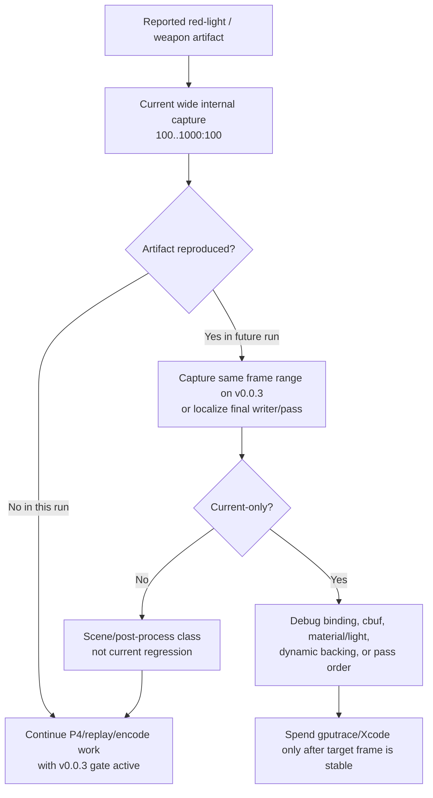

# Snapshot Cache Visual 04 - Current Wide-Window Visual Scout

**Question.** Does a wider current HEAD internal capture window reproduce the
reported red-light / close-up weapon / black-vertex artifact strongly enough to
pause P4/replay/encode performance work?

**Verdict.** No. The current `100..1000:100` internal backbuffer scout is a
second non-reproduction: red corridor frames, wide firefight frames, the
`f900` object window, and the `f1000` close-up all render coherent geometry,
lighting, muzzle/bloom, and particles in this run. This does not prove the
user-observed artifact is impossible; it says the current sampled windows are
not a wall and are not a reason to promote or reject performance candidates by
visual suspicion alone.

## Method

No-gputrace, no encoder-breakdown, foreground-kept, timeout-supervised visual
scout:

```sh
bash scripts/tools/run_3dmark05_perf_probe.sh \
  --suffix visual-current-wide-window-r1 \
  --frame 60 \
  --no-gputrace \
  --no-encoder-breakdown \
  --frame-sampling \
  --timeout 120 \
  --keep-frontmost \
  --capture-range 100:1000:100 \
  --capture-delay-sec 45
```

The wrapper rebuilt/staged the current dirty-source runtime and wrote internal
backbuffer captures under:

```text
traces/app-d3d9-3dmark05-visual-current-wide-window-r1/analysis/captures/
```

## Evidence

| Signal | Value |
|---|---:|
| `status` | `pass` |
| `timed_out` | `false` |
| `capture_error` | `None` |
| captured internal frames | `100, 200, 300, 400, 500, 600, 700, 800, 900, 1000` |
| `present_encoded` | `1,803` |
| `sampled_avg_fps` | `16.457` |
| `draw_skipped_no_pipeline` | `0` |
| `gpu_command_buffer_errors` | `0` |
| `completion_wait_with_enqueue_ms_per_present` | `0.050` |
| `completion_wait_without_enqueue_ms_per_present` | `28.053` |
| `encode_dequeue_ready_depth_max` | `1` |

Qualitative reading:

- `frame000100..200`: red corridor and weapon/character silhouettes are dark
  but coherent; no weapon-attached transparent tear or black-triangle drift is
  visible in the captured backbuffer.
- `frame000300..800`: wide scene, soldiers, crates, floor highlights, muzzle
  flashes, and bloom are present.
- `frame000900`: the known dark foreground/object class appears, but this class
  was already lowered by [snapshot-cache-visual.02](snapshot-cache-visual.02.md) and
  [snapshot-cache-visual.03](snapshot-cache-visual.03.md).
- `frame001000`: close-up armored character and bright muzzle/bloom render
  coherently.

The performance shape remains the known P4 form: the run is almost entirely
no-enqueue completion wait (`99.821%` no-enqueue share), so this visual smoke
does not change the current FPS owner.

## Interpretation

The current correctness stance is:

- `v0.0.3` remains the visual-safe anchor before promoting mutating performance
  candidates.
- The sampled wide current window is visually safe enough to continue
  P4/replay/encode work.
- A future report that visibly reproduces the weapon/lighting artifact should
  be captured as a same-window internal backbuffer range first, then compared
  to `v0.0.3` or localized by draw/pass owner before any `.gputrace` spend.
- Do not use this run as an Xcode/GPU-performance proof; it is a visual gate
  and low-overhead P4-shape refresh only.

## Flow


