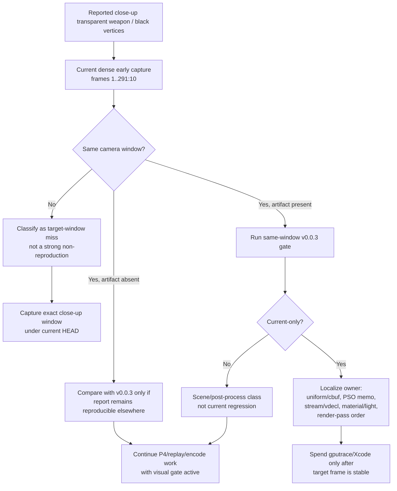

# Snapshot Cache Visual 05 - Red Corridor Close-Up Regression Scout

**Question.** Does a denser early red-corridor internal capture reproduce the
reported close-up transparent weapon / weapon-attached black-vertex artifact?

**Verdict.** Not in this run, but this is a target-window miss rather than a
strong non-reproduction. Frames `1..291:10` cover the red corridor and the
transition into the wide firefight, but they do not match the reported close-up
camera composition. The captured red-corridor frames are dark but coherent, and
the later `actual.png` frame renders normal muzzle/bloom effects. The next
visual gate should capture the exact close-up window before changing the
performance plan or spending `.gputrace`.

## Method

No-gputrace, no encoder-breakdown, foreground-kept, timeout-supervised visual
scout:

```sh
bash scripts/tools/run_3dmark05_perf_probe.sh \
  --suffix visual-redcorridor-regression-r1 \
  --frame 60 \
  --no-gputrace \
  --no-encoder-breakdown \
  --frame-sampling \
  --timeout 120 \
  --keep-frontmost \
  --capture-range 1:300:10 \
  --capture-delay-sec 45
```

The wrapper rebuilt/staged the current dirty-source runtime and wrote internal
backbuffer captures under:

```text
traces/app-d3d9-3dmark05-visual-redcorridor-regression-r1/analysis/captures/
```

## Evidence

| Signal | Value |
|---|---:|
| `status` | `pass` |
| `timed_out` | `false` |
| `capture_error` | `None` |
| captured internal frames | `1, 11, ..., 291` |
| `present_encoded` | `1,767` |
| `sampled_avg_fps` | `16.100` |
| `draw_skipped_no_pipeline` | `0` |
| `gpu_command_buffer_errors` | `0` |
| `completion_wait_with_enqueue_ms_per_present` | `0.000` |
| `completion_wait_without_enqueue_ms_per_present` | `28.076` |
| `encode_dequeue_ready_depth_max` | `1` |

Qualitative reading:

- `frame000001` is black/startup and not scene evidence.
- `frame000011..191` show the red corridor. The foreground soldiers and weapons
  are very dark under red lighting, but the captured geometry is coherent.
- `frame000201..291` transitions into the wide firefight and does not show the
  reported close-up weapon overlay.
- `actual.png` is a later wide firefight frame with visible muzzle/bloom and no
  skipped-pipeline or Metal-error counter signal.

## Interpretation

This scout is useful because it prevents the current report from being promoted
to a global wall, but it does not close the bug:

- Current performance work remains gated by `v0.0.3` visual safety.
- The reported artifact still needs a same-window current capture. The existing
  `1..291:10`, `100..1000:100`, and `880..960:10` windows are not exact enough.
- If the exact close-up reproduces, the next split should be same-window
  current-vs-`v0.0.3` first, then a small A/B against likely visual owners:
  compact uniform ABI prefix, PSO resource-shape memo, stream/vdecl binding
  carrier, material/light state, or render-pass ordering.
- Do not use this run as Xcode/GPU evidence. It is a no-gputrace visual target
  search and P4-shape refresh only.

## Flow


