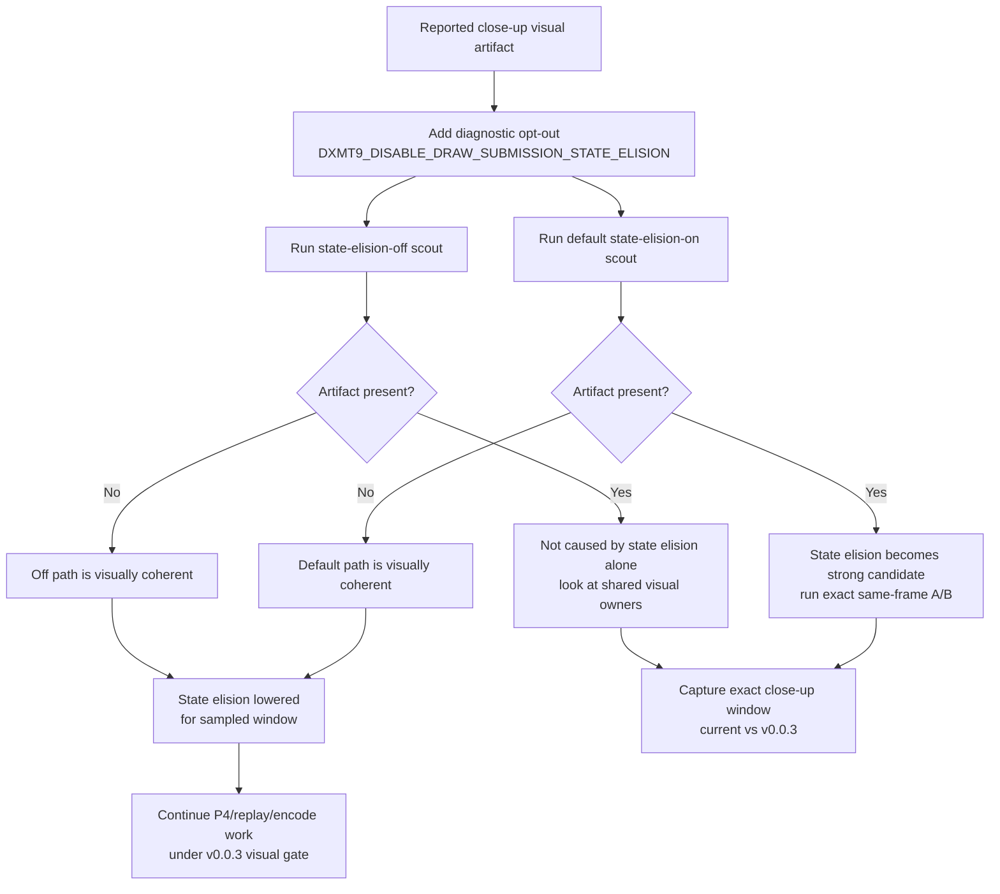

# Snapshot Cache Visual 06 - Draw Submission State-Elision Visual A/B

**Question.** Is the latest reported transparent weapon / black-vertex /
lighting artifact directly caused by same-generation draw-submission state-copy
elision?

**Verdict.** Not reproduced by this A/B. `DXMT9_DISABLE_DRAW_SUBMISSION_STATE_ELISION=1`
successfully forces every draw submission to materialize state again
(`d3d9_snapshot_state_elided=0`), while the default run re-enables the current
state-elision path (`411,532` elisions, `4.211GiB` elided). Both captured
firefight frames render coherent geometry, muzzle flash, bloom, sparks, and
lighting. Treat state elision as lowered for this visual report, not as closed
for all possible same-frame regressions.

## Method

State-elision-off visual scout:

```sh
DXMT9_DISABLE_DRAW_SUBMISSION_STATE_ELISION=1 \
bash scripts/tools/run_3dmark05_perf_probe.sh \
  --suffix visual-state-elision-off-r1 \
  --frame 60 \
  --no-gputrace \
  --no-encoder-breakdown \
  --frame-sampling \
  --timeout 120 \
  --keep-frontmost \
  --wait-unlocked-sec 5 \
  --wait-unlocked-interval-sec 1
```

Default current-path visual scout:

```sh
bash scripts/tools/run_3dmark05_perf_probe.sh \
  --suffix visual-state-elision-on-r1 \
  --frame 60 \
  --no-gputrace \
  --no-encoder-breakdown \
  --frame-sampling \
  --timeout 120 \
  --keep-frontmost \
  --wait-unlocked-sec 5 \
  --wait-unlocked-interval-sec 1
```

The off/on `actual.png` screenshots are time-based and landed at nearby but not
identical GT1 frames (`1068` and `1083`). This is therefore a broad visual A/B,
not a pixel-equal same-frame proof.

## Evidence

| Signal | State elision off | Default state elision on |
|---|---:|---:|
| `status` | `pass` | `pass` |
| `timed_out` | `false` | `true` |
| `present_encoded` | `1,799` | `1,800` |
| `d3d9_snapshot_state_elided` | `0` | `411,532` |
| `d3d9_snapshot_state_elided_bytes` | `0` | `4,210,795,424` |
| `d3d9_snapshot_state_materialized` | `879,885` | `470,508` |
| `d3d9_snapshot_state_copy_cpu_ms` | `274.227` | `152.888` |
| `commit_chunk_queue_draw_submission_cpu_ms` | `7,265.941` | `6,976.788` |
| `completion_wait_without_enqueue_ms` | `50,547.446` | `50,117.600` |
| `completion_wait_with_enqueue_ms` | `49.836` | `289.286` |
| `encode_dequeue_ready_depth_max` | `1` | `1` |
| `gpu_command_buffer_time_ms` | `5,733.009` | `5,773.902` |
| `map_buffer_total_ms` | `802.652` | `799.311` |

Qualitative reading:

- State-elision-off frame `1068` shows a wide firefight with large bloom,
  muzzle flashes, ricochet/spark particles, coherent soldiers, crates, and
  lighting.
- Default frame `1083` shows the same broad firefight class with state elision
  active and similarly coherent bloom, sparks, crates, soldiers, and lighting.
- Neither frame reproduces the transparent-weapon or weapon-attached
  black-vertex artifact.
- The default run timed out after writing complete artifacts, matching the
  known final-frame hang policy; it is valid as a timeout-finalized visual and
  counter sample, not as a wall-clock lifetime sample.

## Interpretation

This A/B lowers one plausible correctness owner:

- Same-generation draw-submission state-copy elision is not the direct owner for
  the sampled effects-heavy window.
- The diagnostic knob remains useful when an exact close-up reproducer exists,
  because it can cleanly isolate the state-elision path without disabling the
  wider binding-agnostic snapshot lane.
- The remaining visual report still needs a same-window capture. If the exact
  close-up reproduces, compare current vs `v0.0.3` first, then split likely
  owners: compact uniform ABI prefix, cbuf identity/update, PSO resource-shape
  memo, stream/vdecl binding override, material/light state, or render-pass
  ordering.
- Average-FPS work remains P4/replay/encode shaped: both runs keep ready-depth
  max at `1`, and neither produces enqueue-during-wait overlap.

## Flow


