# State-Churn Encode — the CPU encode path and draw-run batching

> Part of the 3DMark05 GT1 GPU-bottleneck investigation. Root map: [[overview-3dmark05-gt1]].

## Scope & question

This domain owns the **CPU encode side** of GT1: why the importer almost never
batches draws into draw-runs, what state actually breaks the runs, and what the
binding-override fix bought. It introduces the per-encoder breakdown
instrumentation (`DXMT9_PERF_ENCODER_BREAKDOWN=1`), measures stream/IB handle
churn, decomposes the draw-run state-delta taxonomy down to the exact stream+IB
pair, lands the `DrawBindingOverride` payload that lets stream/IB-only changes
batch, rechecks after submission batching, and tests disabling auto-expand-indexed.
Every finding here is CPU-throughput. None of them move the GPU frame-time
bottleneck — that is owned by [[hidden-backend-storage]].

## Hypotheses & verdicts

| # | Hypothesis | Verdict | Evidence |
|---|-----------|---------|----------|
| H1 | The per-draw encode path stays hot because ~99.9% of draws fail to batch | accepted | [[state-churn-encode-drawrun.01]] (580 submits vs 913k draws) |
| H2 | A draw-run cannot blindly cross a constant-upload record (one shared uniform) | accepted | [[state-churn-encode-drawrun.02]] (ConstantUpload stop; per-draw snapshot fallback) |
| H3 | Draw-run breaks are offset/stride churn | rejected | [[state-churn-encode-stream.01]], [[state-churn-encode-stream.02]] (handle churn 81.5-81.9%) |
| H4 | Handle churn is per-draw object creation (lock/rename) | rejected | [[state-churn-encode-stream.03]] (bounded ~184/93 handles, managed-pool alternation) |
| H5 | State-delta breaks are dominated by exact stream+IB pairs | accepted | [[state-churn-encode-statedelta.01]]→[[state-churn-encode-statedelta.03]] (82.17% stream+IB-only) |
| H6 | A per-draw stream/IB binding override cuts encode CPU without moving GPU or churn | accepted (CPU win) | [[state-churn-encode-binding.01]] (-30.13% stream-bind CPU, GPU +0.03%) |
| H7 | More draw/submission batching moves the GPU limiter | rejected | [[state-churn-encode-batch.01]] (VS write flat at ~1627 MiB) |
| H8 | Disabling auto-expand-indexed reduces top-pass GPU buffer writes | rejected (GPU); inconclusive (correctness) | [[state-churn-encode-expand.01]], [[state-churn-encode-expand.02]] |
| H9 | Extending `_skipped` bind-cache pattern to vertex_buffer / index_buffer / pipeline / rasterizer / viewport / scissor / depth_state cuts per-CB encode below the 16.67 ms vsync slot | rejected | [[present-pacing-bind-cache-work-a.01]] (0% wallclock movement; `encode_chunk_cpu_ms` rose) |
| H10 | Reducing `mixed_pair_stream_*` draw-run break frequency raises mean run length from 1.88 toward the 32-record cap | open | [[present-pacing-encode-budget-fix-proposal.01]] |
| H11 | The old unattributed `encode_draw_cpu_ms` remainder is mostly argbuf setup and binding-packet construction/bookkeeping | accepted attribution | [[state-churn-encode-encode-phase.01]], [[state-churn-encode-encode-phase.02]] (`argbuf_cbuf_update=3.92s`, `binding_packet_cache=1.87s`, `argbuf_open=1.21s`) |
| H12 | Skipping clean/no-op argbuf cbuf updates is enough to move the encode budget | rejected as major lever; accepted micro | [[state-churn-encode-encode-phase.03]] (272,956 clean skips, but cbuf-update only -39.7ms; 778,587 dirty writes remain) |
| H13 | Dirty-bit-only partial cbuf repoint can reuse clean categories on argbuf reopen | rejected; new attribution accepted | [[state-churn-encode-encode-phase.04]] (0 cached repoints; 760,157 no-dirty hash mismatches force conservative full dirty upload) |
| H14 | Per-category cbuf identity can repoint cached VS/PS/FFPPS entries on no-dirty payload mismatch | accepted CPU win | [[state-churn-encode-encode-phase.05]] (`encode_draw_cpu_ms` -3.42s, transient bytes -62.05%, dirty cbuf calls -41.88%) |
| H15 | The current category-identity checkout still renders a normal GT1 frame and stable counters | accepted smoke | [[state-churn-encode-encode-phase.06]] (`actual.png` normal robot/flare/HUD frame; cbuf repoint calls +0.02% vs identity-r1) |
| H16 | The remaining binding-packet cache cost is mostly full key probe/equality rather than pure miss/store cost | accepted attribution | [[state-churn-encode-encode-phase.07]] (`probe=939ms`, `key=495ms`, hit rate 85.51%, collision share of misses 99.92%; attribution timers only) |
| H17 | Hashing/probing the already-built binding packet plan directly removes the hot key/probe cost | accepted CPU win | [[state-churn-encode-encode-phase.08]] (`binding_packet_cache` -57.34%, `binding_packet` -30.96%, `encode_draw` -7.40% vs identity smoke; normal GT1 frame) |
| H18 | `argbuf_open` is mostly Metal argument-encoder retarget cost | rejected; attribution accepted | [[state-churn-encode-encode-phase.09]] (`setArgumentBuffer=115ms`; reserve `746ms`, table bind `193ms`, skip `0`) |
| H19 | Skipping transient arena overlap scans on the non-wrapped append path reduces argbuf-open CPU | accepted CPU win | [[state-churn-encode-encode-phase.10]] (`reserve` -51.95%, `argbuf_setup` -16.33%, `encode_draw` -3.87%; same `1680` presents) |
| H20 | Dirty cbuf categories often still match encoder-local cached identities and can be repointed | rejected | [[state-churn-encode-encode-phase.11]] (VS/PS/FFPPS dirty identity hits all `0`; probe removed) |
| H21 | The remaining `stream_bind` parent has one dominant bind class | rejected as single-class; attribution accepted | [[state-churn-encode-encode-phase.12]] (texture/sampler `1065ms`, index `670ms`, shader stream `497ms`, raster `389ms`; FFP stream negligible) |
| H22 | Texture/sampler bind cost is spread across fragment/vertex/resource-array/LOD-bias lanes | rejected as broad split; attribution accepted | [[state-churn-encode-encode-phase.13]] (fragment resolve `575ms`, fragment direct `317ms`; resource-array, vertex textures, and LOD bias all `0`) |
| H23 | Sampler binds can skip `samplerStateFor()` before materializing a Metal handle | accepted CPU win | [[state-churn-encode-encode-phase.14]] (`sampler_lookup_skipped_prehandle=2,108,453`, texture/sampler parent -18.84%, encode_draw -117ms) |
| H24 | Direct sampler shadowing should reuse the packet's sampler-state hash instead of rehashing each entry | accepted CPU win | [[state-churn-encode-encode-phase.15]] (`fragment_direct` -68.425ms, texture/sampler parent -69.616ms, `encode_draw` -126.622ms; heavy split counters are opt-in) |
| H25 | Fragment texture resolve can skip `findTexture()` / `textureForShaderRead()` by matching D3D texture handle + sRGB before materializing the Metal handle | rejected as default CPU win; removed from hot path | [[state-churn-encode-encode-phase.16]] (`1,206,015` pre-resolve skips and local resolve -28.902ms, but texture/sampler parent +48.224ms; temporary default-off smoke proved skip counter `0`; after branch removal, texture/sampler parent returned to baseline `822.864 -> 821.007`) |
| H26 | Remaining cbuf update time is mainly Metal `setBuffer` or transient upload | rejected; attribution accepted | [[state-churn-encode-encode-phase.17]] (`setBuffer=114.568ms`, upload `276.019ms`, build `477.921ms`, inferred residual `954.163ms`; VS residual `618.150ms`) |
| H27 | The phase.17 cbuf residual is mostly upload-plan or observer cost | rejected; binding-hash attribution accepted | [[state-churn-encode-encode-phase.18]] (`binding_hash=570.070ms`, VS `489.627ms`; `upload_plan=43.287ms` nested in build; observer `0`) |

## Verification methods

- **`DXMT9_PERF_ENCODER_BREAKDOWN=1`** — emits `[dxmt9-perf-encoder]` (one row
  per render-encoder close) and `[dxmt9-perf-encoder-stream]` (per used stream)
  lines: stream/IB samples, Metal binds, handle/offset/stride changes, argbuf
  table/cbuf bytes, `setVertexBytes`, geometry transient vertex/index bytes,
  unique-handle counts/bytes/pool buckets. Proves churn is handle-dominated.
- **`commit_chunk_draw_run_*` counters** — `_submits`, `_records`, break-type
  (`_const_upload`), and the state-delta sub-buckets (`_stream_only`, `_ib_only`,
  `_texture_only`, `_mixed`, `_mixed_group2/3/4plus`, `_mixed_pair_stream_ib`,
  `_stream_ib_only`). Size each draw-run break class exactly.
- **`DrawBindingOverride` payload** — per-draw serialized stream/IB binding range
  in `DrawParam`; lets `scanImportedDrawRun()` accept stream-only and
  stream+IB-only runs. Counters: `commit_chunk_draw_run_binding_override_{records,bytes,stream_records,ib_records}`.
- **`RenderPass[seq=N,enc=N,rt=,depth=]` labels** — join dxmt per-encoder
  attribution to Xcode counters without row-order assumptions.
- **Run-level CPU gates** — `--require-binding-overrides-present`,
  `--require-draw-submission-batch-present`,
  `--require-draw-run-records-increase`, `--require-encode-draw-cpu-decrease`
  prove the intended CPU mechanism by `result.json` before reading Xcode frame
  counters.
- **`DXMT_DISABLE_AUTO_EXPAND_INDEXED=1`** — removes the indexed-expansion
  transient vertex amplifier (correctness-risky; needs image proof).

## Experiment dependency graph

```mermaid
flowchart TD
  classDef accepted fill:#d6f5d6,stroke:#2b7a2b,color:#063
  classDef rejected fill:#f8d7da,stroke:#a33,color:#600
  classDef open fill:#fff3cd,stroke:#a80,color:#640

  Drawrun1["drawrun.01\nfailure shape\n580 submits / 913k draws"]:::accepted
  Drawrun2["drawrun.02\nconst-upload boundary\nper-draw uniform"]:::accepted
  Enc1["encoder.01\nfirst breakdown\ncbuf 4.64GB / transient 1.05GB"]:::accepted
  Enc2["encoder.02\nbinding/bytes\ntransient=0 no-auto-expand"]:::accepted
  Stream1["stream.01\nstream split\nhandle 81.9% / IB 81.5%"]:::rejected
  Stream2["stream.02\ndelta breakdown\nIB delta all handle"]:::rejected
  Stream3["stream.03\nunique handles\nbounded alternation"]:::rejected
  Churn["churn.01\nDrawBindingOverride design"]:::accepted
  SD1["statedelta.01\nbucket split\n85.66% mixed"]:::accepted
  SD2["statedelta.02\nmixed pairs\n96.61% 2-group"]:::accepted
  SD3["statedelta.03\nexact stream+IB\n82.17%"]:::accepted
  Bind["binding.01\noverride fix\n-30.13% stream CPU / GPU +0.03%"]:::accepted
  Batch["batch.01\nHEAD recheck\nVS write flat 1627MiB"]:::rejected
  Join["encoder.03\nlabel-join\ndxmt 450KiB vs 1.63GiB"]:::accepted
  Exp1["expand.01\nno-auto-expand\nGPU 3.64->3.54s"]:::open
  Exp2["expand.02\nsame-frame Xcode\nwrites unchanged"]:::rejected
  EncodePhase["encode-phase.01\nargbuf 5.07s / packet 2.57s"]:::accepted
  EncodePhase2["encode-phase.02\ncbuf update 3.92s;\npacket cache 1.87s"]:::accepted
  EncodePhase3["encode-phase.03\nclean cbuf gate\n272k skips / -39.7ms"]:::accepted
  EncodePhase4["encode-phase.04\nreopen mask attribution\n760k no-dirty hash mismatches"]:::accepted
  EncodePhase5["encode-phase.05\ncategory identity repoint\nencode_draw -3.42s"]:::accepted
  EncodePhase6["encode-phase.06\ncurrent smoke\nnormal GT1 frame"]:::accepted
  EncodePhase7["encode-phase.07\nbinding packet split\nprobe 939ms / key 495ms"]:::accepted
  EncodePhase8["encode-phase.08\nplan-direct cache\ncache -57.34%"]:::accepted
  EncodePhase9["encode-phase.09\nargbuf open split\nreserve 746ms / setArg 115ms / table skip 0"]:::accepted
  EncodePhase10["encode-phase.10\ntransient fast append\nreserve -51.95% / encode_draw -3.87%"]:::accepted
  EncodePhase11["encode-phase.11\ndirty identity probe\n0 hits / rejected"]:::rejected
  EncodePhase12["encode-phase.12\nstream bind split\ntexture 1065ms / index 670ms\nshader 497ms / raster 389ms"]:::accepted
  EncodePhase13["encode-phase.13\ntexture sampler split\nfragment resolve 575ms\nfragment direct 317ms"]:::accepted
  EncodePhase14["encode-phase.14\nsampler pre-handle skip\n2.11M lookups avoided\ntexture parent -18.84%"]:::accepted
  EncodePhase15["encode-phase.15\nsampler-state hash reuse\nfragment direct -68ms"]:::accepted
  EncodePhase16["encode-phase.16\ntexture pre-resolve skip\n1.206M skips but parent +48ms"]:::rejected
  EncodePhase17["encode-phase.17\ncbuf category operation split\nresidual 954ms / VS residual 618ms"]:::accepted
  EncodePhase18["encode-phase.18\ncbuf residual split\nbinding hash 570ms\nVS hash 490ms"]:::accepted

  Drawrun1 -->|"split-into"| Drawrun2
  Drawrun1 -->|"measured-by"| Enc1
  Enc1 -->|"stream-split"| Stream1
  Stream1 -->|"delta-confirm"| Stream2
  Stream2 -->|"unique-handle"| Stream3
  Stream1 -->|"handle-churn->design"| Churn
  Drawrun1 -->|"state-delta-split"| SD1
  SD1 -->|"mixed-pairs"| SD2
  SD2 -->|"exact-pair"| SD3
  SD3 -->|"motivated"| Bind
  Churn -->|"mechanism-for"| Bind
  Bind -->|"recheck"| Batch
  Enc2 -->|"label-join"| Join
  Stream3 -->|"flagged-amplifier"| Exp1
  Exp1 -->|"same-frame-validate"| Exp2
  Exp2 -->|"motivated-labels"| Join
  Batch -->|"GPU unmoved"| Join
  Batch -->|"CPU remainder split"| EncodePhase
  EncodePhase -->|"child buckets"| EncodePhase2
  EncodePhase2 -->|"safe no-op gate"| EncodePhase3
  EncodePhase3 -->|"dirty path split"| EncodePhase4
  EncodePhase4 -->|"category identity"| EncodePhase5
  EncodePhase5 -->|"fresh smoke"| EncodePhase6
  EncodePhase6 -->|"next hot child split"| EncodePhase7
  EncodePhase7 -->|"plan-direct cache"| EncodePhase8
  EncodePhase8 -->|"argbuf open split"| EncodePhase9
  EncodePhase9 -->|"remove arena scan"| EncodePhase10
  EncodePhase10 -->|"dirty upload reuse probe"| EncodePhase11
  EncodePhase11 -->|"split next named bucket"| EncodePhase12
  EncodePhase12 -->|"split texture/sampler child"| EncodePhase13
  EncodePhase13 -->|"avoid skipped sampler lookup"| EncodePhase14
  EncodePhase14 -->|"reuse sampler state hash"| EncodePhase15
  EncodePhase15 -->|"try texture source pre-resolve"| EncodePhase16
  EncodePhase16 -->|"return to cbuf bucket"| EncodePhase17
  EncodePhase17 -->|"split residual"| EncodePhase18
```



## Results synthesis

The CPU encode story is settled. The per-draw encode path stays hot because
~99.94% of draws fail to batch into draw-runs ([[state-churn-encode-drawrun.01]]):
constant-upload boundaries are the largest break class, and state-delta breaks
are second. The per-encoder breakdown ([[state-churn-encode-encoder.01]],
[[state-churn-encode-stream.01]]) proved the state-delta churn is **handle
churn** (81.5-81.9% of stream/IB samples), not offset/stride, and that the
handles are a bounded set repeatedly *alternated* — not per-draw created
([[state-churn-encode-stream.03]]). The state-delta taxonomy
([[state-churn-encode-statedelta.01]]→[[state-churn-encode-statedelta.03]])
narrowed the dominant break to the *exact stream+IB pair* (82.17% of all
state-delta), naming the precise payload target. The `DrawBindingOverride` path
([[state-churn-encode-churn.01]], [[state-churn-encode-binding.01]]) then carried
per-draw stream/IB bindings inside a run, cutting stream-bind encode CPU
`-30.13%` and total encode CPU `-10.44%` with no churn increase — the one
**accepted CPU win** of this domain.

What is also settled is the negative: every GPU frame-time check stayed flat.
The binding-override A/B moved `gpu_command_buffer_time_ms` only `+0.03%`; the
post-submission-batch HEAD recheck ([[state-churn-encode-batch.01]]) left the
top-three VS buffer write at ~`1627.3 MiB` (unchanged); disabling auto-expand
([[state-churn-encode-expand.01]], [[state-churn-encode-expand.02]]) removed the
CPU transient amplifier but left the Xcode top-pass buffer/device writes
unchanged at ~`1.63 GiB`. The label-join validation
([[state-churn-encode-encoder.03]]) is the clean proof: the top three encoders
own ~`98.4%` of frame GPU and ~`1.63 GiB` of buffer writes, while their entire
dxmt CPU/upload payload is ~`450 KiB`. These are CPU-throughput wins, orthogonal
to the GPU bottleneck. The only open item is the correctness of disabling
auto-expand-indexed, which still needs visual proof.

The current CPU-side open path has also narrowed. The broad bind-cache proposal
from [[present-pacing-encode-budget-fix-proposal.01]] is rejected by
[[present-pacing-bind-cache-work-a.01]]. Follow-up encode-phase timers first
named argbuf setup and binding-packet construction/bookkeeping
([[state-churn-encode-encode-phase.01]]), then split them into child buckets:
dirty cbuf mirroring (`3.92s`), binding-packet cache lookup/store (`1.87s`),
and argbuf table open/repoint (`1.21s`) ([[state-churn-encode-encode-phase.02]]).
The first mutating A/B then skipped `272,956` clean/no-op argbuf cbuf updates
but saved only `39.7ms` from that bucket ([[state-churn-encode-encode-phase.03]]).
The dirty-path split then rejected dirty-bit-only partial repoint:
[[state-churn-encode-encode-phase.04]] saw `0` cached repoints and `760,157`
no-dirty whole-payload hash mismatches that force conservative VS/PS/FFPPS
uploads. The follow-up category identity implementation closed that bet:
[[state-churn-encode-encode-phase.05]] repoints cached VS/PS/FFPPS entries on
no-dirty payload mismatch and cuts `encode_draw_cpu_ms` by `3.42s`
(`-17.74%`), transient upload bytes by `-62.05%`, and dirty cbuf calls by
`-41.88%` versus reopen mask. The fresh current-state smoke
[[state-churn-encode-encode-phase.06]] keeps the same counter shape and produces
a normal visible GT1 frame (`actual.png` robot/flare/HUD), so the path is no
longer counter-only. It is still weaker than same-input exact image proof. Treat
stream/texture/index bind counters as useful but partly nested aggregates.
The next child split also narrowed the binding-packet cache: in
[[state-churn-encode-encode-phase.07]], `cacheDrawBindingPacket()` spends most
of its measured local time in probe/full key equality (`939ms`) and key
construction (`495ms`), while store/copy is `292ms`. Hits are already 85.51%,
and 99.92% of misses are direct-map collisions, so associativity is plausible
but secondary until a compact packet identity/signature reduces hit-side
comparison cost. The next CPU implementation bet should therefore target
binding-packet identity/probe cost or D3D9 snapshot/state rebuild path, with
only smaller cbuf follow-ups such as narrowing FFPPS identity. That
binding-packet bet is now closed as a CPU win:
[[state-churn-encode-encode-phase.08]] hashes/probes the existing
`DrawBindingPacketPlan` directly and compares only active binding/sampler
prefixes, cutting `encode_draw_binding_packet_cache_cpu_ms` by `57.34%` and
total `encode_draw_cpu_ms` by `7.40%` versus current identity smoke with a
normal GT1 frame. After [[snapshot-cache-snapshot.09]], the priority has shifted
again: D3D9 snapshot submission is down to `7196.881ms` over `1740` presents,
while backend `encode_draw_cpu_ms` is `17711.215ms`. The packet-cache bucket
itself is no longer first-order (`965.745ms`), but the broader encode path still
is: argbuf setup (`4033.644ms`), binding-packet plan/cache (`2944.990ms`),
stream/texture binding (`2618.304ms` / `1017.715ms`), and issue cost
(`1094.704ms`) are the next named buckets to split or reduce before another
generic bind-cache guess.

The first follow-up split of that broader encode path is
[[state-churn-encode-encode-phase.09]]. It rejects the simple "argbuf open is
mostly `MTLArgumentEncoder.setArgumentBuffer`" explanation: the argument-encoder
retarget is only `115.192ms` over the run, while transient table reservation is
`745.942ms`, slot-30 render-table bind is `192.913ms`, cached cbuf repoint is
`326.434ms`, and content probing is `99.576ms`. `encode_draw_argbuf_table_bind_skipped`
is `0`, because the fresh-table design gives every reopened argbuf a distinct
offset. That makes more slot-30 bind shadowing the wrong next bet; the remaining
argbuf work has to be structural table allocation/open reduction or narrower
cache/repoint decision work.

The first structural table-allocation bet is accepted in
[[state-churn-encode-encode-phase.10]]. `ResourceArena` now skips the O(n)
live-allocation overlap scan when a request appends at the current slab cursor
and the live allocation deque is non-wrapped; wrapped ring states still use the
old scan. In a same-present A/B (`1680 -> 1680` presents), this cuts
`transient_upload_cpu_ms` `961.534 -> 223.304`, `encode_draw_argbuf_open_reserve_cpu_ms`
`745.942 -> 358.422` (`-51.95%`), `encode_draw_argbuf_setup_cpu_ms`
`4259.704 -> 3564.075` (`-16.33%`), and total `encode_draw_cpu_ms`
`17593.130 -> 16911.650` (`-3.87%`). GPU command-buffer time and
`completion_wait_ms` stay flat/noisy, so this is a CPU-throughput win only.
The residual argbuf work is now cbuf upload/build/repoint decision cost rather
than simple transient reservation scanning.

The first dirty-cbuf reuse follow-up is rejected in
[[state-churn-encode-encode-phase.11]]. A temporary dirty-category identity
probe tried to reuse cached VS/PS/FFPPS slices when a dirty reopen still matched
the current category identity. GT1 produced `0` hits for all three categories
over `19,769` partial-dirty reopen candidates, while adding `8.609ms` of probe
overhead. The branch was removed. Treat the dirty VS/PS/FFPPS update path as
real dirty work for this workload; the next cbuf direction has to reduce
upstream dirty frequency, make build/upload cheaper, or change the constants
layout, not add another identity repoint check.

The next retained attribution split is [[state-churn-encode-encode-phase.12]].
It decomposes `encode_draw_stream_bind_cpu_ms` after the fast-append baseline.
The run processed more presents (`1680 -> 1740`), so it is not an A/B CPU win,
but per-present GPU/`completion_wait_ms` stayed flat/noisy and the visible frame
was normal. The parent `stream_bind` bucket is distributed across multiple
classes: texture/sampler binding (`1065.369ms`, 35.66% of parent), index phase
(`669.907ms`, 22.43%), shader stream binding (`496.708ms`, 16.63%), and
raster/base-state work (`389.388ms`, 13.03%). FFP stream binding is only
`6.845ms`. The next stream-side work should therefore split texture/sampler
skip opportunities, index setup/source resolve, and shader-stream binding
diversity before attempting a broad bind-cache or FFP stream optimization.

That texture/sampler split is now recorded in
[[state-churn-encode-encode-phase.13]]. It is a same-present attribution run
(`1740 -> 1740`) with normal visual smoke. The path is almost entirely
fragment-stage: fragment resolve costs `575.228ms` and fragment direct
bind/shadow/set costs `316.761ms`, while resource-array binding, vertex
textures, and LOD-bias upload are all zero for this GT1 run. Existing skip
counters also show the direct path is already skipping heavily: texture binds
skip ~`52.69%`, and sampler binds skip ~`92.05%`. The useful next hypothesis is
not "add more sampler bind shadowing" after the handle exists; it is to avoid
materializing sampler handles/cache lookups before the shadow identity proves
the sampler bind will be skipped.

The follow-up implementation [[state-churn-encode-encode-phase.14]] accepts that
hypothesis as a CPU win. `TextureSamplerBindShadow` now stores an exact sampler
identity (`FlatStateSet`, LOD, argument-buffer support bit) in addition to the
final Metal handle, so the direct fragment sampler path can skip before calling
`samplerStateFor()`. In a same-present A/B, pre-handle skip count exactly
matches skipped sampler binds (`2,108,453`), remaining lookup calls exactly
match real sampler binds (`181,844`), `encode_draw_texture_sampler_bind_cpu_ms`
drops `1099.703 -> 892.480` (`-18.84%`), and total `encode_draw_cpu_ms` drops
`17842.278 -> 17724.955` (`-117.323ms`). GPU and completion wait remain
flat/noisy, so this is still a CPU-throughput win rather than a GPU/fps proof.

[[state-churn-encode-encode-phase.15]] closes the remaining sampler-side hash
tax in that direct lane. The binding packet now carries `samplerStateHash`, so
the sampler shadow key can mix the precomputed hash instead of rehashing the
`FlatStateSet` for every direct texture/sampler entry. In the default perf
profile this cuts `encode_draw_texture_sampler_fragment_direct_cpu_ms`
`495.039 -> 426.614` (`-68.425ms`) and the texture/sampler parent
`892.480 -> 822.864` (`-69.616ms`) in a same-present run. The heavy per-entry
direct split counters are preserved only behind
`DXMT9_PERF_TEXTURE_SAMPLER_DIRECT_SPLIT=1`.

The follow-up texture-side source match is rejected in
[[state-churn-encode-encode-phase.16]]. Matching D3D texture handle + sRGB before
`findTexture()` proves the mechanism (`1,206,015` skipped texture resolves) and
cuts the local fragment resolve bucket `186.426 -> 157.524`, but it regresses the
parent `encode_draw_texture_sampler_bind_cpu_ms` `822.864 -> 871.088` and leaves
total `encode_draw_cpu_ms` slightly worse. A temporary default-off smoke proved
the skip counter was `0`, but still showed parent texture/sampler instability,
so the rejected source-identity branch, counter, env flag, and extra shadow
fields were removed from the hot path. The removed-branch default run returns
texture/sampler parent CPU to baseline (`822.864 -> 821.007`) with a normal
visible frame, so default perf keeps the Metal-handle texture shadow from
[[state-churn-encode-encode-phase.15]].

With the texture path back at baseline, [[state-churn-encode-encode-phase.17]]
returns to the remaining cbuf-update bucket and splits build/upload/setBuffer by
VS/PS/FFP category. The result rejects the simple "Metal `setBuffer` owns cbuf
update" explanation: `setBuffer` is only `114.568ms`, transient upload is
`276.019ms`, and cbuf struct build is `477.921ms` over the `1680`-present run.
The inferred update residual is larger than all of them (`954.163ms`), dominated
by VS residual (`618.150ms`). [[state-churn-encode-encode-phase.18]] performs
that residual split and rejects upload-plan/observer as the owner:
`upload_plan` is only `43.287ms` and is nested inside build, while observer cost
is `0`. The newly named dominant child is binding content hash:
`encode_draw_argbuf_cbuf_binding_hash_cpu_ms=570.070`, with VS alone at
`489.627ms`. `writtenBindings` writeback is only `41.288ms`. That leaves a real
but smaller residual (`523.767ms` total; VS `200.752ms`). The next cbuf
implementation bet should therefore target safe `hashConstantBufferBytes()`
avoidance or deferral before changing constants layout, and any cache-key
semantic change needs same-input image proof because time-based GT1
`actual.png` is not a correctness oracle ([[baselines-visual-capture.01]]).

## How to run
Every experiment here is a 3DMark05 GT1 run via the standard wrapper. This is a
CPU draw-run / handle-churn domain: enable the per-encoder breakdown, run a cheap
`--no-gputrace` A/B, and prove the batching mechanism with run-level CPU gates:

```sh
DXMT9_PERF_ENCODER_BREAKDOWN=1 \
bash scripts/tools/run_3dmark05_perf_probe.sh --suffix state-churn --frame 60 \
  --no-gputrace --timeout 180

bash scripts/tools/finalize_3dmark05_perf_probe.sh --suffix state-churn --frame 60 \
  --baseline-output experiments/output/<baseline>/result.json \
  --require-binding-overrides-present --require-draw-submission-batch-present \
  --require-draw-run-records-increase --require-encode-draw-cpu-decrease
```

The `[dxmt9-perf-encoder]` / `[dxmt9-perf-encoder-stream]` lines and
`commit_chunk_draw_run_*` counters carry the churn attribution. The exact
per-experiment flags live in each leaf's `**Method.**` field. See
`agents/rules/environment_variables.rules.md` for env-var meanings and
`agents/rules/metal_debugging.rules.md` for the full workflow.

## Cross-references

- [[const-upload]] — constant-upload boundaries are the larger, separate
  draw-run break class (`2.88x` state-delta); crossing them needs const
  coalescing, not a stream/IB payload. The 4.64GB cbuf write bucket is measured
  in the same encoder-breakdown runs.
- [[snapshot-cache]] — the D3D9 draw-state snapshot cache and binding-agnostic
  snapshot reuse address the same per-draw state-binding cost from the front end.
- [[hidden-backend-storage]] — the GPU-side ~1.63GiB VS-write bucket these CPU
  wins do not touch; the label-join here is shared evidence for that domain.
- [[index-cache-locality]] — the one accepted *GPU-side* win, which reduces VS
  invocations rather than CPU encode cost; auto-expand is a different indexed-path
  axis.
- [[overview-3dmark05-gt1]] — root map, priority DAG, and ceiling synthesis.
