# State-Churn Encode — the CPU encode path and draw-run batching

> Part of the 3DMark05 GT1 GPU-bottleneck investigation. Root map: [[overview-3dmark05-gt1]].

## Scope & question

This domain owns the **CPU encode side** of GT1: why the importer almost never
batches draws into draw-runs, what state actually breaks the runs, and what the
binding-override fix bought. It introduces the per-encoder breakdown
instrumentation (`DXMT9_PERF_ENCODER_BREAKDOWN=1`), measures stream/IB handle
churn, decomposes the draw-run state-delta taxonomy down to the exact stream+IB
pair, lands the `DrawBindingOverride` payload that lets stream/IB-only changes
batch, rechecks after submission batching, and tests disabling auto-expand-indexed.
Every finding here is CPU-throughput. None of them move the GPU frame-time
bottleneck — that is owned by [[hidden-backend-storage]].

## Hypotheses & verdicts

| # | Hypothesis | Verdict | Evidence |
|---|-----------|---------|----------|
| H1 | The per-draw encode path stays hot because ~99.9% of draws fail to batch | accepted | [[state-churn-encode-drawrun.01]] (580 submits vs 913k draws) |
| H2 | A draw-run cannot blindly cross a constant-upload record (one shared uniform) | accepted | [[state-churn-encode-drawrun.02]] (ConstantUpload stop; per-draw snapshot fallback) |
| H3 | Draw-run breaks are offset/stride churn | rejected | [[state-churn-encode-stream.01]], [[state-churn-encode-stream.02]] (handle churn 81.5-81.9%) |
| H4 | Handle churn is per-draw object creation (lock/rename) | rejected | [[state-churn-encode-stream.03]] (bounded ~184/93 handles, managed-pool alternation) |
| H5 | State-delta breaks are dominated by exact stream+IB pairs | accepted | [[state-churn-encode-statedelta.01]]→[[state-churn-encode-statedelta.03]] (82.17% stream+IB-only) |
| H6 | A per-draw stream/IB binding override cuts encode CPU without moving GPU or churn | accepted (CPU win) | [[state-churn-encode-binding.01]] (-30.13% stream-bind CPU, GPU +0.03%) |
| H7 | More draw/submission batching moves the GPU limiter | rejected | [[state-churn-encode-batch.01]] (VS write flat at ~1627 MiB) |
| H8 | Disabling auto-expand-indexed reduces top-pass GPU buffer writes | rejected (GPU); inconclusive (correctness) | [[state-churn-encode-expand.01]], [[state-churn-encode-expand.02]] |
| H9 | Extending `_skipped` bind-cache pattern to vertex_buffer / index_buffer / pipeline / rasterizer / viewport / scissor / depth_state cuts per-CB encode below the 16.67 ms vsync slot | rejected | [[present-pacing-bind-cache-work-a.01]] (0% wallclock movement; `encode_chunk_cpu_ms` rose) |
| H10 | Reducing `mixed_pair_stream_*` draw-run break frequency raises mean run length from 1.88 toward the 32-record cap | open | [[present-pacing-encode-budget-fix-proposal.01]] |
| H11 | The old unattributed `encode_draw_cpu_ms` remainder is mostly argbuf setup and binding-packet construction/bookkeeping | accepted attribution | [[state-churn-encode-encode-phase.01]], [[state-churn-encode-encode-phase.02]] (`argbuf_cbuf_update=3.92s`, `binding_packet_cache=1.87s`, `argbuf_open=1.21s`) |
| H12 | Skipping clean/no-op argbuf cbuf updates is enough to move the encode budget | rejected as major lever; accepted micro | [[state-churn-encode-encode-phase.03]] (272,956 clean skips, but cbuf-update only -39.7ms; 778,587 dirty writes remain) |
| H13 | Dirty-bit-only partial cbuf repoint can reuse clean categories on argbuf reopen | rejected; new attribution accepted | [[state-churn-encode-encode-phase.04]] (0 cached repoints; 760,157 no-dirty hash mismatches force conservative full dirty upload) |
| H14 | Per-category cbuf identity can repoint cached VS/PS/FFPPS entries on no-dirty payload mismatch | accepted CPU win | [[state-churn-encode-encode-phase.05]] (`encode_draw_cpu_ms` -3.42s, transient bytes -62.05%, dirty cbuf calls -41.88%) |
| H15 | The current category-identity checkout still renders a normal GT1 frame and stable counters | accepted smoke | [[state-churn-encode-encode-phase.06]] (`actual.png` normal robot/flare/HUD frame; cbuf repoint calls +0.02% vs identity-r1) |
| H16 | The remaining binding-packet cache cost is mostly full key probe/equality rather than pure miss/store cost | accepted attribution | [[state-churn-encode-encode-phase.07]] (`probe=939ms`, `key=495ms`, hit rate 85.51%, collision share of misses 99.92%; attribution timers only) |
| H17 | Hashing/probing the already-built binding packet plan directly removes the hot key/probe cost | accepted CPU win | [[state-churn-encode-encode-phase.08]] (`binding_packet_cache` -57.34%, `binding_packet` -30.96%, `encode_draw` -7.40% vs identity smoke; normal GT1 frame) |
| H18 | `argbuf_open` is mostly Metal argument-encoder retarget cost | rejected; attribution accepted | [[state-churn-encode-encode-phase.09]] (`setArgumentBuffer=115ms`; reserve `746ms`, table bind `193ms`, skip `0`) |
| H19 | Skipping transient arena overlap scans on the non-wrapped append path reduces argbuf-open CPU | accepted CPU win | [[state-churn-encode-encode-phase.10]] (`reserve` -51.95%, `argbuf_setup` -16.33%, `encode_draw` -3.87%; same `1680` presents) |
| H20 | Dirty cbuf categories often still match encoder-local cached identities and can be repointed | rejected | [[state-churn-encode-encode-phase.11]] (VS/PS/FFPPS dirty identity hits all `0`; probe removed) |
| H21 | The remaining `stream_bind` parent has one dominant bind class | rejected as single-class; attribution accepted | [[state-churn-encode-encode-phase.12]] (texture/sampler `1065ms`, index `670ms`, shader stream `497ms`, raster `389ms`; FFP stream negligible) |
| H22 | Texture/sampler bind cost is spread across fragment/vertex/resource-array/LOD-bias lanes | rejected as broad split; attribution accepted | [[state-churn-encode-encode-phase.13]] (fragment resolve `575ms`, fragment direct `317ms`; resource-array, vertex textures, and LOD bias all `0`) |
| H23 | Sampler binds can skip `samplerStateFor()` before materializing a Metal handle | accepted CPU win | [[state-churn-encode-encode-phase.14]] (`sampler_lookup_skipped_prehandle=2,108,453`, texture/sampler parent -18.84%, encode_draw -117ms) |
| H24 | Direct sampler shadowing should reuse the packet's sampler-state hash instead of rehashing each entry | accepted CPU win | [[state-churn-encode-encode-phase.15]] (`fragment_direct` -68.425ms, texture/sampler parent -69.616ms, `encode_draw` -126.622ms; heavy split counters are opt-in) |
| H25 | Fragment texture resolve can skip `findTexture()` / `textureForShaderRead()` by matching D3D texture handle + sRGB before materializing the Metal handle | rejected as default CPU win; removed from hot path | [[state-churn-encode-encode-phase.16]] (`1,206,015` pre-resolve skips and local resolve -28.902ms, but texture/sampler parent +48.224ms; temporary default-off smoke proved skip counter `0`; after branch removal, texture/sampler parent returned to baseline `822.864 -> 821.007`) |
| H26 | Remaining cbuf update time is mainly Metal `setBuffer` or transient upload | rejected; attribution accepted | [[state-churn-encode-encode-phase.17]] (`setBuffer=114.568ms`, upload `276.019ms`, build `477.921ms`, inferred residual `954.163ms`; VS residual `618.150ms`) |
| H27 | The phase.17 cbuf residual is mostly upload-plan or observer cost | rejected; binding-hash attribution accepted | [[state-churn-encode-encode-phase.18]] (`binding_hash=570.070ms`, VS `489.627ms`; `upload_plan=43.287ms` nested in build; observer `0`) |
| H28 | `hashConstantBufferBytes()` is still required in the default cbuf cache path | rejected; CPU win accepted | [[state-churn-encode-encode-phase.19]] (`binding_hash=570.070 -> 0ms`; cbuf update `1.216 -> 0.875ms/present`; encode_draw `10.359 -> 10.006ms/present`) |
| H29 | Dirty cbuf upload must first materialize full `VsConsts` / `PsConsts` structs | rejected; prefix-preserving CPU win accepted | [[state-churn-encode-encode-phase.20]] (build `0.333815 -> 0.175342ms/present`; cbuf update `0.875284 -> 0.679652ms/present`; live-range-only prefix zeroing failed visual smoke) |
| H30 | Binding-packet sampler plans must rehash `FlatStateSet` payloads after snapshot key build | rejected; CPU win accepted | [[state-churn-encode-encode-phase.21]] (`binding_packet_plan` `0.666122 -> 0.599724ms/present`; packet parent `-4.42%`; full sampler equality retained) |
| H31 | Forcing full VS/PS cbuf uploads clearly fixes the suspected black/translucent GT1 geometry | inconclusive visual check; full-upload fallback rejected | [[state-churn-encode-encode-phase.22]] (`argbuf_hybrid_bytes_per_encoder` +519.59%; no obvious visual normalization; `actual.png` frame drift prevents exact verdict) |
| H32 | Draw submission batches can reuse stale argbuf cbuf slices when per-draw uniform payloads change but base hot constant hashes do not | accepted correctness fix; visual smoke restored | [[state-churn-encode-encode-phase.23]] (disable-batch A/B localizes artifact; payload component hash identity keeps batching and cuts dirty-fix traffic `-34.24%`) |
| H33 | Current stream/IB churn is a direct backend-storage Xcode candidate | rejected-current; handle-stable A/B required | [[state-churn-encode-stream.04]] (`60/2` binding tuple changes `160/187`, unique tuples `58`, stream1 extra changes `111`, explicit writers `0.089 B/vertex`) |
| H34 | Row-scoped staging can isolate stream/IB handle churn without changing draw/PSO/argbuf shape | accepted diagnostic; GPU win unproven | [[state-churn-encode-stream.08]] (`60/2` stream handle changes `271 -> 0`, IB `160 -> 0`, PSO `48 -> 48`, argbuf table `5056 -> 5056`, but staged copy `7.38 MiB` and offset churn remains) |
| H35 | Stream/IB handle identity owns the Xcode hidden backend write bucket | rejected as first-order GPU owner | [[state-churn-encode-stream.09]] (`60/2` stream/IB handle changes `271/160 -> 0/0`, but GPU `19.184 -> 19.278 ms`, VS write `981.159 -> 981.166 MiB`, VS invocations unchanged) |
| H36 | `bridge_commit_latency_ns` is raw Wine bridge/ABI overhead | rejected as bridge owner; commit_chunk replay accepted | [[state-churn-encode-encode-phase.24]] (`bridge_commit_latency=22.473s`, replay `21.839s`, import `88ms`, handle `542ms`, draw-batch-submit `3.234s`) |
| H37 | `commit_chunk_replay_cpu_ms` is mostly draw-run scan/state/const dispatch | rejected; queued submission/snapshot accepted | [[state-churn-encode-encode-phase.25]] (replay `22.224s`, queue submission `9.927s`, nested snapshot `7.697s`, draw-batch submit `3.229s`, draw-run submit `2.094s`) |
| H38 | `CommandQueue` submit residual can be localized before changing batching behavior | accepted attribution | [[state-churn-encode-encode-phase.26]] (`commit_chunk_draw_batch_submit_cpu_ms=3629.383`; batch append `2379.837ms`, compat scan `559.625ms`; resource mark/slot/chunk commit are small) |
| H39 | Snapshot cache misses may be inflated by declared draw-packet deltas that do not actually change non-binding state | rejected-current | [[state-churn-encode-encode-phase.28]] (`draw_packet_declared_nonbinding=419,990`, `actual_nonbinding=419,990`, `redundant_nonbinding=0`) |
| H40 | Snapshot/uniform cost is mostly real payload construction and hashing, not redundant invalidation | accepted local CPU win; FPS flat | [[state-churn-encode-encode-phase.28]], [[snapshot-cache-snapshot.10]] (`uniform_refresh 2014.263ms→814.507ms`, snapshot submission `7622.807ms→6495.069ms`, sampled FPS `15.717→15.752`) |
| H41 | The batch append owner is raw payload byte copy | rejected; state/uniform attribution accepted | [[state-churn-encode-encode-phase.29]] (`state=958ms`, `uniform=902ms`, `payload=65ms` despite `232.5MB` copied) |
| H42 | Removing extra `CanonicalDrawState` value hops cuts the state append child | accepted CPU win | [[state-churn-encode-encode-phase.30]] (`append` `2708→2116ms`, `state` `958→720ms`, GPU flat) |
| H43 | Remaining state append cost is PSO/invariant construction | rejected; SoA append attribution accepted | [[state-churn-encode-encode-phase.31]] (`state=879ms`, `SoA=707ms`, `PSO=50ms`, `invariant=22ms`; split timers add overhead) |
| H44 | Slot-local full-state interning amortizes the state SoA push | rejected; frontend generation fast path accepted as next proof | [[state-churn-encode-encode-phase.32]] (`0.150866%` state reuse hit rate; SoA `707ms→962ms`; first add generation/lane opportunity counters) |
| H45 | Adjacent same stable-generation/lane submissions can skip the deep compat compare | accepted proof | [[state-churn-encode-encode-phase.33]] (`52.524409%` same-generation/lane pairs; `385,120/385,120` compatible; `0` incompatible) |
| H46 | Using the generation/lane stamp as a compat fast path removes the compat scan bucket | accepted CPU win | [[state-churn-encode-encode-phase.34]] (`compat_scan` `557.621ms→44.923ms`; `draw_batch_submit` `3491.771ms→3070.200ms`) |
| H47 | Filling queued `DrawRunSubmission` entries in place removes a first-order queue copy | accepted small CPU win; rejected as first-order | [[state-churn-encode-encode-phase.35]] (`queue-snapshot residual` `2286.890ms→2193.875ms`; total queue `-0.60%`) |
| H48 | Reusing a device-owned pending submission vector removes per-chunk allocation churn | rejected-current | [[state-churn-encode-encode-phase.36]] (`queue-snapshot residual` `2193.875ms→2200.657ms`; scratch branch removed) |
| H49 | Reusing draw binding snapshot scratch removes per-group vector allocation churn | accepted small CPU win | [[state-churn-encode-encode-phase.37]] (`batch_binding_snapshot` `0.119755→0.089566ms/present`; total replay flat) |
| H50 | Shader bytecode value ownership makes layout/state copies allocate and copy bytecode per draw | accepted CPU win | [[state-churn-encode-encode-phase.38]] (`state_copy` `0.421921→0.271225ms/present`; queue submit `5.176033→4.792983ms/present`) |
| H51 | Sampler `FlatStateSet` capacity can be reduced from ID-space 64 to public D3DSAMP 16 | accepted CPU win | [[state-churn-encode-encode-phase.39]] (`FlatDrawStateRecord` `18,736→11,056B`; `state_copy` `0.271225→0.181239ms/present`) |
| H52 | Texture-stage `FlatStateSet` active-entry capacity can be split from the 64-key DeviceState id space | accepted targeted CPU win | [[state-churn-encode-encode-phase.40]] (`FlatDrawStateRecord` `11,056→9,008B`; `append_state_soa` `0.263628→0.220626ms/present`; `encode_draw` mixed) |
| H53 | Render-state `FlatStateSet` needs an active-entry count proof before compaction | accepted proof; shrink held | [[state-churn-encode-encode-phase.41]] (`render_state_entries_max=62`, `gt64=0`, but default table already has 62 entries) |
| H54 | Render-state flat payload can use a 128-slot priority active-entry set while keeping the full 256-state digest | accepted bounded CPU width win | [[state-churn-encode-encode-phase.42]] (`FlatDrawStateRecord` `9,008→7,984B`; GT1 render max `62`, overflow `0`; GPU flat) |
| H55 | Same-stamp non-front submissions can skip copied canonical state if batching is stamp-only | accepted proof; strict grouping remains diagnostic | [[state-churn-encode-encode-phase.44]] (`DXMT9_DRAWRUN_GROUP_BY_GEN_LANE=1`; `4.10GB` state bytes elided, state-copy CPU `-46.07%`, sampled FPS flat) |
| H56 | Elided submissions may still pay large `DrawRunSubmission` carrier construction cost | accepted bounded attribution | [[state-churn-encode-encode-phase.45]] (`emplace=1,123.253ms`, `13.99%` of queued submission, `0.646ms/present`; phase36 scratch reuse remains rejected) |
| H57 | Optional queued-submission carrier storage removes default construction without reusing vector capacity | accepted bounded CPU win | [[state-churn-encode-encode-phase.46]] (`emplace` `1,123.253→573.056ms`, `-48.98%`; queue submission `-2.04%`; sampled FPS `+0.64%`) |
| H58 | Default path still materializes non-front state that batch append discards | accepted attribution | [[state-churn-encode-encode-phase.47]] (`411,362` records / `4.209GB`, `46.70%` of batch records) |
| H59 | Same-stamp N-1 state-copy elision can be promoted without stamp-only batching | accepted default CPU cleanup | [[state-churn-encode-encode-phase.48]] (`discarded_state_records 411,362→0`, `state_elided=412,180`, state-copy CPU `261.001→138.856ms`, FPS flat/noisy) |
| H60 | Binding-packet cache associativity can reduce direct-map collision misses enough to cut encode CPU | rejected-current | [[state-churn-encode-encode-phase.49]] (misses/collisions `189k→133k`, but cache CPU `706.875→816.355ms` and encode CPU `+86ms`; code reverted) |
| H61 | The default indexed path spends CPU preparing diagnostic index byte spans even when all diagnostics/reorder paths are off | accepted CPU cleanup | [[state-churn-encode-encode-phase.50]] (`index_setup` `636.514→342.602ms`, index phase `775.311→480.350ms`, total encode only `-0.73%`, FPS flat/noisy) |
| H62 | Uniform payload append cost is dominated by repeated lookup-reserve checks | rejected-current | [[state-churn-encode-encode-phase.51]] (`append_uniform/present` `0.474488→0.474157ms`, parent append `+2.05%`; code reverted) |
| H63 | The remaining uniform append child is mostly payload copy/materialization rather than reserve/linking | accepted attribution | [[state-churn-encode-encode-phase.52]] (`append_copy=813.196ms`, lookup `294.215ms`, reserve `53.018ms`; attribution timers only) |
| H64 | Uniform payload append copy includes an avoidable aggregate-record temporary | accepted CPU cleanup | [[state-churn-encode-encode-phase.53]] (`append_copy` `813.196→602.274ms`, append-uniform parent `-13.15%`; FPS flat/noisy) |
| H65 | Reusing resolved prefetched PSO handles removes the remaining pipeline-lookup parent | rejected-current | [[state-churn-encode-encode-phase.54]] (`152,261` cache hits, but `pipeline_lookup` `934.420→950.626ms`; code reverted) |
| H66 | The `argbuf_open` parent is mostly actual Metal argument-buffer open work | rejected as phrased; post-open attribution accepted | [[state-churn-encode-encode-phase.55]] (`open_call=573.804ms`, `reopen_post=891.359ms`, table bind `178.803ms`, cached repoint `269.898ms`, content probe `123.303ms`) |
| H67 | Pre-open component identity can skip whole argbuf table reopen in GT1 | rejected-current | [[state-churn-encode-encode-phase.56]] (`961,473` candidates, `0` skips; VS misses `812,520`; identity check cost `956.102ms`) |
| H68 | The phase55 post-open residual is a single hidden argbuf child | rejected; distributed bookkeeping accepted | [[state-churn-encode-encode-phase.57]] (table probe `50.933ms`, byte account `51.990ms`, cbuf cache/dirty scans `118.813ms`, force dirty `104.757ms`; attribution timers add overhead) |
| H69 | The remaining binding-packet plan parent has one large child worth primary optimization | rejected as primary lever; attribution accepted | [[state-churn-encode-encode-phase.58]] (`DXMT9_PERF_BINDING_PACKET_PLAN_SPLIT=1`: fragment plan largest at `0.204682ms/present`; default-off guard keeps child counters `0` and parent near baseline) |
| H70 | Slot-local `DrawUniformPayload` dedup lookup is worth its GT1 CPU cost | rejected as default assumption; accepted diagnostic micro-win | [[state-churn-encode-encode-phase.59]] (`DXMT9_DISABLE_DRAW_UNIFORM_PAYLOAD_DEDUP=1`: lookup `276.107→0ms`, appends `877,508→930,994`, append-uniform `1041.108→799.528ms`, but queue submission flat) |
| H71 | The `encode_draw_issue_cpu_ms` bucket hides dxmt9 wrapper or diagnostic overhead | rejected; indexed Metal draw-call attribution accepted | [[state-churn-encode-encode-phase.60]] (`DXMT9_PERF_DRAW_ISSUE_SPLIT=1`: all draws indexed, visibility/expanded/split/nonindexed `0`, Metal draw call `897.049ms` / `77.0%` of issue parent) |
| H72 | Argbuf cached-repoint/content-probe residual has one stage worth primary optimization | rejected as primary lever; attribution accepted | [[state-churn-encode-encode-phase.61]] (`DXMT9_PERF_ARGBUF_CBUF_PROBE_SPLIT=1`: FFPPS repoint `899,453` calls / `345.390MB` but `137.306ms`; VS probe `143,728` hits / `788,015` misses and `83.048ms`; dirty VS update remains `936.123ms`) |

## Verification methods

- **`DXMT9_PERF_ENCODER_BREAKDOWN=1`** — emits `[dxmt9-perf-encoder]` (one row
  per render-encoder close) and `[dxmt9-perf-encoder-stream]` (per used stream)
  lines: stream/IB samples, Metal binds, handle/offset/stride changes, argbuf
  table/cbuf bytes, `setVertexBytes`, geometry transient vertex/index bytes,
  unique-handle counts/bytes/pool buckets. Proves churn is handle-dominated.
- **`analyze_stream_ib_backend_churn.py`** — hot-row preflight for stream/IB as
  a possible hidden-backend denominator experiment. It proved the frame60 rows
  were handle-churn-dominant and named the row-scoped staging A/B target. The
  later Xcode gate rejects handle identity as the first-order GPU owner, so use
  this analyzer for CPU/draw-run attribution or for new stream/IB mechanisms
  only after they change more than handle identity.
- **`commit_chunk_draw_run_*` counters** — `_submits`, `_records`, break-type
  (`_const_upload`), and the state-delta sub-buckets (`_stream_only`, `_ib_only`,
  `_texture_only`, `_mixed`, `_mixed_group2/3/4plus`, `_mixed_pair_stream_ib`,
  `_stream_ib_only`). Size each draw-run break class exactly.
- **`commit_chunk_*_cpu_ms` stage counters** — split the historical
  `bridge_commit_latency_ns` wall time into wire import, handle/resource
  marking, record replay, and nested draw-batch submit. Use these before
  treating a large bridge latency number as an ABI or Wine thunking problem.
- **Replay child counters** — `commit_chunk_queue_draw_submission_cpu_ms`,
  `commit_chunk_draw_run_scan_cpu_ms`, `commit_chunk_draw_run_build_cpu_ms`,
  `commit_chunk_draw_run_submit_cpu_ms`, `commit_chunk_apply_draw_state_cpu_ms`,
  and `commit_chunk_const_upload_cpu_ms` split the replay owner after the broad
  stage counter has already named `commit_chunk` replay. Use
  `commit_chunk_queue_draw_submission_emplace_cpu_ms` only to size the
  default-construction/reallocation part of queued submission creation before an
  optional-state/direct-construct carrier refactor.
- **`CommandQueue` submit child counters** —
  `submit_draw_run_*_cpu_ms` and `submit_draw_run_batch_*_cpu_ms` split the
  queued draw submission residual into binding snapshot, payload byte scan,
  slot/payload-arena preparation, resource marking, append, and chunk-commit
  stages. Use them after `commit_chunk_queue_draw_submission_cpu_ms` or
  `commit_chunk_draw_*_submit_cpu_ms` is proven hot.
- **Submission generation/lane counters** —
  `submit_draw_run_batch_submission_adjacent_*` and
  `submit_draw_run_batch_compat_same_generation_lane_*` prove whether frontend
  stable-state cache identity agrees with the queue's deep compatibility
  comparison before enabling a generation fast path.
- **Discarded-state counters** —
  `submit_draw_run_batch_discarded_state_{records,bytes}` count non-front
  `DrawRunSubmission` states that were materialized in the default path but are
  not stored by `appendDrawRunBatch()`. After
  [[state-churn-encode-encode-phase.48]], these should stay zero on the default
  binding-agnostic path. If they rise again, the same-stamp state-elision
  contract regressed or a new materialized non-front class appeared.
- **Uniform payload append split counters** —
  `draw_uniform_payload_lookup_cpu_ms`,
  `draw_uniform_payload_lookup_bucket_cpu_ms`, and
  `draw_uniform_payload_append_{reserve,copy,link}_cpu_ms` attribute the
  `submit_draw_run_batch_append_uniform_cpu_ms` child. These timers are hot-path
  attribution probes, so read parent movement as measurement overhead unless a
  separate no-extra-timer A/B confirms it.
- **Snapshot flat-state entry counters** —
  `d3d9_snapshot_flat_render_state_entries{,_max,_gt64,_gt128}`,
  `d3d9_snapshot_flat_tss_{entries,stage_entries_max}`, and
  `d3d9_snapshot_flat_sampler_{entries,slot_entries_max}` prove whether a
  copied active-entry capacity change is safe for the weighted draw-submission
  path. Overflow counters must stay zero before accepting any cap split.
- **Draw-packet actual-change counters** —
  `draw_packet_declared_*`, `draw_packet_actual_*`, and
  `draw_packet_redundant_*` are opt-in via
  `--probe-draw-packet-actual-change`. Use them to decide whether snapshot
  cache invalidation is inflated by declared non-binding/uniform deltas that
  repeat the current `DeviceState` value.
- **`DrawBindingOverride` payload** — per-draw serialized stream/IB binding range
  in `DrawParam`; lets `scanImportedDrawRun()` accept stream-only and
  stream+IB-only runs. Counters: `commit_chunk_draw_run_binding_override_{records,bytes,stream_records,ib_records}`.
- **`RenderPass[seq=N,enc=N,rt=,depth=]` labels** — join dxmt per-encoder
  attribution to Xcode counters without row-order assumptions.
- **Run-level CPU gates** — `--require-binding-overrides-present`,
  `--require-draw-submission-batch-present`,
  `--require-draw-run-records-increase`, `--require-encode-draw-cpu-decrease`
  prove the intended CPU mechanism by `result.json` before reading Xcode frame
  counters.
- **`DXMT_DISABLE_AUTO_EXPAND_INDEXED=1`** — removes the indexed-expansion
  transient vertex amplifier (correctness-risky; needs image proof).
- **`DXMT9_FORCE_FULL_CBUF_UPLOADS=1`** — diagnostic-only cbuf visual bisection
  knob. Forces full VS/PS cbuf uploads to test whether prefix sizing owns a
  suspected artifact; do not use as a default perf workaround without
  same-input image proof.

## Experiment dependency graph

```mermaid
flowchart TD
  classDef accepted fill:#d6f5d6,stroke:#2b7a2b,color:#063
  classDef rejected fill:#f8d7da,stroke:#a33,color:#600
  classDef open fill:#fff3cd,stroke:#a80,color:#640

  Drawrun1["drawrun.01\nfailure shape\n580 submits / 913k draws"]:::accepted
  Drawrun2["drawrun.02\nconst-upload boundary\nper-draw uniform"]:::accepted
  Enc1["encoder.01\nfirst breakdown\ncbuf 4.64GB / transient 1.05GB"]:::accepted
  Enc2["encoder.02\nbinding/bytes\ntransient=0 no-auto-expand"]:::accepted
  Stream1["stream.01\nstream split\nhandle 81.9% / IB 81.5%"]:::rejected
  Stream2["stream.02\ndelta breakdown\nIB delta all handle"]:::rejected
  Stream3["stream.03\nunique handles\nbounded alternation"]:::rejected
  Stream4["stream.04\ncurrent backend gate\nhandle-stable A/B required"]:::accepted
  Stream8["stream.08\nrow-scoped staging A/B\n60/2 handles -> 0\noffset churn remains"]:::accepted
  Stream9["stream.09\nXcode handle-stable gate\nGPU/VS write unchanged"]:::rejected
  Churn["churn.01\nDrawBindingOverride design"]:::accepted
  SD1["statedelta.01\nbucket split\n85.66% mixed"]:::accepted
  SD2["statedelta.02\nmixed pairs\n96.61% 2-group"]:::accepted
  SD3["statedelta.03\nexact stream+IB\n82.17%"]:::accepted
  Bind["binding.01\noverride fix\n-30.13% stream CPU / GPU +0.03%"]:::accepted
  Batch["batch.01\nHEAD recheck\nVS write flat 1627MiB"]:::rejected
  Join["encoder.03\nlabel-join\ndxmt 450KiB vs 1.63GiB"]:::accepted
  Exp1["expand.01\nno-auto-expand\nGPU 3.64->3.54s"]:::open
  Exp2["expand.02\nsame-frame Xcode\nwrites unchanged"]:::rejected
  EncodePhase["encode-phase.01\nargbuf 5.07s / packet 2.57s"]:::accepted
  EncodePhase2["encode-phase.02\ncbuf update 3.92s;\npacket cache 1.87s"]:::accepted
  EncodePhase3["encode-phase.03\nclean cbuf gate\n272k skips / -39.7ms"]:::accepted
  EncodePhase4["encode-phase.04\nreopen mask attribution\n760k no-dirty hash mismatches"]:::accepted
  EncodePhase5["encode-phase.05\ncategory identity repoint\nencode_draw -3.42s"]:::accepted
  EncodePhase6["encode-phase.06\ncurrent smoke\nnormal GT1 frame"]:::accepted
  EncodePhase7["encode-phase.07\nbinding packet split\nprobe 939ms / key 495ms"]:::accepted
  EncodePhase8["encode-phase.08\nplan-direct cache\ncache -57.34%"]:::accepted
  EncodePhase9["encode-phase.09\nargbuf open split\nreserve 746ms / setArg 115ms / table skip 0"]:::accepted
  EncodePhase10["encode-phase.10\ntransient fast append\nreserve -51.95% / encode_draw -3.87%"]:::accepted
  EncodePhase11["encode-phase.11\ndirty identity probe\n0 hits / rejected"]:::rejected
  EncodePhase12["encode-phase.12\nstream bind split\ntexture 1065ms / index 670ms\nshader 497ms / raster 389ms"]:::accepted
  EncodePhase13["encode-phase.13\ntexture sampler split\nfragment resolve 575ms\nfragment direct 317ms"]:::accepted
  EncodePhase14["encode-phase.14\nsampler pre-handle skip\n2.11M lookups avoided\ntexture parent -18.84%"]:::accepted
  EncodePhase15["encode-phase.15\nsampler-state hash reuse\nfragment direct -68ms"]:::accepted
  EncodePhase16["encode-phase.16\ntexture pre-resolve skip\n1.206M skips but parent +48ms"]:::rejected
  EncodePhase17["encode-phase.17\ncbuf category operation split\nresidual 954ms / VS residual 618ms"]:::accepted
  EncodePhase18["encode-phase.18\ncbuf residual split\nbinding hash 570ms\nVS hash 490ms"]:::accepted
  EncodePhase19["encode-phase.19\ncbuf content hash off\nbinding hash 0ms\ncbuf -0.341ms/present"]:::accepted
  EncodePhase20["encode-phase.20\nprefix-preserving cbuf builder\nbuild -47%/present\nzero-unused prefix rejected"]:::accepted
  EncodePhase21["encode-phase.21\nbinding-packet sampler key hash reuse\nplan -9.97%/present"]:::accepted
  EncodePhase22["encode-phase.22\nforce full cbuf diagnostic\nbytes +519%\nvisual inconclusive"]:::open
  EncodePhase23["encode-phase.23\nper-draw payload cbuf identity\nvisual smoke restored\nbytes -34% vs dirty fix"]:::accepted
  EncodePhase24["encode-phase.24\ncommit_chunk stage split\nreplay 21.84s / import 88ms"]:::accepted
  EncodePhase25["encode-phase.25\nreplay child split\nqueue 9.93s / snapshot 7.70s"]:::accepted
  EncodePhase26["encode-phase.26\nCommandQueue submit split\nappend 2379ms\ncompat scan 560ms"]:::accepted
  EncodePhase27["encode-phase.27\nsnapshot invalidation candidate\nactual-change probe designed"]:::open
  EncodePhase28["encode-phase.28\nactual-change probe\nredundant nonbinding 0"]:::rejected
  EncodePhase29["encode-phase.29\nbatch append split\nstate 958ms / uniform 902ms\npayload 65ms"]:::accepted
  EncodePhase30["encode-phase.30\nrvalue state append\nappend -21.85%\nstate -24.82%"]:::accepted
  EncodePhase31["encode-phase.31\nstate inner split\nSoA 707ms\nPSO 50ms / invariant 22ms"]:::accepted
  EncodePhase32["encode-phase.32\nslot-state intern rejected\n0.15% reuse hits\nnext: generation/lane counters"]:::accepted
  EncodePhase33["encode-phase.33\ngeneration/lane proof\n52.5% pairs; 0 incompatible\nnext: compat fast path"]:::accepted
  EncodePhase34["encode-phase.34\ngeneration/lane fast path\ncompat scan -91.9%\nqueue still copy-bound"]:::accepted
  EncodePhase35["encode-phase.35\nin-place submission fill\nresidual -93ms\nnot first-order"]:::accepted
  EncodePhase36["encode-phase.36\npersistent pending scratch\nno residual win\nremoved"]:::rejected
  EncodePhase37["encode-phase.37\nTLS binding snapshot scratch\nsnapshot bucket -27.3%\nreplay flat"]:::accepted
  EncodePhase38["encode-phase.38\nshared shader bytecode storage\nstate copy -35.7%\nqueue -7.4%"]:::accepted
  EncodePhase39["encode-phase.39\nsampler state compact\nFlatDrawState -41%\nqueue -12.3%"]:::accepted
  EncodePhase40["encode-phase.40\nTSS active-entry compact\nFlatDrawState -18.5%\nSoA -16.3%"]:::accepted
  EncodePhase41["encode-phase.41\nrender-state count proof\nmax 62 / gt64 0\nshrink held"]:::accepted
  EncodePhase42["encode-phase.42\nrender-state priority compact\nFlatDrawState -11.4%\noverflow 0 / GPU flat"]:::accepted
  EncodePhase43["encode-phase.43\nfront resource marking\nresource mark -8.9%"]:::accepted
  EncodePhase44["encode-phase.44\nsame-stamp state elision\n4.10GB elided\nFPS flat"]:::accepted
  EncodePhase45["encode-phase.45\ncarrier emplace split\n13.99% of queue"]:::accepted
  EncodePhase46["encode-phase.46\noptional carrier storage\nemplace -49%"]:::accepted
  EncodePhase47["encode-phase.47\ndiscarded materialized state\n411k / 4.21GB"]:::accepted
  EncodePhase48["encode-phase.48\ndefault state elision\ndiscarded -> 0"]:::accepted
  EncodePhase49["encode-phase.49\n2-way binding cache\nmisses down\nCPU regresses"]:::rejected
  EncodePhase50["encode-phase.50\nindexed fast path\nindex setup -46%\nFPS flat"]:::accepted
  EncodePhase51["encode-phase.51\nuniform lookup prereserve\nappend_uniform flat\nreverted"]:::rejected
  EncodePhase52["encode-phase.52\nuniform append split\ncopy 813ms\nreserve 53ms"]:::accepted
  EncodePhase53["encode-phase.53\nuniform record emplace\ncopy -25.9%"]:::accepted
  EncodePhase54["encode-phase.54\nPSO resolve cache\nhits exist\nlookup no win"]:::rejected
  EncodePhase55["encode-phase.55\nargbuf reopen split\nopen_call 574ms\npost 891ms"]:::accepted
  EncodePhase56["encode-phase.56\nwhole-table argbuf reuse\n961k checks / 0 skips"]:::rejected
  EncodePhase57["encode-phase.57\npost-open residual split\nsmall bookkeeping children"]:::accepted
  EncodePhase58["encode-phase.58\nbinding-plan split\nfragment largest child\nopt-in only"]:::accepted
  EncodePhase59["encode-phase.59\nuniform dedup off\nappend_uniform -242ms\nqueue flat"]:::accepted
  EncodePhase60["encode-phase.60\nissue split\nMetal indexed draw\nowns issue"]:::accepted
  EncodePhase61["encode-phase.61\nargbuf cbuf probe split\nno single stage owner"]:::accepted
  Snapshot10["snapshot.10\nuniform-refresh fast path\nrefresh -59.6%\nFPS flat"]:::accepted

  Drawrun1 -->|"split-into"| Drawrun2
  Drawrun1 -->|"measured-by"| Enc1
  Enc1 -->|"stream-split"| Stream1
  Stream1 -->|"delta-confirm"| Stream2
  Stream2 -->|"unique-handle"| Stream3
  Stream3 -->|"current frame60 gate"| Stream4
  Stream4 -->|"row-scoped diagnostic"| Stream8
  Stream8 -->|"Xcode sensitivity gate"| Stream9
  Stream1 -->|"handle-churn->design"| Churn
  Drawrun1 -->|"state-delta-split"| SD1
  SD1 -->|"mixed-pairs"| SD2
  SD2 -->|"exact-pair"| SD3
  SD3 -->|"motivated"| Bind
  Churn -->|"mechanism-for"| Bind
  Bind -->|"recheck"| Batch
  Enc2 -->|"label-join"| Join
  Stream3 -->|"flagged-amplifier"| Exp1
  Exp1 -->|"same-frame-validate"| Exp2
  Exp2 -->|"motivated-labels"| Join
  Batch -->|"GPU unmoved"| Join
  Batch -->|"CPU remainder split"| EncodePhase
  EncodePhase -->|"child buckets"| EncodePhase2
  EncodePhase2 -->|"safe no-op gate"| EncodePhase3
  EncodePhase3 -->|"dirty path split"| EncodePhase4
  EncodePhase4 -->|"category identity"| EncodePhase5
  EncodePhase5 -->|"fresh smoke"| EncodePhase6
  EncodePhase6 -->|"next hot child split"| EncodePhase7
  EncodePhase7 -->|"plan-direct cache"| EncodePhase8
  EncodePhase8 -->|"argbuf open split"| EncodePhase9
  EncodePhase9 -->|"remove arena scan"| EncodePhase10
  EncodePhase10 -->|"dirty upload reuse probe"| EncodePhase11
  EncodePhase11 -->|"split next named bucket"| EncodePhase12
  EncodePhase12 -->|"split texture/sampler child"| EncodePhase13
  EncodePhase13 -->|"avoid skipped sampler lookup"| EncodePhase14
  EncodePhase14 -->|"reuse sampler state hash"| EncodePhase15
  EncodePhase15 -->|"try texture source pre-resolve"| EncodePhase16
  EncodePhase16 -->|"return to cbuf bucket"| EncodePhase17
  EncodePhase17 -->|"split residual"| EncodePhase18
  EncodePhase28 -->|"real payload work"| Snapshot10
  EncodePhase18 -->|"remove unused hash"| EncodePhase19
  EncodePhase19 -->|"avoid full cbuf build"| EncodePhase20
  EncodePhase20 -->|"next residual packet plan"| EncodePhase21
  EncodePhase20 -->|"visual bisection"| EncodePhase22
  EncodePhase22 -->|"diff + disable-batch A/B"| EncodePhase23
  EncodePhase23 -->|"commit call owner split"| EncodePhase24
  EncodePhase24 -->|"replay child split"| EncodePhase25
  EncodePhase25 -->|"submit path split"| EncodePhase26
  EncodePhase25 -->|"snapshot owner analysis"| EncodePhase27
  EncodePhase27 -->|"no-op delta proof"| EncodePhase28
  EncodePhase26 -->|"append child split"| EncodePhase29
  Snapshot10 -->|"queue append next"| EncodePhase29
  EncodePhase29 -->|"remove value hops"| EncodePhase30
  EncodePhase30 -->|"split remaining state child"| EncodePhase31
  EncodePhase31 -->|"slot interning rejected;\nmove upstream"| EncodePhase32
  EncodePhase32 -->|"stamp and count generation/lane"| EncodePhase33
  EncodePhase33 -->|"skip proven deep compares"| EncodePhase34
  EncodePhase34 -->|"remove temporary submission move"| EncodePhase35
  EncodePhase35 -->|"test vector capacity reuse"| EncodePhase36
  EncodePhase36 -->|"fix submit scratch allocation"| EncodePhase37
  EncodePhase37 -->|"remove bytecode value copies"| EncodePhase38
  EncodePhase38 -->|"reduce sampler state width"| EncodePhase39
  EncodePhase39 -->|"split TSS id space vs active entries"| EncodePhase40
  EncodePhase40 -->|"prove render-state count before shrinking"| EncodePhase41
  EncodePhase41 -->|"use 128-slot priority payload"| EncodePhase42
  EncodePhase42 -->|"avoid duplicate resource marking"| EncodePhase43
  EncodePhase43 -->|"skip N-1 copied states behind gate"| EncodePhase44
  EncodePhase44 -->|"measure remaining carrier construction"| EncodePhase45
  EncodePhase45 -->|"avoid default construction"| EncodePhase46
  EncodePhase46 -->|"size default-path discarded state"| EncodePhase47
  EncodePhase47 -->|"promote safe same-stamp elision"| EncodePhase48
  EncodePhase21 -->|"test cache associativity later"| EncodePhase49
  EncodePhase12 -->|"remove default diagnostic index bytes"| EncodePhase50
  EncodePhase48 -->|"probe uniform append reserve overhead"| EncodePhase51
  EncodePhase51 -->|"split append miss path"| EncodePhase52
  EncodePhase52 -->|"remove record temporary"| EncodePhase53
  EncodePhase53 -->|"probe prefetched PSO resolve residual"| EncodePhase54
  EncodePhase54 -->|"return to larger argbuf child"| EncodePhase55
  EncodePhase55 -->|"try pre-open whole-table skip"| EncodePhase56
  EncodePhase56 -->|"split residual instead"| EncodePhase57
  EncodePhase57 -->|"check packet-plan residual"| EncodePhase58
  EncodePhase53 -->|"test uniform payload dedup value"| EncodePhase59
  EncodePhase58 -->|"split draw issue bucket"| EncodePhase60
  EncodePhase57 -->|"split cbuf probe/repoint stages"| EncodePhase61
```



## Results synthesis

The CPU encode story is settled. The per-draw encode path stays hot because
~99.94% of draws fail to batch into draw-runs ([[state-churn-encode-drawrun.01]]):
constant-upload boundaries are the largest break class, and state-delta breaks
are second. The per-encoder breakdown ([[state-churn-encode-encoder.01]],
[[state-churn-encode-stream.01]]) proved the state-delta churn is **handle
churn** (81.5-81.9% of stream/IB samples), not offset/stride, and that the
handles are a bounded set repeatedly *alternated* — not per-draw created
([[state-churn-encode-stream.03]]). The state-delta taxonomy
([[state-churn-encode-statedelta.01]]→[[state-churn-encode-statedelta.03]])
narrowed the dominant break to the *exact stream+IB pair* (82.17% of all
state-delta), naming the precise payload target. The `DrawBindingOverride` path
([[state-churn-encode-churn.01]], [[state-churn-encode-binding.01]]) then carried
per-draw stream/IB bindings inside a run, cutting stream-bind encode CPU
`-30.13%` and total encode CPU `-10.44%` with no churn increase — the one
**accepted CPU win** of this domain.

What is also settled is the negative: every GPU frame-time check stayed flat.
The binding-override A/B moved `gpu_command_buffer_time_ms` only `+0.03%`; the
post-submission-batch HEAD recheck ([[state-churn-encode-batch.01]]) left the
top-three VS buffer write at ~`1627.3 MiB` (unchanged); disabling auto-expand
([[state-churn-encode-expand.01]], [[state-churn-encode-expand.02]]) removed the
CPU transient amplifier but left the Xcode top-pass buffer/device writes
unchanged at ~`1.63 GiB`. The label-join validation
([[state-churn-encode-encoder.03]]) is the clean proof: the top three encoders
own ~`98.4%` of frame GPU and ~`1.63 GiB` of buffer writes, while their entire
dxmt CPU/upload payload is ~`450 KiB`. These are CPU-throughput wins, orthogonal
to the GPU bottleneck. The only open item is the correctness of disabling
auto-expand-indexed, which still needs visual proof.

The current stream/IB backend preflight
([[state-churn-encode-stream.04]]) keeps the GPU-side question alive but narrows
the spend gate. Frame60 hot rows are handle-churn-dominant, not offset/stride
noise: `60/2` has combined stream+IB handle changes/draw `2.305` versus
offset+stride/draw `0.053`, with explicit dxmt writers only `0.089 B/vertex`.
`60/1` and `60/0` show the same pattern. The probe-draw join confirms draw-level
stream0/IB alternation (`60/2`: `160` stream0 changes and `160` IB changes),
and the new `stream_extra_bindings` field confirms stream1 as another active
row-local source (`111` extra-stream changes, `25` unique extra-stream
bindings). The complete binding tuple changes `160` times across `187` draws
with only `58` unique tuples, max tuple run `6`, and average run length `1.161`.
The follow-up tuple-structure pass ([[state-churn-encode-stream.05]]) makes the
shape more concrete: `60/2` has `168/187` stream0/IB pairs with `IB =
stream0 + 2`, and `132/187` full stream0/stream1/IB triplets with `stream1 =
stream0 + 1` and `IB = stream0 + 2`; `60/1` and `60/0` are `100%` stream0/IB
`+2` pairs. This makes stream/IB a plausible handle-stabilizing A/B target, but
also rejects a simple bind-cache fix. The feasibility pass
([[state-churn-encode-stream.06]]) closes two invalid shortcuts:
force-expanding indexed rows changes the index/VS-invocation denominator, and a
per-draw transient copy adds explicit writer traffic. A future run must present
the same geometry bytes through fewer/stable Metal buffer identities while
holding geometry, index order, VS invocations, render state, and visible shader
layout stable before it can claim hidden-backend bytes/invocation movement. The
staging-cost preflight ([[state-churn-encode-stream.07]]) says row-stable
staging is feasible as a diagnostic but carries confounders: `60/2` would copy
about `8.2 MiB` (`7.035 B/vertex`), roughly `78.7x` the row's current explicit
dxmt writers, and handle changes would become `2.305` expected offset
changes/draw. That is acceptable for a no-gputrace A/B, not for a direct Xcode
claim. The implemented row-scoped A/B ([[state-churn-encode-stream.08]]) proves
that isolation is real: `60/2` keeps `187` draws, PSO changes `48 -> 48`,
argbuf table bytes `5056 -> 5056`, argbuf cbuf bytes `96424 -> 96424`, and
`setVertexBytes` bytes `2992 -> 2992`, while stream handle changes drop
`271 -> 0` and IB handle changes drop `160 -> 0`. The cost is explicit
staging traffic (`6.94 MiB` stream + `0.44 MiB` IB) and remaining offset churn
(`stream_offset_changes=271`). The Xcode follow-up
([[state-churn-encode-stream.09]]) rejects the GPU-side owner hypothesis:
target row `60/2` is shape-stable with stream/IB handle changes `271/160 ->
0/0`, but GPU time is effectively unchanged (`19.184 -> 19.278 ms`), VS buffer
write is unchanged (`981.159 -> 981.166 MiB`), and VS invocations stay fixed
at `642,001`. Stream/IB handle churn remains a CPU/draw-run batching problem,
not the first-order GT1 hidden-backend GPU limiter.

The current CPU-side open path has also narrowed. The broad bind-cache proposal
from [[present-pacing-encode-budget-fix-proposal.01]] is rejected by
[[present-pacing-bind-cache-work-a.01]]. Follow-up encode-phase timers first
named argbuf setup and binding-packet construction/bookkeeping
([[state-churn-encode-encode-phase.01]]), then split them into child buckets:
dirty cbuf mirroring (`3.92s`), binding-packet cache lookup/store (`1.87s`),
and argbuf table open/repoint (`1.21s`) ([[state-churn-encode-encode-phase.02]]).
The first mutating A/B then skipped `272,956` clean/no-op argbuf cbuf updates
but saved only `39.7ms` from that bucket ([[state-churn-encode-encode-phase.03]]).
The dirty-path split then rejected dirty-bit-only partial repoint:
[[state-churn-encode-encode-phase.04]] saw `0` cached repoints and `760,157`
no-dirty whole-payload hash mismatches that force conservative VS/PS/FFPPS
uploads. The follow-up category identity implementation closed that bet:
[[state-churn-encode-encode-phase.05]] repoints cached VS/PS/FFPPS entries on
no-dirty payload mismatch and cuts `encode_draw_cpu_ms` by `3.42s`
(`-17.74%`), transient upload bytes by `-62.05%`, and dirty cbuf calls by
`-41.88%` versus reopen mask. The fresh current-state smoke
[[state-churn-encode-encode-phase.06]] keeps the same counter shape and produces
a normal visible GT1 frame (`actual.png` robot/flare/HUD), so the path is no
longer counter-only. It is still weaker than same-input exact image proof. Treat
stream/texture/index bind counters as useful but partly nested aggregates.
The next child split also narrowed the binding-packet cache: in
[[state-churn-encode-encode-phase.07]], `cacheDrawBindingPacket()` spends most
of its measured local time in probe/full key equality (`939ms`) and key
construction (`495ms`), while store/copy is `292ms`. Hits are already 85.51%,
and 99.92% of misses are direct-map collisions, so associativity is plausible
but secondary until a compact packet identity/signature reduces hit-side
comparison cost. The next CPU implementation bet should therefore target
binding-packet identity/probe cost or D3D9 snapshot/state rebuild path, with
only smaller cbuf follow-ups such as narrowing FFPPS identity. That
binding-packet bet is now closed as a CPU win:
[[state-churn-encode-encode-phase.08]] hashes/probes the existing
`DrawBindingPacketPlan` directly and compares only active binding/sampler
prefixes, cutting `encode_draw_binding_packet_cache_cpu_ms` by `57.34%` and
total `encode_draw_cpu_ms` by `7.40%` versus current identity smoke with a
normal GT1 frame. After [[snapshot-cache-snapshot.10]], the priority has shifted
again: the uniform-refresh fast path drops D3D9 snapshot submission
`7622.807ms→6495.069ms` and refresh cost `2014.263ms→814.507ms` over `1680`
presents, but sampled FPS remains flat (`15.717→15.752`). The packet-cache
bucket itself is no longer first-order, and residual snapshot is now a named
CPU cleanup rather than a run-level limiter by itself. The broader encode path
still is: argbuf setup (`3357.980ms`), binding-packet plan/cache
(`2705.893ms`), stream/index bind, and queue append are the next named buckets
to split or reduce before another generic bind-cache guess. The later
[[state-churn-encode-encode-phase.60]] closes issue cost as indexed Metal draw
call attribution rather than wrapper overhead.

The first follow-up split of that broader encode path is
[[state-churn-encode-encode-phase.09]]. It rejects the simple "argbuf open is
mostly `MTLArgumentEncoder.setArgumentBuffer`" explanation: the argument-encoder
retarget is only `115.192ms` over the run, while transient table reservation is
`745.942ms`, slot-30 render-table bind is `192.913ms`, cached cbuf repoint is
`326.434ms`, and content probing is `99.576ms`. `encode_draw_argbuf_table_bind_skipped`
is `0`, because the fresh-table design gives every reopened argbuf a distinct
offset. That makes more slot-30 bind shadowing the wrong next bet; the remaining
argbuf work has to be structural table allocation/open reduction or narrower
cache/repoint decision work.

The first structural table-allocation bet is accepted in
[[state-churn-encode-encode-phase.10]]. `ResourceArena` now skips the O(n)
live-allocation overlap scan when a request appends at the current slab cursor
and the live allocation deque is non-wrapped; wrapped ring states still use the
old scan. In a same-present A/B (`1680 -> 1680` presents), this cuts
`transient_upload_cpu_ms` `961.534 -> 223.304`, `encode_draw_argbuf_open_reserve_cpu_ms`
`745.942 -> 358.422` (`-51.95%`), `encode_draw_argbuf_setup_cpu_ms`
`4259.704 -> 3564.075` (`-16.33%`), and total `encode_draw_cpu_ms`
`17593.130 -> 16911.650` (`-3.87%`). GPU command-buffer time and
`completion_wait_ms` stay flat/noisy, so this is a CPU-throughput win only.
The residual argbuf work is now cbuf upload/build/repoint decision cost rather
than simple transient reservation scanning.

The first dirty-cbuf reuse follow-up is rejected in
[[state-churn-encode-encode-phase.11]]. A temporary dirty-category identity
probe tried to reuse cached VS/PS/FFPPS slices when a dirty reopen still matched
the current category identity. GT1 produced `0` hits for all three categories
over `19,769` partial-dirty reopen candidates, while adding `8.609ms` of probe
overhead. The branch was removed. Treat the dirty VS/PS/FFPPS update path as
real dirty work for this workload; the next cbuf direction has to reduce
upstream dirty frequency, make build/upload cheaper, or change the constants
layout, not add another identity repoint check.

The next retained attribution split is [[state-churn-encode-encode-phase.12]].
It decomposes `encode_draw_stream_bind_cpu_ms` after the fast-append baseline.
The run processed more presents (`1680 -> 1740`), so it is not an A/B CPU win,
but per-present GPU/`completion_wait_ms` stayed flat/noisy and the visible frame
was normal. The parent `stream_bind` bucket is distributed across multiple
classes: texture/sampler binding (`1065.369ms`, 35.66% of parent), index phase
(`669.907ms`, 22.43%), shader stream binding (`496.708ms`, 16.63%), and
raster/base-state work (`389.388ms`, 13.03%). FFP stream binding is only
`6.845ms`. The next stream-side work should therefore split texture/sampler
skip opportunities, index setup/source resolve, and shader-stream binding
diversity before attempting a broad bind-cache or FFP stream optimization.

That texture/sampler split is now recorded in
[[state-churn-encode-encode-phase.13]]. It is a same-present attribution run
(`1740 -> 1740`) with normal visual smoke. The path is almost entirely
fragment-stage: fragment resolve costs `575.228ms` and fragment direct
bind/shadow/set costs `316.761ms`, while resource-array binding, vertex
textures, and LOD-bias upload are all zero for this GT1 run. Existing skip
counters also show the direct path is already skipping heavily: texture binds
skip ~`52.69%`, and sampler binds skip ~`92.05%`. The useful next hypothesis is
not "add more sampler bind shadowing" after the handle exists; it is to avoid
materializing sampler handles/cache lookups before the shadow identity proves
the sampler bind will be skipped.

The follow-up implementation [[state-churn-encode-encode-phase.14]] accepts that
hypothesis as a CPU win. `TextureSamplerBindShadow` now stores an exact sampler
identity (`FlatStateSet`, LOD, argument-buffer support bit) in addition to the
final Metal handle, so the direct fragment sampler path can skip before calling
`samplerStateFor()`. In a same-present A/B, pre-handle skip count exactly
matches skipped sampler binds (`2,108,453`), remaining lookup calls exactly
match real sampler binds (`181,844`), `encode_draw_texture_sampler_bind_cpu_ms`
drops `1099.703 -> 892.480` (`-18.84%`), and total `encode_draw_cpu_ms` drops
`17842.278 -> 17724.955` (`-117.323ms`). GPU and completion wait remain
flat/noisy, so this is still a CPU-throughput win rather than a GPU/fps proof.

[[state-churn-encode-encode-phase.15]] closes the remaining sampler-side hash
tax in that direct lane. The binding packet now carries `samplerStateHash`, so
the sampler shadow key can mix the precomputed hash instead of rehashing the
`FlatStateSet` for every direct texture/sampler entry. In the default perf
profile this cuts `encode_draw_texture_sampler_fragment_direct_cpu_ms`
`495.039 -> 426.614` (`-68.425ms`) and the texture/sampler parent
`892.480 -> 822.864` (`-69.616ms`) in a same-present run. The heavy per-entry
direct split counters are preserved only behind
`DXMT9_PERF_TEXTURE_SAMPLER_DIRECT_SPLIT=1`.

The follow-up texture-side source match is rejected in
[[state-churn-encode-encode-phase.16]]. Matching D3D texture handle + sRGB before
`findTexture()` proves the mechanism (`1,206,015` skipped texture resolves) and
cuts the local fragment resolve bucket `186.426 -> 157.524`, but it regresses the
parent `encode_draw_texture_sampler_bind_cpu_ms` `822.864 -> 871.088` and leaves
total `encode_draw_cpu_ms` slightly worse. A temporary default-off smoke proved
the skip counter was `0`, but still showed parent texture/sampler instability,
so the rejected source-identity branch, counter, env flag, and extra shadow
fields were removed from the hot path. The removed-branch default run returns
texture/sampler parent CPU to baseline (`822.864 -> 821.007`) with a normal
visible frame, so default perf keeps the Metal-handle texture shadow from
[[state-churn-encode-encode-phase.15]].

With the texture path back at baseline, [[state-churn-encode-encode-phase.17]]
returns to the remaining cbuf-update bucket and splits build/upload/setBuffer by
VS/PS/FFP category. The result rejects the simple "Metal `setBuffer` owns cbuf
update" explanation: `setBuffer` is only `114.568ms`, transient upload is
`276.019ms`, and cbuf struct build is `477.921ms` over the `1680`-present run.
The inferred update residual is larger than all of them (`954.163ms`), dominated
by VS residual (`618.150ms`). [[state-churn-encode-encode-phase.18]] performs
that residual split and rejects upload-plan/observer as the owner:
`upload_plan` is only `43.287ms` and is nested inside build, while observer cost
is `0`. The newly named dominant child is binding content hash:
`encode_draw_argbuf_cbuf_binding_hash_cpu_ms=570.070`, with VS alone at
`489.627ms`. `writtenBindings` writeback is only `41.288ms`. That leaves a real
but smaller residual (`523.767ms` total; VS `200.752ms`). The next cbuf
implementation bet should therefore target safe `hashConstantBufferBytes()`
avoidance or deferral before changing constants layout, and any cache-key
semantic change needs same-input image proof because time-based GT1
`actual.png` is not a correctness oracle ([[baselines-visual-capture.01]]).
[[state-churn-encode-encode-phase.19]] closes that bet as a default CPU win:
uploaded argbuf cbuf bindings now leave `contentHash=0` unless
`DXMT9_ARGBUF_CBUF_CONTENT_HASH=1` explicitly requests the legacy byte hash, and
`contentMatches()` treats zero as a non-match sentinel. The live cache decisions
remain full `payloadHash`, per-category `identityHash`, and FFPVS byte compare.
In a watchdog-finalized no-gputrace run, `binding_hash` drops `570.070 -> 0ms`,
cbuf update drops `1.216 -> 0.875ms/present`, and backend encode drops
`10.359 -> 10.006ms/present`; GPU time remains flat/noisy. The next cbuf work
should therefore move to build/upload, content-probe/cached-repoint, binding
writeback, or residual dispatch/timer cost.
[[state-churn-encode-encode-phase.20]] closes the build sub-bet, with an
important correctness boundary. Dirty VS/PS cbuf updates now build raw upload
bytes instead of first materializing full `VsConsts` / `PsConsts`, but the raw
builder preserves the exact MSL-visible byte prefix that the old full builder
would have uploaded. The first live-range-only version zeroed bytes inside that
prefix and produced visibly dark/black GT1 geometry, so usage bounds are only
safe for choosing the prefix size, not for rewriting bytes inside the prefix.
The accepted prefix-preserving version restores the normal smoke frame and cuts
cbuf build `0.333815 -> 0.175342ms/present`, cbuf update
`0.875284 -> 0.679652ms/present`, and backend encode
`10.005939 -> 9.853414ms/present`. The next cbuf targets are cached repoint,
upload/setBuffer, content probe, and residual timer/dispatch cost, not another
full-builder reduction.
[[state-churn-encode-encode-phase.21]] then returns to the broader encode
frontier and closes a small binding-packet plan tax. The packet plan previously
rehashed active sampler `FlatStateSet` payloads even though the D3D9 snapshot
had already computed `hot.key.samplerStateHashes[]`. Reusing the canonical key
hash, while still storing and comparing the full sampler state set for packet
equality, cuts `binding_packet_plan` `0.666122 -> 0.599724ms/present`, the
packet parent `1.646770 -> 1.573957ms/present`, and backend encode
`9.853414 -> 9.662653ms/present`. This is a CPU-only cleanup; the visible smoke
frame is normal but not an exact image proof because the two `actual.png`
captures drifted by frame/time.
[[state-churn-encode-encode-phase.22]] adds a diagnostic fallback for the
reported black/semi-transparent-looking geometry. `DXMT9_FORCE_FULL_CBUF_UPLOADS=1`
forces VS/PS cbuf plans back to full `VsConsts` / `PsConsts` uploads, but the
same-present smoke rejects it as a default workaround: argbuf cbuf/transient
traffic jumps by about `+519%`, backend encode rises `+2.61%`, and the visual
smoke does not obviously normalize the artifact. Because the images drifted
from frame 1003 to frame 994, this is not exact correctness proof; future visual
debugging should use mini-replay or same-input semantic image gates rather than
time-based `actual.png`.
[[state-churn-encode-encode-phase.23]] closes that visual bisection with the
actual root cause. Disabling draw submission batching normalizes the GT1 smoke,
and the code diff from the `v0.0.1` visual-good tag points at the batched
per-draw uniform path. The bug is not full cbuf size; it is stale cbuf cache
identity. Batched draws can carry a current `DrawUniformPayload` while the base
`FlatDrawStateRecord` still has the first draw's VS/PS constant hashes, so the
argbuf cbuf probe could false-hit a stale slice. The accepted fix stores VS/PS
component hashes in `DrawUniformPayload` and uses those for argbuf cbuf identity.
It keeps normal visual smoke, retains batching, and cuts the temporary
all-dirty correctness fix's argbuf traffic by `34.24%`.

[[state-churn-encode-encode-phase.24]] corrects the next CPU attribution
mistake. The historical `bridge_commit_latency_ns` key is not raw Wine bridge
or ABI crossing cost; it measures the whole synchronous
`dxmt9c_device_commit_chunk()` call up to return to PE. A no-gputrace stage
split shows `22.473s` total bridge-call time, but `21.839s` is record replay,
only `88ms` is import validation, `542ms` is handle/resource marking, and
`3.234s` is nested `submitDrawSubmissionBatch()` work. The next CPU split
therefore belongs inside `commit_chunk` replay - record dispatch, draw-run scan,
constant-upload pass-through, draw packet state application, batch construction,
and snapshot/payload lookup - not in bridge ABI tuning.

[[state-churn-encode-encode-phase.25]] names the first child inside that replay
bucket. A watchdog-finalized partial-log run still reached `1680` presents and
produced a normal-looking `actual.png`. `commit_chunk_replay_cpu_ms` was
`22.224s`; the dominant named child is queued draw submission
(`9.927s`), and its nested `snapshotDrawSubmissionFromCurrentState()` timer is
`7.697s`. The next tier is `submitDrawSubmissionBatch()` (`3.229s`) and
`drawPrimitiveRun()` (`2.094s`). Draw-run scan (`168ms`), draw-state apply
(`369ms`), draw-run build (`223ms`), constant upload record dispatch
(`152ms`), and final binding (`14ms`) are not first-order owners. The next CPU
work should therefore split/reduce snapshot cache lookup/miss hot-build,
uniform refresh/build/hash, payload lookup collisions, and the two draw submit
paths before changing scan heuristics.

[[state-churn-encode-encode-phase.26]] and
[[state-churn-encode-encode-phase.29]] split the queued submit path far enough
to reject the simplest copy-volume hypothesis. The batch append parent remains
large (`2707.789ms` in the 120-second append-split run), but payload byte copy
is only `65.088ms` while copying `232.5MB`. The dominant children are full
draw-state append / PSO subview / invariant construction (`958.031ms`) and
per-submission uniform payload lookup/append (`901.830ms`). The average batch is
only `1.877` records per group, so one copied `CanonicalDrawState` and one
uniform lookup pass are poorly amortized. The next queue-side implementation
bet should therefore compact or intern the run state, add a uniform-handle
reuse fast path, or improve coalescing enough to raise records/group; do not
spend the next iteration optimizing raw payload arena byte copies.

[[state-churn-encode-encode-phase.30]] closes the first state-append
implementation bet. `appendDrawState()` now consumes `CanonicalDrawState&&`, and
`appendDrawRunBatch()` moves the first submission state directly into the slot
instead of passing it through an extra local value and by-value parameter. That
cuts the batch append parent `2707.789ms -> 2116.270ms` and the state child
`958.031ms -> 720.274ms` over the same `1680` presents, while GPU time remains
flat. The next queue-side work should split the remaining state child before a
larger compact-state design, and should also revisit the now-largest child:
per-submission uniform lookup/append (`837.360ms`) with mostly unique payloads.

[[state-churn-encode-encode-phase.31]] closes that split as attribution. The
extra nested timers are hot enough to add measurement overhead (`state/present`
`0.428735 -> 0.505263ms`), so the run is not a CPU win. The child distribution is
still decisive: `appendDrawState()` SoA storage is `707.490ms` (`80.47%` of the
state parent), while `makeDrawPsoSubview()` is only `50.156ms` and invariant
construction is `22.451ms`. The next implementation bet should therefore change
the stored state shape or amortization, not micro-optimize PSO subview or
run-invariant construction.

[[state-churn-encode-encode-phase.32]] rejects the first stored-state
amortization attempt and refines the target. Slot-local full-state interning
found only `663` hits across `439,464` batch groups (`0.150866%`) and made the
state SoA child worse (`707.490ms -> 961.947ms`) because the fingerprint/probe
work ran after the queue had already copied and compared the large submission
states. The useful critique is upstream: `cachedBaseDrawStateForSubmissionBatch`
already proves stable-state identity by generation, while
`submitDrawRunBatch()` rediscovers compatibility through deep `FlatStateSet`
and shader-layout comparisons before storing only `submissions.front().state`.
The next non-mutating proof should stamp submissions with stable generation and
snapshot lane, then count adjacent same-generation/lane opportunities and their
agreement with the existing deep compare. Only after that counter is high should
the compat scan use a generation fast path or the snapshot code skip N-1
state/layout copies. Per-draw binding overrides and dynamic backing snapshots
must remain per-draw until resource-lifetime marking proves they can be safely
coalesced.

[[state-churn-encode-encode-phase.33]] closes that non-mutating proof. In a
120s no-gputrace scout, `submitDrawRunBatch()` saw `733,221` adjacent compat
pairs; `385,120` pairs (`52.524409%`) had the same stable generation and
snapshot lane, and all `385,120` were compatible by the existing deep compare.
Same-generation/lane incompatible cases were `0`. This makes a guarded compat
scan fast path safe for the next implementation: return compatible immediately
for same generation/lane, otherwise keep the current deep compare. Its direct
target is the `557.621ms` compat-scan bucket, not the entire queued-submission
cost. The same counter also sizes a future copy-elision opportunity for
`385,120` non-front records, but state/layout copy elision must keep per-draw
uniforms, binding overrides, dynamic backing snapshots, and resource marking
correct.

[[state-churn-encode-encode-phase.34]] applies the guarded compat fast path.
Same-generation/lane pairs now return compatible without the deep
`FlatStateSet` and shader-layout comparison; debug builds still assert that the
old deep comparison would agree. The 120s no-gputrace scout keeps a normal
visible GT1 frame with machine-gun muzzle flash/bloom, and cuts
`submit_draw_run_batch_compat_scan_cpu_ms` `557.621ms -> 44.923ms`
(`0.331917 -> 0.025818ms/present`). The parent
`commit_chunk_draw_batch_submit_cpu_ms` drops `3491.771ms -> 3070.200ms`
(`2.078435 -> 1.764483ms/present`). The larger
`commit_chunk_queue_draw_submission_cpu_ms` remains effectively dominated by
snapshot/state copy and append work, so the next CPU work should move to F2
in-place queue fill, persistent replay scratch, and then stronger state/layout
copy elision for same-generation non-front submissions.

[[state-churn-encode-encode-phase.35]] closes the first F2 microfix. The replay
queue now fills `pendingDrawSubmissions.emplace_back()` directly instead of
constructing a stack `DrawRunSubmission` and `push_back(move)`-ing it. The run
is same-present versus phase.34 (`1740`), keeps a normal visible GT1 frame, and
cuts the queue residual after subtracting nested snapshot time
`2286.890ms -> 2193.875ms` (`1.314305 -> 1.260848ms/present`). The total
`commit_chunk_queue_draw_submission_cpu_ms` moves only `8873.818ms ->
8820.641ms` (`-0.60%`), so the old move was real waste but not the first-order
owner. Continue with persistent replay scratch only as an isolated allocation
test; the major remaining work is still snapshot/cache lookup, state/layout
copy width, and append/state storage.

[[state-churn-encode-encode-phase.36]] rejects the remaining F2 persistent
scratch bet for the current path. A temporary `D9CDevice`-owned
`pendingDrawSubmissions` vector reused capacity across `commit_chunk` calls and
kept a release fallback for reentrancy, but it did not reduce the residual
after subtracting nested snapshot time (`2193.875ms -> 2200.657ms`). The total
queue timer moved with snapshot noise, while draw-batch submit and append
slightly worsened. The scratch branch was removed. This closes F2 allocation
churn as a near-term owner; the next queue work should target snapshot/cache
lookup, state/layout copy width, and same-generation copy elision rather than
per-chunk vector capacity.

[[state-churn-encode-encode-phase.37]] accepts the narrower F6 hygiene fix but
not as a first-order owner. `submitDrawRun()` and `submitDrawRunBatch()` no
longer create local `DrawBindingSnapshot` / `DrawParamPayloadView` vectors under
the submit hot path; they reuse thread-local scratch so payload spans remain
valid even if queue chunk commit temporarily releases the queue mutex. The
batch binding-snapshot bucket drops `0.119755 -> 0.089566ms/present`, and the
non-batch snapshot bucket drops `0.054349 -> 0.043882ms/present`. The broader
`commit_chunk_replay_cpu_ms` and `commit_chunk_queue_draw_submission_cpu_ms`
stay flat within run noise on a per-present basis, so this closes F6 as perf
hygiene and leaves the large owners unchanged: snapshot/cache lookup,
uniform/hash work, state/layout copy width, and same-generation copy elision.

[[state-churn-encode-encode-phase.38]] accepts the first F3 ownership fix.
`ShaderBytecode` no longer owns a mutable `std::vector<u8>` by value inside
copied draw-state/layout records; it now carries shared immutable byte storage,
so cache hits, snapshot submissions, and per-draw shader-layout overrides do
not allocate and memcpy VS/PS bytecode payloads. The 120s no-gputrace scout
keeps a normal visible GT1 frame and cuts the targeted copy-shaped buckets:
`d3d9_snapshot_state_copy_cpu_ms` `0.421921 -> 0.271225ms/present`,
`d3d9_snapshot_cache_miss_shader_layout_cpu_ms`
`0.532211 -> 0.409452ms/present`, and
`commit_chunk_queue_draw_submission_cpu_ms`
`5.176033 -> 4.792983ms/present`. This confirms the review's bytecode-copy
critique, but it does not remove the remaining fixed-width `FlatDrawStateRecord`
SoA push or N-1 same-generation state/layout copies; those remain separate F1/F4
design work.

[[state-churn-encode-encode-phase.39]] accepts the first F4 width fix. Render
state capacity stays `256` because D3DRS ids reach `209`, and texture-stage
capacity stays `64` because dxmt9 uses internal `TSS_TEXTURE_TYPE=63`. Sampler
states are different: public D3DSAMP ordinals are `1..13`, so
`kMaxSamplerStates` and the PE sampler shadow can shrink from `64` to `16`
without changing identity mapping. This cuts `FlatStateSet<sampler>` from
`536B` to `152B`, `FlatDrawStateRecord` from `18,736B` to `11,056B`,
`CanonicalDrawState` from `21,080B` to `13,384B`, and `DrawRunSubmission` from
`31,744B` to `24,064B`. In the rebuilt-unix 120s scout, per-present
`d3d9_snapshot_state_copy_cpu_ms` drops `0.271225 -> 0.181239`,
`submit_draw_run_batch_append_state_soa_cpu_ms` drops
`0.387479 -> 0.263628`, and
`commit_chunk_queue_draw_submission_cpu_ms` drops
`4.792983 -> 4.205132`. The visible smoke frame is normal. This validates
sampler-state compaction as a real CPU win, but the larger F4 render-state/TSS
compaction still requires sparse id remapping or a different compact record
shape.

[[state-churn-encode-encode-phase.40]] refines that last sentence: the
DeviceState texture-stage id space must stay `64`, but the copied
`FlatDrawStateRecord` active-entry set can use a separate capacity. PE validates
public `D3DTSS_*` ids to `18` possible entries and dxmt9 adds one internal
`TSS_TEXTURE_TYPE=63`, so `kMaxFlatTextureStageStates=32` keeps a conservative
active-entry bound without remapping keys. The structural width drops
`FlatDrawStateRecord` `11,056 -> 9,008B`, `CanonicalDrawState`
`13,384 -> 11,336B`, and `DrawRunSubmission` `24,064 -> 22,016B`. The primary
same-present scout shows targeted copy wins:
`d3d9_snapshot_state_copy_cpu_ms` `0.181239 -> 0.158232ms/present`,
`submit_draw_run_batch_append_state_cpu_ms`
`0.367501 -> 0.323385ms/present`, and
`submit_draw_run_batch_append_state_soa_cpu_ms`
`0.263628 -> 0.220626ms/present`. Broader encode remains mixed
(`encode_draw_cpu_ms` `+1.55%` per present), so this is accepted as a
state-width reduction, not a GPU/encode-bottleneck fix. The next F4 target,
render-state compaction, still needs a sparse/remapped record or supported-ID
proof before reducing any capacity.

[[state-churn-encode-encode-phase.41]] adds that proof layer without changing
render-state storage. New snapshot flat-state counters show the weighted GT1
submission path has `883,062` samples, `render_state_entries_max=62`,
`render_state_entries_gt64=0`, and no render/TSS/sampler overflow. TSS and
sampler caps are additionally validated by `tss_stage_entries_max=11` and
`sampler_slot_entries_max=9`. This proves `FlatStateSet<64>` would fit current
GT1, but it does not yet justify changing the default: `DeviceState::reset()`
already initializes `62` render-state entries, leaving only two spare entries
for arbitrary `SetRenderState()` ids. Render-state compaction therefore remains
either a wider active-entry cap with broader app evidence (`96`/`128`) or a
sparse/remapped record that stores encoder-consumed states separately from the
full compatibility digest.

[[state-churn-encode-encode-phase.42]] implements the conservative variant of
that design: `DeviceState` keeps the full `256` render-state id space, while the
copied `FlatDrawStateRecord::renderStates` payload becomes a `128`-entry
priority active set. Backend-consumed high-id states are appended first,
remaining ids fill spare slots, and the full render-state hash remains the
compatibility/debug digest. The structural width drops `FlatDrawStateRecord`
`9,008 -> 7,984B`, `CanonicalDrawState` `11,336 -> 10,312B`, and
`DrawRunSubmission` `22,016 -> 20,992B`. The 120s GT1 scout stays visually
normal and reports `render_state_entries_max=62`, `gt128=0`, and overflow `0`.
This is accepted as another bounded state-width reduction: direct state-copy and
state-SoA children improve, but broader queue/snapshot and GPU totals remain
run-variance dominated.

[[state-churn-encode-encode-phase.43]] accepts a smaller resource-retention
cleanup from the F1 critique. `appendDrawRunBatch()` stores one front
`CanonicalDrawState` plus N draw params, so `CommandQueue::submitDrawRunBatch`
now marks `batch.front().state.hot` once and keeps only binding
override/snapshot payload marking per submission. The companion test update
records the current contract for single imported batch submissions: base
stream/index hot fields are binding-agnostic, and effective bindings live in
`DrawBindingOverride` payloads. The 120s no-gputrace scout remains visually
normal and moves the intended bucket:
`submit_draw_run_batch_resource_mark_cpu_ms` `27.146 -> 24.739` (`-8.87%`).
Broader `submit_draw_cpu_ms` drops `-1.87%`, while `gpu_command_buffer_time_ms`
is flat (`+0.32%`) and completion wait worsens (`+2.00%`), so this is a
targeted CPU micro-win, not a GPU bottleneck fix.

[[state-churn-encode-encode-phase.44]] implements the F1 N-1 state-copy elision
behind `DXMT9_DRAWRUN_GROUP_BY_GEN_LANE=1`. Same-stamp continuations now skip
the `state.hot` / `shaderLayout` cache copy, and the queue groups by stamp only
so elided non-front state is never deep-compared. The 2026-06-14 no-gputrace
GT1 A/B proves the intended mechanism (`400,838` elisions, `4.10GB` elided
state bytes, `d3d9_snapshot_state_copy_cpu_ms` `258.969 -> 139.672`), but it is
not an FPS lever by itself: sampled mean FPS is flat (`18.435 -> 18.403`) and
GPU/completion wait move slightly the wrong way. At this point the strict
stamp-only mode stayed diagnostic; phase48 later promotes only the safe
same-stamp copy-elision subset while preserving normal compatibility grouping.

[[state-churn-encode-encode-phase.45]] adds the next split before that larger
carrier refactor: `commit_chunk_queue_draw_submission_emplace_cpu_ms` times only
`submissions.emplace_back()` in the primitive and indexed queued-submission
paths. The 120s GT1 scout accepts this as a bounded target:
`commit_chunk_queue_draw_submission_emplace_cpu_ms=1,123.253`, `13.99%` of
queued-submission CPU and `0.646ms/present`, with a normal output frame. This
does not repeat the rejected phase36 capacity-reuse branch and does not explain
the remaining FPS limit by itself; it only justifies an optional-state or
direct-construct carrier experiment if we want the next CPU cleanup.

[[state-churn-encode-encode-phase.46]] implements that cleanup without changing
vector ownership: `DrawRunSubmission::state` and `uniforms` become optional
storage, materialized only by `snapshotDrawSubmissionFromCurrentState()`. This
slightly increases `DrawRunSubmission` width (`20,992 -> 21,008B`) but avoids
default construction for the large carrier fields. The no-gputrace A/B moves the
target bucket directly: `commit_chunk_queue_draw_submission_emplace_cpu_ms`
`1,123.253 -> 573.056` (`-48.98%`), with queued-submission CPU down `-2.04%`.
Output stayed visually normal. Broader FPS movement is small (`+0.64%`) and
should be treated as supportive but not a final average-FPS fix. The after-run
residual also closes the carrier branch for now: queue submission is still
`4.522ms/present`, but snapshot accounts for `3.900ms/present`, emplace accounts
for `0.329ms/present`, and the remainder is only `0.292ms/present`.
`d3d9_snapshot_cache_lookup_cpu_ms` remains `3.343ms/present`, so the next CPU
owner is snapshot/cache lookup or backend encode cadence, not more
queued-carrier construction.

[[state-churn-encode-encode-phase.47]] then adds a non-mutating counter for the
copy-policy frontier that remains after optional carrier storage. In the default
path, `submit_draw_run_batch_discarded_state_records=411,362` and
`submit_draw_run_batch_discarded_state_bytes=4,209,055,984`, which is `46.70%`
of batch records and materialized state bytes. This independently matches the
phase44 opt-in elision magnitude while leaving runtime behavior unchanged. The
next state-copy implementation should therefore target direct construction into
queue-owned storage or an interned compact draw-state carrier for this
materialized-but-discarded non-front class. It should not keep digging in
queued-carrier default construction unless a new counter names another child.

[[state-churn-encode-encode-phase.48]] promotes the safe subset of that target:
same-stamp non-front submissions now elide their canonical state copy in the
default binding-agnostic snapshot path, while the queue keeps the normal
compatibility policy and accepts elided candidates through the previously
accepted draw when needed. The 120s GT1 scout removes the phase47 waste
directly: `submit_draw_run_batch_discarded_state_records` `411,362 -> 0`,
`d3d9_snapshot_state_elided=412,180`, and `d3d9_snapshot_state_copy_cpu_ms`
`261.001 -> 138.856` (`-46.80%`). Broader queue submission improves
`7,463.771 -> 7,023.458ms` (`-5.90%`), the output frame remains visually
normal, and pipeline skips/errors stay zero. This is accepted as a default
copy-policy cleanup, not as the average-FPS owner: GPU command-buffer time and
completion wait stay flat/noisy. `DXMT9_DRAWRUN_GROUP_BY_GEN_LANE=1` remains a
strict stamp-only batching diagnostic, not the required default elision gate.

[[state-churn-encode-encode-phase.49]] then rejects the next obvious
binding-packet cache idea. A 2-way set cache does remove direct-map misses and
collisions (`189,178/189,050 -> 132,947/132,819`), but the extra probe,
promotion, shift, and larger packet-store work costs more than the saved misses:
`encode_draw_binding_packet_cache_cpu_ms` regresses `706.875 -> 816.355` and
the parent `encode_draw_binding_packet_cpu_ms` regresses `1,835.316 ->
1,939.451`. The candidate code was reverted; do not chase cache associativity
again unless a new plan reduces the packet identity/probe width rather than
retaining more full packet entries.

[[state-churn-encode-encode-phase.50]] accepts the indexed draw default fast
path as a local cleanup. With encoder breakdown, index-cache/reorder/split, dump,
and stream/IB staging all off, the encoder no longer prepares reusable CPU index
byte spans just to skip every diagnostic path. This cuts
`encode_draw_index_setup_cpu_ms` `636.514 -> 342.602` and the index phase
`775.311 -> 480.350`, but total `encode_draw_cpu_ms` moves only
`16,023.609 -> 15,906.915` and sampled FPS/GPU/completion remain flat/noisy.
Treat the default diagnostic-byte-span class as closed; remaining index work
needs a new counter-named owner rather than another broad pass through the same
block.

[[state-churn-encode-encode-phase.51]] rejects the simple
`DrawUniformPayload` lookup prereserve cleanup. `appendDrawRunBatch()` already
reserves uniform storage/lookup for the whole batch, so the probe skipped the
inner `reserveDrawUniformPayloadLookup()` call on the miss append path. The run
was visually normal, but normalized counters do not support the change:
`submit_draw_run_batch_append_uniform_cpu_ms / present` is effectively flat
(`0.474488 -> 0.474157ms`) and the parent append bucket regresses
(`1.047767 -> 1.069220ms`). The code was reverted. If the uniform-append child
is pursued again, split lookup bucket walk, payload equality compare, payload
copy, and lookup linking first; do not re-try the reserve-check shortcut.

[[state-churn-encode-encode-phase.52]] performs that split as attribution-only
instrumentation. It confirms the reserve shortcut was the wrong lever:
`draw_uniform_payload_append_reserve_cpu_ms` is only `53.018ms`, while
`draw_uniform_payload_append_copy_cpu_ms` is `813.196ms`. Lookup remains visible
(`294.215ms`, with `154.102ms` in bucket chains), but the miss path is dominated
by materializing the owned `DrawUniformPayloadRecord`. Future work on this child
should target fewer/narrower payload copies or a proven lifetime-safe interned
payload representation, not another reserve/linking micro-optimization.

[[state-churn-encode-encode-phase.53]] closes the easy copy-construction part of
that bucket. Constructing `DrawUniformPayloadRecord` in-place avoids the
aggregate temporary on append miss and cuts
`draw_uniform_payload_append_copy_cpu_ms` `813.196 -> 602.274ms`; the
append-uniform parent follows `1299.014 -> 1128.212ms`. The run is visually
normal and GPU/completion/FPS stay flat/noisy, so this is a local submit-side
cleanup, not the frame-rate owner. Any next uniform-payload change needs a
storage-shape proof: fewer append misses, component interning, or compact owned
payload storage.

[[state-churn-encode-encode-phase.54]] rejects a simple prefetched-PSO resolve
cache as the next encode target. The transient cache saw `152,261` same-handle
hits, but `encode_draw_pipeline_lookup_cpu_ms` moved the wrong way
(`934.420 -> 950.626ms`) while FPS/GPU/completion stayed flat. The experiment
code was reverted. Keep `pipeline_lookup` below the larger `argbuf_setup`,
`stream_bind`, `binding_packet`, snapshot/replay, and completion-pacing buckets
unless a split counter first names a larger subchild. `issue` is now split in
[[state-churn-encode-encode-phase.60]] and reads as per-draw Metal indexed
draw-call cost.

[[state-churn-encode-encode-phase.55]] then fixes the argbuf-open attribution.
The legacy `encode_draw_argbuf_open_cpu_ms` counter is a per-draw reopen-block
parent, not just the `openArgbuf()` call. In the 120s GT1 scout,
`open_cpu_ms=1625.608`, actual `openArgbuf()` is `573.804ms`, and post-open
table/cache bookkeeping is larger at `891.359ms`. The live post-open children
are table bind (`178.803ms`), cached cbuf repoint (`269.898ms`), no-dirty
component probe (`123.303ms`), and an inferred `~319ms` residual; the full-cbuf
repoint branch is dead for GT1 (`0`). This is attribution-only and does not
move FPS/GPU/completion. Future argbuf work should avoid treating `openArgbuf()`
as the single owner; reduce reopen frequency only with a pre-open component
identity proof that preserves per-draw table lifetime, or split the post-open
residual further before optimizing it.

[[state-churn-encode-encode-phase.56]] rejects that pre-open whole-table skip
for GT1. A temporary default-off gate checked only constants-only argbuf draws
where the previous slot-30 table shadow was still valid, the cbuf cache was
complete, no cbuf dirty bits were pending, and VS/PS/FFPVS/FFPPS identities all
matched. It reached `961,473` candidates but skipped `0`: VS identity misses
dominated (`812,520`), followed by PS (`310,696`) and FFPPS (`33,233`). The
check cost `956.102ms` when enabled and regressed `encode_draw_cpu_ms` by
`+4.46%`, while FPS/GPU/completion stayed noisy-flat. The temporary code was
removed after the run. Do not pursue whole-table argbuf reuse as the next GT1
lever; either split the phase55 post-open residual further or prove that the VS
identity misses are false misses before touching this area again.

[[state-churn-encode-encode-phase.57]] performs that residual split. It adds
attribution-only timers inside `encode_draw_argbuf_reopen_post_cpu_ms` and keeps
behavior unchanged. The run passes with a normal machine-gun muzzle-bloom frame,
`draw_skipped_no_pipeline=0`, and `gpu_command_buffer_errors=0`. The added
hot-path timers are not free (`encode_draw_us_per_draw` rises
`11.926 -> 12.833us`), so parent movement is measurement overhead rather than a
runtime regression. The useful signal is internal distribution: table probe
(`50.933ms`), byte accounting (`51.990ms`), cbuf cache/dirty scans
(`60.990 + 57.823ms`), and force-dirty writes (`104.757ms`) explain the old
phase55 residual as distributed bookkeeping. `table_shadow_store=48.420ms` is a
sub-slice of the table-bind parent. Do not chase a single hidden post-open API
child; the next argbuf work must either reduce reopen frequency with a
correctness proof or consolidate the required cbuf decision/repoint control
flow.

[[state-churn-encode-encode-phase.58]] performs the same attribution-only split
for the binding-packet plan parent. The useful signal is negative: fragment
texture/sampler planning is the largest named child (`356.146ms`,
`0.204682ms/present`, `48.3%` of named children), but the absolute size is
smaller than the larger default owners such as argbuf setup, stream bind,
binding-packet cache/probe, snapshot/replay, and present under-pipelining. The
child timers are explicitly opt-in via
`DXMT9_PERF_BINDING_PACKET_PLAN_SPLIT=1`; the default-off validation keeps the
child counters at `0` and the parent near baseline (`0.314560ms/present`).
Do not make binding-packet plan reuse the next primary FPS bet unless a future
patch can reuse the fragment plan without a per-entry check that recreates the
texture pre-resolve regression from [[state-churn-encode-encode-phase.16]].

[[state-churn-encode-encode-phase.59]] closes the adjacent-uniform follow-up on
the backend append side. Since [[snapshot-cache-snapshot.20]] reports `0`
adjacent same-`uniformGeneration` submissions, the next question was whether the
slot-local `DrawUniformPayload` dedup table is doing useful work at all. The
diagnostic `DXMT9_DISABLE_DRAW_UNIFORM_PAYLOAD_DEDUP=1` skips lookup/reserve/link
and appends every materialized payload. In a same-present no-gputrace run,
lookup drops `276.107 -> 0ms` and append-copy rises `574.305 -> 629.058ms`;
the targeted append-uniform parent improves `1041.108 -> 799.528ms`
(`0.619707 -> 0.475910ms/present`). But
`commit_chunk_queue_draw_submission_cpu_ms` is flat (`6813.183 -> 6817.526ms`)
and completion/GPU movement is noise, so this is a diagnostic micro-win, not a
new FPS owner. Keep the env for A/Bs; do not promote a default policy change
without repeated runs or a memory-pressure check.

[[state-churn-encode-encode-phase.60]] closes the `encode_draw_issue_cpu_ms`
owner as attribution. The opt-in `DXMT9_PERF_DRAW_ISSUE_SPLIT=1` run is
heavy (`present_encoded=1620` instead of the adjacent `1680`), so it is not an
A/B performance result. The internal signal is still decisive: GT1 issue work
is entirely indexed (`draw_indexed=draw_calls=1,199,600`), with
non-indexed, expanded-indexed, split-indexed, and visibility-scout children all
`0`. The Metal draw-call child is `897.049ms`, which is `77.0%` of the issue
parent and `86.9%` of the indexed-path child. Do not treat issue as a hidden
dxmt9 wrapper bucket; moving it materially requires fewer submitted Metal draws
or a different submission model, not micro-optimizing the call wrapper.

[[state-churn-encode-encode-phase.61]] closes the next argbuf cbuf attribution
question as a negative primary lever. The opt-in
`DXMT9_PERF_ARGBUF_CBUF_PROBE_SPLIT=1` run adds nested hot-path timers, so the
parent bucket movement is instrumentation overhead. The useful stage split says
FFPPS repoint has the largest byte/call count (`899,453` calls,
`345.390MB`) but only `137.306ms`; PS repoint is `108.299ms`; and VS repoint is
only `28.678ms`. VS content probing has a low hit rate
(`143,728 / 931,743`) and costs `83.048ms`, but skipping it would convert those
hits into more VS uploads. Dirty VS update remains larger
(`936.123ms`) than any probe/repoint child. Do not pursue a default "skip VS
probe" or FFPPS repoint micro-optimization without a stronger A/B; the next
argbuf work should reduce table reopen frequency, dirty VS upload frequency, or
the table storage model itself.

## How to run
Every experiment here is a 3DMark05 GT1 run via the standard wrapper. This is a
CPU draw-run / handle-churn domain: enable the per-encoder breakdown, run a cheap
`--no-gputrace` A/B, and prove the batching mechanism with run-level CPU gates:

```sh
DXMT9_PERF_ENCODER_BREAKDOWN=1 \
bash scripts/tools/run_3dmark05_perf_probe.sh --suffix state-churn --frame 60 \
  --no-gputrace --timeout 120

bash scripts/tools/finalize_3dmark05_perf_probe.sh --suffix state-churn --frame 60 \
  --baseline-output experiments/output/<baseline>/result.json \
  --require-binding-overrides-present --require-draw-submission-batch-present \
  --require-draw-run-records-increase --require-encode-draw-cpu-decrease
```

For state-width-only changes, do not require draw-run record growth; those
patches should compare per-present copy and append buckets instead.

The `[dxmt9-perf-encoder]` / `[dxmt9-perf-encoder-stream]` lines and
`commit_chunk_draw_run_*` plus `commit_chunk_*_cpu_ms` counters carry the churn
and replay attribution. The exact
per-experiment flags live in each leaf's `**Method.**` field. See
`agents/rules/environment_variables.rules.md` for env-var meanings and
`agents/rules/metal_debugging.rules.md` for the full workflow.

## Cross-references

- [[const-upload]] — constant-upload boundaries are the larger, separate
  draw-run break class (`2.88x` state-delta); crossing them needs const
  coalescing, not a stream/IB payload. The 4.64GB cbuf write bucket is measured
  in the same encoder-breakdown runs.
- [[snapshot-cache]] — the D3D9 draw-state snapshot cache and binding-agnostic
  snapshot reuse address the same per-draw state-binding cost from the front end.
- [[hidden-backend-storage]] — the GPU-side ~1.63GiB VS-write bucket these CPU
  wins do not touch; the label-join here is shared evidence for that domain.
- [[index-cache-locality]] — the one accepted *GPU-side* win, which reduces VS
  invocations rather than CPU encode cost; auto-expand is a different indexed-path
  axis.
- [[overview-3dmark05-gt1]] — root map, priority DAG, and ceiling synthesis.
