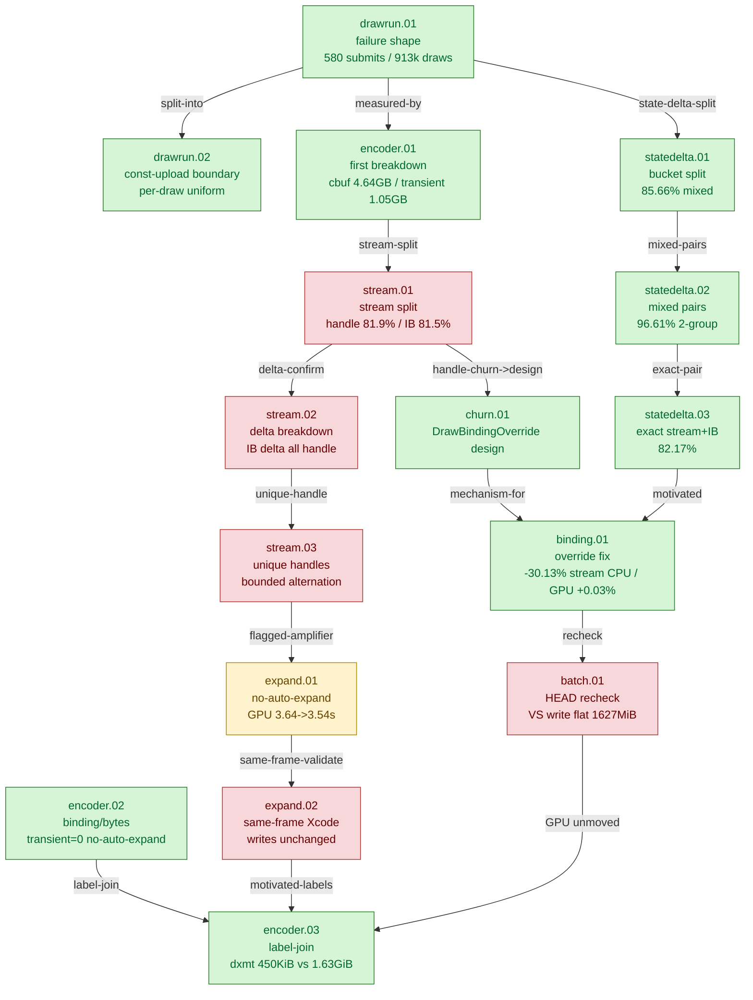

# State-Churn Encode — the CPU encode path and draw-run batching

> Part of the 3DMark05 GT1 GPU-bottleneck investigation. Root map: [[overview-3dmark05-gt1]].

## Scope & question

This domain owns the **CPU encode side** of GT1: why the importer almost never
batches draws into draw-runs, what state actually breaks the runs, and what the
binding-override fix bought. It introduces the per-encoder breakdown
instrumentation (`DXMT9_PERF_ENCODER_BREAKDOWN=1`), measures stream/IB handle
churn, decomposes the draw-run state-delta taxonomy down to the exact stream+IB
pair, lands the `DrawBindingOverride` payload that lets stream/IB-only changes
batch, rechecks after submission batching, and tests disabling auto-expand-indexed.
Every finding here is CPU-throughput. None of them move the GPU frame-time
bottleneck — that is owned by [[hidden-backend-storage]].

## Hypotheses & verdicts

| # | Hypothesis | Verdict | Evidence |
|---|-----------|---------|----------|
| H1 | The per-draw encode path stays hot because ~99.9% of draws fail to batch | accepted | [[state-churn-encode-drawrun.01]] (580 submits vs 913k draws) |
| H2 | A draw-run cannot blindly cross a constant-upload record (one shared uniform) | accepted | [[state-churn-encode-drawrun.02]] (ConstantUpload stop; per-draw snapshot fallback) |
| H3 | Draw-run breaks are offset/stride churn | rejected | [[state-churn-encode-stream.01]], [[state-churn-encode-stream.02]] (handle churn 81.5-81.9%) |
| H4 | Handle churn is per-draw object creation (lock/rename) | rejected | [[state-churn-encode-stream.03]] (bounded ~184/93 handles, managed-pool alternation) |
| H5 | State-delta breaks are dominated by exact stream+IB pairs | accepted | [[state-churn-encode-statedelta.01]]→[[state-churn-encode-statedelta.03]] (82.17% stream+IB-only) |
| H6 | A per-draw stream/IB binding override cuts encode CPU without moving GPU or churn | accepted (CPU win) | [[state-churn-encode-binding.01]] (-30.13% stream-bind CPU, GPU +0.03%) |
| H7 | More draw/submission batching moves the GPU limiter | rejected | [[state-churn-encode-batch.01]] (VS write flat at ~1627 MiB) |
| H8 | Disabling auto-expand-indexed reduces top-pass GPU buffer writes | rejected (GPU); inconclusive (correctness) | [[state-churn-encode-expand.01]], [[state-churn-encode-expand.02]] |
| H9 | Extending `_skipped` bind-cache pattern to vertex_buffer / index_buffer / pipeline / rasterizer / viewport / scissor / depth_state cuts per-CB encode below the 16.67 ms vsync slot | proposed | [[present-pacing-encode-budget-fix-proposal.01]] (2026-06-05 — sized by present-pacing topic; expected +44% wallclock on GT1 conservatively, ceiling +199% if matching DSync=0) |
| H10 | Reducing `mixed_pair_stream_*` draw-run break frequency raises mean run length from 1.88 toward the 32-record cap and composes additively with H9 | proposed | [[present-pacing-encode-budget-fix-proposal.01]] |

## Verification methods

- **`DXMT9_PERF_ENCODER_BREAKDOWN=1`** — emits `[dxmt9-perf-encoder]` (one row
  per render-encoder close) and `[dxmt9-perf-encoder-stream]` (per used stream)
  lines: stream/IB samples, Metal binds, handle/offset/stride changes, argbuf
  table/cbuf bytes, `setVertexBytes`, geometry transient vertex/index bytes,
  unique-handle counts/bytes/pool buckets. Proves churn is handle-dominated.
- **`commit_chunk_draw_run_*` counters** — `_submits`, `_records`, break-type
  (`_const_upload`), and the state-delta sub-buckets (`_stream_only`, `_ib_only`,
  `_texture_only`, `_mixed`, `_mixed_group2/3/4plus`, `_mixed_pair_stream_ib`,
  `_stream_ib_only`). Size each draw-run break class exactly.
- **`DrawBindingOverride` payload** — per-draw serialized stream/IB binding range
  in `DrawParam`; lets `scanImportedDrawRun()` accept stream-only and
  stream+IB-only runs. Counters: `commit_chunk_draw_run_binding_override_{records,bytes,stream_records,ib_records}`.
- **`RenderPass[seq=N,enc=N,rt=,depth=]` labels** — join dxmt per-encoder
  attribution to Xcode counters without row-order assumptions.
- **Run-level CPU gates** — `--require-binding-overrides-present`,
  `--require-draw-submission-batch-present`,
  `--require-draw-run-records-increase`, `--require-encode-draw-cpu-decrease`
  prove the intended CPU mechanism by `result.json` before reading Xcode frame
  counters.
- **`DXMT_DISABLE_AUTO_EXPAND_INDEXED=1`** — removes the indexed-expansion
  transient vertex amplifier (correctness-risky; needs image proof).

## Experiment dependency graph



## Results synthesis

The CPU encode story is settled. The per-draw encode path stays hot because
~99.94% of draws fail to batch into draw-runs ([[state-churn-encode-drawrun.01]]):
constant-upload boundaries are the largest break class, and state-delta breaks
are second. The per-encoder breakdown ([[state-churn-encode-encoder.01]],
[[state-churn-encode-stream.01]]) proved the state-delta churn is **handle
churn** (81.5-81.9% of stream/IB samples), not offset/stride, and that the
handles are a bounded set repeatedly *alternated* — not per-draw created
([[state-churn-encode-stream.03]]). The state-delta taxonomy
([[state-churn-encode-statedelta.01]]→[[state-churn-encode-statedelta.03]])
narrowed the dominant break to the *exact stream+IB pair* (82.17% of all
state-delta), naming the precise payload target. The `DrawBindingOverride` path
([[state-churn-encode-churn.01]], [[state-churn-encode-binding.01]]) then carried
per-draw stream/IB bindings inside a run, cutting stream-bind encode CPU
`-30.13%` and total encode CPU `-10.44%` with no churn increase — the one
**accepted CPU win** of this domain.

What is also settled is the negative: every GPU frame-time check stayed flat.
The binding-override A/B moved `gpu_command_buffer_time_ms` only `+0.03%`; the
post-submission-batch HEAD recheck ([[state-churn-encode-batch.01]]) left the
top-three VS buffer write at ~`1627.3 MiB` (unchanged); disabling auto-expand
([[state-churn-encode-expand.01]], [[state-churn-encode-expand.02]]) removed the
CPU transient amplifier but left the Xcode top-pass buffer/device writes
unchanged at ~`1.63 GiB`. The label-join validation
([[state-churn-encode-encoder.03]]) is the clean proof: the top three encoders
own ~`98.4%` of frame GPU and ~`1.63 GiB` of buffer writes, while their entire
dxmt CPU/upload payload is ~`450 KiB`. These are CPU-throughput wins, orthogonal
to the GPU bottleneck. The only open item is the correctness of disabling
auto-expand-indexed, which still needs visual proof.

## How to run
Every experiment here is a 3DMark05 GT1 run via the standard wrapper. This is a
CPU draw-run / handle-churn domain: enable the per-encoder breakdown, run a cheap
`--no-gputrace` A/B, and prove the batching mechanism with run-level CPU gates:

```sh
DXMT9_PERF_ENCODER_BREAKDOWN=1 \
bash scripts/tools/run_3dmark05_perf_probe.sh --suffix state-churn --frame 60 \
  --no-gputrace --timeout 180

bash scripts/tools/finalize_3dmark05_perf_probe.sh --suffix state-churn --frame 60 \
  --baseline-output experiments/output/<baseline>/result.json \
  --require-binding-overrides-present --require-draw-submission-batch-present \
  --require-draw-run-records-increase --require-encode-draw-cpu-decrease
```

The `[dxmt9-perf-encoder]` / `[dxmt9-perf-encoder-stream]` lines and
`commit_chunk_draw_run_*` counters carry the churn attribution. The exact
per-experiment flags live in each leaf's `**Method.**` field. See
`agents/rules/environment_variables.rules.md` for env-var meanings and
`agents/rules/metal_debugging.rules.md` for the full workflow.

## Cross-references

- [[const-upload]] — constant-upload boundaries are the larger, separate
  draw-run break class (`2.88x` state-delta); crossing them needs const
  coalescing, not a stream/IB payload. The 4.64GB cbuf write bucket is measured
  in the same encoder-breakdown runs.
- [[snapshot-cache]] — the D3D9 draw-state snapshot cache and binding-agnostic
  snapshot reuse address the same per-draw state-binding cost from the front end.
- [[hidden-backend-storage]] — the GPU-side ~1.63GiB VS-write bucket these CPU
  wins do not touch; the label-join here is shared evidence for that domain.
- [[index-cache-locality]] — the one accepted *GPU-side* win, which reduces VS
  invocations rather than CPU encode cost; auto-expand is a different indexed-path
  axis.
- [[overview-3dmark05-gt1]] — root map, priority DAG, and ceiling synthesis.
