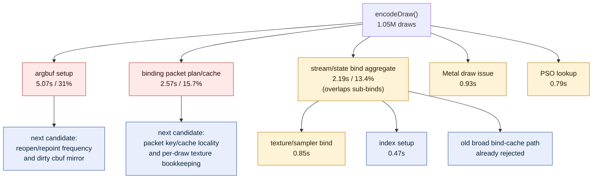

# Encode Draw Phase Attribution

**Question / hypothesis.** After broad bind-cache work failed to move GT1
wallclock, split the old `encode_draw_cpu_ms` remainder with narrower timers.
The immediate question is whether the missing cost sits in state/bind packet
construction, argument-buffer setup, or the already-named stream/texture/index
bind buckets.

**Method.** Add two run-level perf counters:

- `encode_draw_binding_packet_cpu_ms`: `makeDrawBindingPacketPlan()`,
  binding-packet cache lookup/update, and texture-binding bookkeeping.
- `encode_draw_argbuf_setup_cpu_ms`: per-draw argbuf table open/repoint plus
  dirty constant-buffer region mirroring.

Then run the current supervised no-gputrace profile:

```bash
bash scripts/tools/run_3dmark05_perf_probe.sh \
  --suffix encode-phase-attribution-r1 \
  --frame 50 \
  --no-gputrace \
  --no-encoder-breakdown \
  --timeout 180

python3 scripts/tools/compare_3dmark05_perf_counters.py \
  experiments/output/app-d3d9-3dmark05-watchdog-cleanup-smoke-r1 \
  experiments/output/app-d3d9-3dmark05-encode-phase-attribution-r1 \
  --before-label watchdog \
  --after-label encode-phase
```

The wrapper hit the `180+45s` watchdog and synthesized counters from the
final `[dxmt9-perf]` line. This is a valid counter sample, not a wallclock fps
sample.

**Shape check.**

| Metric | Watchdog baseline | Encode-phase run | Delta |
|---|---:|---:|---:|
| `present_encoded` | 1,440 | 1,440 | 0 |
| `draw_calls` | 1,052,045 | 1,051,310 | -0.07% |
| `render_pass_begin` | 16,881 | 16,870 | -0.07% |
| `gpu_command_buffer_time_ms` | 4,207.759 | 4,199.588 | -0.19% |
| `completion_wait_ms` | 31,071.820 | 31,146.827 | +0.24% |
| `encode_draw_cpu_ms` | 16,086.742 | 16,351.649 | +1.65% |
| `d3d9_snapshot_draw_submission_cpu_ms` | 19,719.847 | 19,804.929 | +0.43% |
| `render_pass_tile_preservation_bytes` | 180,717,559,808 | 180,667,662,336 | -0.03% |

The run is shape-stable enough for CPU attribution. The `encode_draw_cpu_ms`
increase is expected instrumentation/noise territory; no GPU or workload shape
changed.

**Result.**

| Phase counter | Time (ms) | Share of `encode_draw_cpu_ms` |
|---|---:|---:|
| `encode_draw_argbuf_setup_cpu_ms` | 5,072.330 | 31.02% |
| `encode_draw_binding_packet_cpu_ms` | 2,573.945 | 15.74% |
| `encode_draw_stream_bind_cpu_ms` | 2,193.921 | 13.42% |
| `encode_draw_issue_cpu_ms` | 934.071 | 5.71% |
| `encode_draw_texture_sampler_bind_cpu_ms` | 848.267 | 5.19% |
| `encode_draw_pipeline_lookup_cpu_ms` | 790.692 | 4.84% |
| `encode_draw_index_setup_cpu_ms` | 470.278 | 2.88% |
| `encode_draw_fvf_decode_cpu_ms` | 266.628 | 1.63% |
| `encode_draw_uniform_build_cpu_ms` | 120.908 | 0.74% |

Important caveat: these timers are not a strict exclusive stack.
`encode_draw_stream_bind_cpu_ms` intentionally wraps several narrower state
bind phases, so do not sum the table as exact exclusive time. The ranking is
still useful: the new argbuf setup and binding-packet timers explain the
largest previously unnamed CPU buckets.



**Verdict.** Accepted attribution. The old "73% encode remainder" is now much
smaller: argbuf setup and binding-packet construction/bookkeeping are the two
largest named buckets. Broad bind suppression remains rejected as the main GT1
lever because Work A did not move wallclock; future CPU work should target
argbuf table lifetime/repoint frequency and binding-packet/texture bookkeeping
with narrow counters or A/Bs.

**Next.** [state-churn-encode-encode-phase.02](state-churn-encode-encode-phase.02.md) adds child counters and
narrows the parent buckets further:
`argbuf_cbuf_update=3.92s`, `binding_packet_cache=1.87s`,
`argbuf_open=1.21s`.

Only after those sub-buckets name a concrete mechanism should we try a
mutating A/B.

**Related.** [state-churn-encode](../state-churn-encode.md) · [present-pacing](../present-pacing.md) ·
[present-pacing-bind-cache-work-a.01](../present-pacing/present-pacing-bind-cache-work-a.01.md) · [baselines-frame50.04](../baselines/baselines-frame50.04.md).
