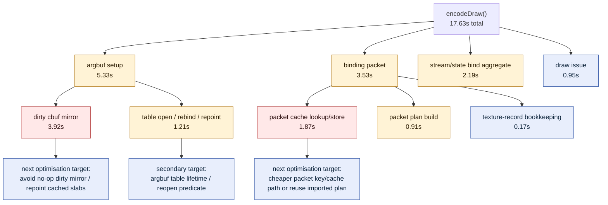

# Argbuf and Binding-Packet Sub-Bucket Breakdown

**Question / hypothesis.** [state-churn-encode-encode-phase.01](state-churn-encode-encode-phase.01.md) showed the
largest named `encode_draw` CPU buckets are argbuf setup and binding-packet
construction/bookkeeping. Split those two parent buckets into actionable
sub-buckets before attempting another mutating optimisation.

**Method.** Add five child counters under the existing parent scopes:

- `encode_draw_argbuf_open_cpu_ms`: argbuf table open, bind-slot rebind, and
  cached-cbuf repoint work.
- `encode_draw_argbuf_cbuf_update_cpu_ms`: dirty cbuf mirror through
  `updateDirtyArgbufRegions()` plus post-update accounting/cache merge.
- `encode_draw_binding_packet_plan_cpu_ms`: `makeDrawBindingPacketPlan()`.
- `encode_draw_binding_packet_cache_cpu_ms`: `cacheDrawBindingPacket()`.
- `encode_draw_binding_packet_texture_record_cpu_ms`: encoder-breakdown
  texture-record bookkeeping.

Run:

```bash
bash scripts/tools/run_3dmark05_perf_probe.sh \
  --suffix encode-phase-breakdown-r1 \
  --frame 50 \
  --no-gputrace \
  --no-encoder-breakdown \
  --timeout 180

python3 scripts/tools/compare_3dmark05_perf_counters.py \
  experiments/output/app-d3d9-3dmark05-encode-phase-attribution-r1 \
  experiments/output/app-d3d9-3dmark05-encode-phase-breakdown-r1 \
  --before-label encode-phase \
  --after-label breakdown
```

The wrapper again fired at `180+45s` and synthesized counters from the final
`[dxmt9-perf]` line. This is a counter sample, not a wallclock fps sample.

**Shape check.**

| Metric | Encode-phase | Breakdown | Delta |
|---|---:|---:|---:|
| `present_encoded` | 1,440 | 1,440 | 0 |
| `draw_calls` | 1,051,310 | 1,051,597 | +0.03% |
| `render_pass_begin` | 16,870 | 16,871 | +0.01% |
| `gpu_command_buffer_time_ms` | 4,199.588 | 4,210.616 | +0.26% |
| `completion_wait_ms` | 31,146.827 | 30,332.415 | -2.61% |
| `render_pass_tile_preservation_bytes` | 180,667,662,336 | 180,952,006,656 | +0.16% |
| `d3d9_snapshot_draw_submission_cpu_ms` | 19,804.929 | 19,812.848 | +0.04% |

The run shape is stable enough for CPU attribution. `encode_draw_cpu_ms`
increased from `16.35s` to `17.63s`; treat that as added child-timer overhead
plus run noise, not as a production regression.

**Result.**

| Counter | Time (ms) | Share of `encode_draw_cpu_ms` |
|---|---:|---:|
| `encode_draw_argbuf_setup_cpu_ms` | 5,327.459 | 30.23% |
| `encode_draw_argbuf_cbuf_update_cpu_ms` | 3,920.606 | 22.24% |
| `encode_draw_argbuf_open_cpu_ms` | 1,213.516 | 6.88% |
| `encode_draw_binding_packet_cpu_ms` | 3,527.736 | 20.01% |
| `encode_draw_binding_packet_cache_cpu_ms` | 1,874.836 | 10.64% |
| `encode_draw_binding_packet_plan_cpu_ms` | 911.978 | 5.17% |
| `encode_draw_binding_packet_texture_record_cpu_ms` | 171.367 | 0.97% |
| `encode_draw_stream_bind_cpu_ms` | 2,188.938 | 12.42% |
| `encode_draw_texture_sampler_bind_cpu_ms` | 849.586 | 4.82% |
| `encode_draw_issue_cpu_ms` | 947.150 | 5.37% |

The child counters are nested under parent timers; use the ranking rather
than adding every row as exclusive time.



**Verdict.** Accepted attribution. The next CPU candidates are:

1. **Dirty cbuf mirror (`3.92s`)**: determine whether many calls to
   `updateDirtyArgbufRegions()` are no-op or repeat the same payload. A safe
   optimisation would skip or repoint without rewriting descriptors when the
   table and cbuf bindings are already valid for the draw.
2. **Binding-packet cache path (`1.87s`)**: the cache lookup/store itself is
   now a measurable owner. Inspect whether key construction/copying can be
   avoided by reusing an imported draw packet plan or a cheaper hash/key.
3. **Argbuf open/repoint (`1.21s`)**: revisit the per-draw table lifetime
   only with correctness proof, because prior comments document last-write-wins
   hazards when a descriptor table is reused too broadly.

Do not spend Xcode/gputrace budget on these CPU-only candidates until a
no-gputrace A/B reduces the relevant sub-counter. The GPU shape is unchanged.

**Related.** [state-churn-encode](../state-churn-encode.md) ·
[state-churn-encode-encode-phase.01](state-churn-encode-encode-phase.01.md) · [present-pacing](../present-pacing.md) ·
[baselines-frame50.04](../baselines/baselines-frame50.04.md).
