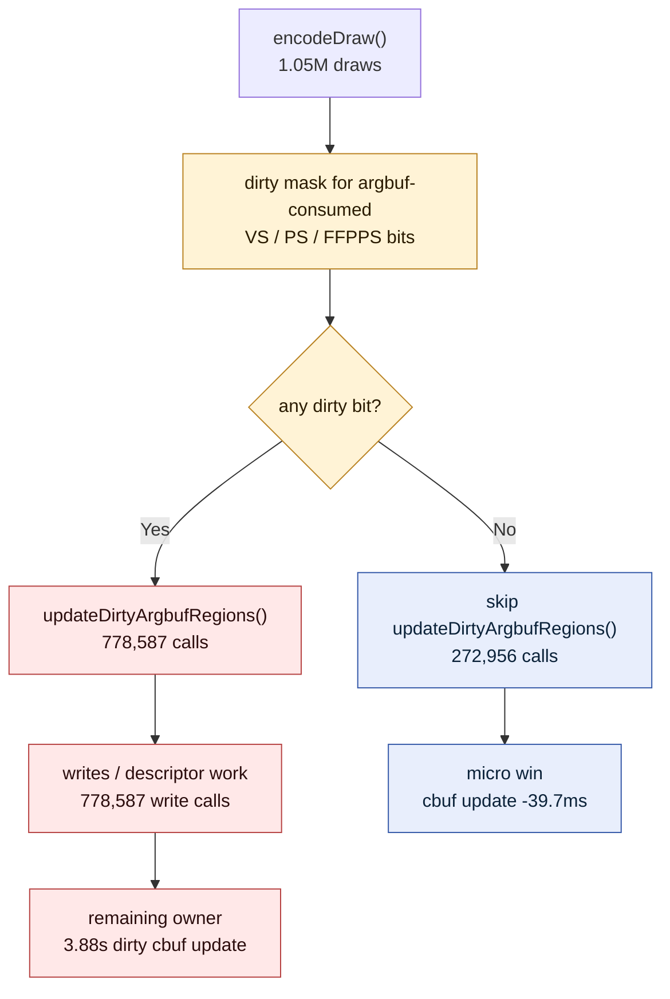

# Argbuf Clean Cbuf Update Gate

**Question / hypothesis.** [[state-churn-encode-encode-phase.02]] measured
`updateDirtyArgbufRegions()` as the largest argbuf sub-bucket
(`encode_draw_argbuf_cbuf_update_cpu_ms = 3.92s`). Test the narrowest safe
mutation first: when the dirty mask has no argbuf-consumed VS/PS/FFPPS bits,
skip the cbuf update call entirely and count the skipped clean calls.

**Method.** Add call-count counters around the argbuf cbuf update block:

- `encode_draw_argbuf_cbuf_update_calls`
- `encode_draw_argbuf_cbuf_update_dirty_calls`
- `encode_draw_argbuf_cbuf_update_skipped_clean`
- `encode_draw_argbuf_cbuf_update_write_calls`

Then run the supervised no-gputrace profile and compare against the prior
child-breakdown run:

```bash
bash scripts/tools/run_3dmark05_perf_probe.sh \
  --suffix argbuf-cbuf-clean-gate-r1 \
  --frame 50 \
  --no-gputrace \
  --no-encoder-breakdown \
  --timeout 180

python3 scripts/tools/compare_3dmark05_perf_counters.py \
  experiments/output/app-d3d9-3dmark05-encode-phase-breakdown-r1 \
  experiments/output/app-d3d9-3dmark05-argbuf-cbuf-clean-gate-r1 \
  --before-label breakdown \
  --after-label clean-gate
```

The wrapper hit the `180+45s` watchdog and synthesized counters from the final
`[dxmt9-perf]` line. This is a counter sample, not a wallclock fps sample.

**Shape check.**

| Metric | Breakdown | Clean gate | Delta |
|---|---:|---:|---:|
| `present_encoded` | 1,440 | 1,440 | 0 |
| `draw_calls` | 1,051,597 | 1,051,543 | -0.01% |
| `render_pass_begin` | 16,871 | 16,877 | +0.04% |
| `gpu_command_buffer_time_ms` | 4,210.616 | 4,239.514 | +0.69% |
| `completion_wait_ms` | 30,332.415 | 30,493.021 | +0.53% |
| `render_pass_tile_preservation_bytes` | 180,952,006,656 | 181,060,804,608 | +0.06% |

The run shape is stable enough for CPU attribution. GPU and render-pass traffic
are effectively unchanged.

**Result.**

| Counter | Breakdown | Clean gate | Delta |
|---|---:|---:|---:|
| `encode_draw_cpu_ms` | 17,625.934 | 17,534.544 | -91.390 ms |
| `encode_draw_argbuf_setup_cpu_ms` | 5,327.459 | 5,268.605 | -58.854 ms |
| `encode_draw_argbuf_cbuf_update_cpu_ms` | 3,920.606 | 3,880.954 | -39.652 ms |
| `encode_draw_argbuf_open_cpu_ms` | 1,213.516 | 1,179.855 | -33.661 ms |
| `transient_upload_cpu_ms` | 3,225.158 | 3,195.596 | -29.562 ms |
| `transient_upload_bytes` | 1,217,509,020 | 1,216,268,028 | -1,240,992 B |

The new call counters name the mechanism:

| Counter | Clean gate |
|---|---:|
| `encode_draw_argbuf_cbuf_update_calls` | 1,051,543 |
| `encode_draw_argbuf_cbuf_update_dirty_calls` | 778,587 |
| `encode_draw_argbuf_cbuf_update_skipped_clean` | 272,956 |
| `encode_draw_argbuf_cbuf_update_write_calls` | 778,587 |



**Verdict.** Accepted as a safe micro-optimisation, rejected as a major lever.
The gate skips `272,956` clean/no-op calls, but it only reduces the measured
cbuf-update bucket by about `39.7ms` and total `encode_draw_cpu_ms` by about
`91.4ms` over the full 1,440-present run. The remaining owner is the
`778,587` dirty/write calls, not clean no-op dispatch overhead.

**Next.** Target the dirty path itself:

1. determine whether repeated dirty payloads can reuse or repoint existing
   descriptor/cbuf state without rewriting;
2. split `updateDirtyArgbufRegions()` into payload-build, table/descriptor
   update, cache-merge, and upload-byte sub-counters;
3. avoid Xcode/gputrace spend until a no-gputrace A/B reduces the dirty/write
   counter or its CPU time.

**Related.** [[state-churn-encode]] ·
[[state-churn-encode-encode-phase.02]] · [[present-pacing]] ·
[[baselines-frame50.04]].
