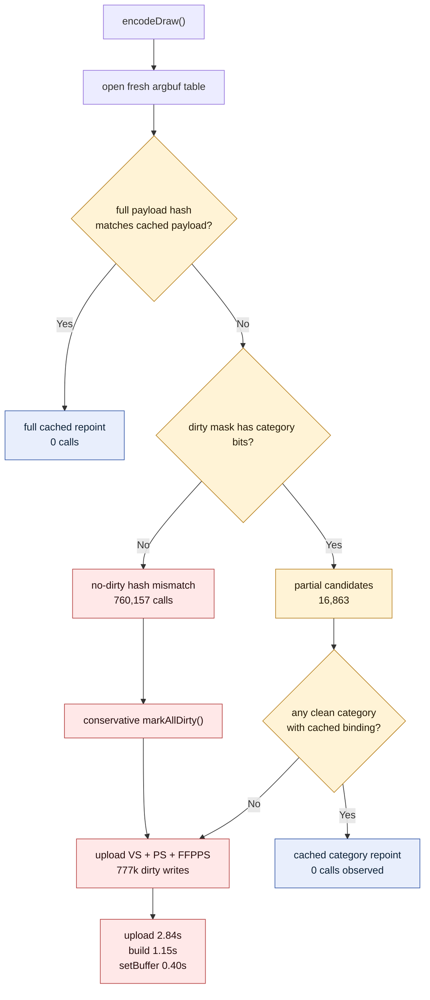

# Dirty Cbuf Reopen Mask Attribution

**Question / hypothesis.** [[state-churn-encode-encode-phase.03]] proved that
clean/no-op cbuf updates are not the load-bearing path. The next hypothesis was
that the dirty path still contains reusable VS/PS/FFPPS categories: when a fresh
argbuf table is reopened, repoint clean categories from the cached table and
only upload categories with dirty bits.

**Method.** Add non-Xcode counters around `updateDirtyArgbufRegions()` and the
argbuf reopen path, then run three supervised no-gputrace probes:

```bash
bash scripts/tools/run_3dmark05_perf_probe.sh \
  --suffix argbuf-cbuf-dirty-split-r1 \
  --frame 50 \
  --no-gputrace \
  --no-encoder-breakdown \
  --timeout 180

bash scripts/tools/run_3dmark05_perf_probe.sh \
  --suffix argbuf-cbuf-partial-repoint-r1 \
  --frame 50 \
  --no-gputrace \
  --no-encoder-breakdown \
  --timeout 180

bash scripts/tools/run_3dmark05_perf_probe.sh \
  --suffix argbuf-cbuf-reopen-mask-r1 \
  --frame 50 \
  --no-gputrace \
  --no-encoder-breakdown \
  --timeout 180
```

All runs hit the supervised watchdog and synthesized counters from the final
`[dxmt9-perf]` line. Treat these as counter attribution samples, not wallclock
fps samples.

**Shape check.**

| Metric | Dirty split | Partial repoint | Reopen mask |
|---|---:|---:|---:|
| `present_encoded` | 1,440 | 1,440 | 1,440 |
| `draw_calls` | 1,050,934 | 1,051,024 | 1,049,273 |
| `render_pass_begin` | 16,881 | 16,865 | 16,863 |
| `gpu_command_buffer_time_ms` | 4,182.011 | 4,185.318 | 4,187.030 |
| `completion_wait_ms` | 29,312.034 | 29,438.257 | 29,500.337 |
| `render_pass_tile_preservation_bytes` | 181,059,014,656 | 181,004,181,504 | 180,829,884,416 |

The shape is stable enough for CPU-path attribution. The reopen-mask comparison
moves GPU CB time only `+0.04%` and tile preservation `-0.10%` versus the
partial-repoint run.

**Dirty update split.**

| Counter | Dirty split | Reopen mask |
|---|---:|---:|
| `encode_draw_argbuf_cbuf_update_cpu_ms` | 5,302.104 | 5,371.057 |
| `encode_draw_argbuf_cbuf_build_cpu_ms` | 1,147.900 | 1,148.229 |
| `encode_draw_argbuf_cbuf_upload_cpu_ms` | 2,825.235 | 2,842.166 |
| `encode_draw_argbuf_cbuf_setbuffer_cpu_ms` | 390.299 | 399.297 |
| `encode_draw_argbuf_cbuf_cache_merge_cpu_ms` | 44.790 | 46.020 |
| `encode_draw_argbuf_cbuf_update_dirty_calls` | 778,333 | 777,020 |
| `encode_draw_argbuf_cbuf_update_vs_calls` | 778,333 | 777,020 |
| `encode_draw_argbuf_cbuf_update_ps_calls` | 778,333 | 777,020 |
| `encode_draw_argbuf_cbuf_update_ffp_ps_calls` | 778,333 | 777,020 |
| `encode_draw_argbuf_cbuf_update_vs_bytes` | 548,727,296 | 548,409,040 |
| `encode_draw_argbuf_cbuf_update_ps_bytes` | 307,439,488 | 306,916,736 |
| `encode_draw_argbuf_cbuf_update_ffp_ps_bytes` | 298,879,872 | 298,375,680 |

The upload half is the largest local child bucket: about `2.84s` of the
`5.37s` dirty cbuf update sample, with VS/PS/FFPPS uploaded on every dirty
write. Build work is second at about `1.15s`. Cache merge is negligible.

**Reopen verdict counters.**

| Counter | Partial repoint | Reopen mask |
|---|---:|---:|
| `encode_draw_argbuf_cbuf_cached_repoint_calls` | 0 | 0 |
| `encode_draw_argbuf_cbuf_cached_repoint_bytes` | 0 | 0 |
| `encode_draw_argbuf_cbuf_reopen_full_repoint_calls` | n/a | 0 |
| `encode_draw_argbuf_cbuf_reopen_no_dirty_hash_mismatch` | n/a | 760,157 |
| `encode_draw_argbuf_cbuf_reopen_partial_candidates` | n/a | 16,863 |
| `encode_draw_argbuf_cbuf_reopen_dirty_vs` | n/a | 16,863 |
| `encode_draw_argbuf_cbuf_reopen_dirty_ps` | n/a | 16,863 |
| `encode_draw_argbuf_cbuf_reopen_dirty_ffp_vs` | n/a | 16,863 |
| `encode_draw_argbuf_cbuf_reopen_dirty_ffp_ps` | n/a | 16,863 |

The partial-repoint path never found a reusable clean category. The dominant
case is not "some categories dirty, some clean"; it is **whole-payload hash
mismatch with no dirty bits** (`760,157` times), which conservatively falls back
to `markAllDirty()` and forces VS/PS/FFPPS uploads.



**Verdict.** Accepted attribution; rejected as an optimization in its current
form. Dirty-bit-only partial repoint is the wrong granularity for GT1 because
the hot fallback is whole-payload hash mismatch after dirty bits have already
been consumed or are not category-specific enough. The current implementation
does not improve the path: cached repoint calls stay at `0`.

**Next.** The next no-gputrace A/B should use category/content identity instead
of dirty bits alone:

1. store a per-entry content hash and byte count for cached VS / PS / FFPPS
   argbuf cbuf bindings;
2. on no-dirty whole-payload hash mismatch, compare current per-category
   content to the cached category;
3. repoint matching categories into the fresh argbuf table and mark only the
   changed categories dirty;
4. add hit/miss counters before treating it as a performance win.

Keep FFPVS conservative until its deferred viewport/pre-transform handling is
separated from the common cbuf update path. Do not schedule an Xcode/gputrace
capture for this CPU path until the no-gputrace counters show fewer dirty cbuf
uploads or less upload CPU time.

**Related.** [[state-churn-encode]] ·
[[state-churn-encode-encode-phase.02]] ·
[[state-churn-encode-encode-phase.03]] · [[present-pacing]].
