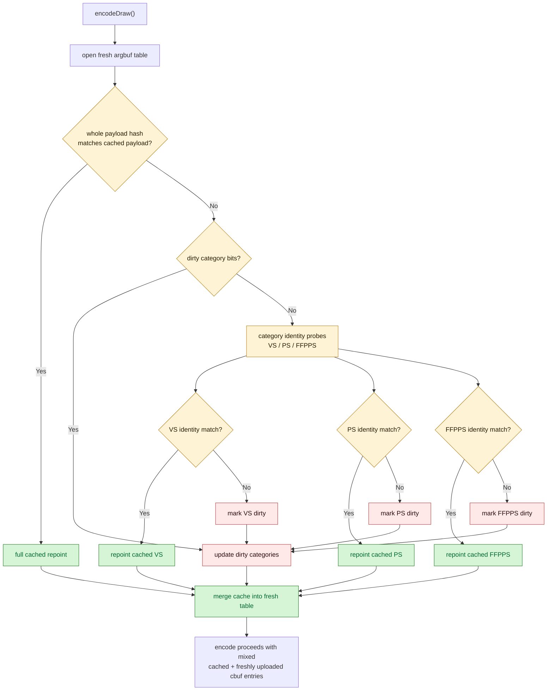

# Category Identity Cbuf Repoint

**Question / hypothesis.** [[state-churn-encode-encode-phase.04]] showed that
dirty-bit-only partial repoint has `0` hits because the hot case is a
no-dirty whole-payload hash mismatch. The next hypothesis was that the payload
mismatch is over-broad: VS, PS, and FFPPS entries can be compared and repointed
independently, avoiding a full dirty upload when only one category changed.

**Method.** Run two supervised no-gputrace probes after the reopen-mask
baseline:

```bash
bash scripts/tools/run_3dmark05_perf_probe.sh \
  --suffix argbuf-cbuf-content-hash-r1 \
  --frame 50 \
  --no-gputrace \
  --no-encoder-breakdown \
  --timeout 180

bash scripts/tools/run_3dmark05_perf_probe.sh \
  --suffix argbuf-cbuf-identity-hash-r1 \
  --frame 50 \
  --no-gputrace \
  --no-encoder-breakdown \
  --timeout 180
```

The first implementation compared category byte content: build the current
VS/PS/FFPPS host structs, hash their bytes, and repoint matching cached argbuf
cbuf entries. It proved the reuse mechanism but spent too much CPU hashing the
rebuilt structs.

The second implementation keeps the same cached repoint path but probes a
category identity instead of rebuilding host bytes:

| Category | Identity input | Rationale |
|---|---|---|
| VS | `vertexConstantsHash` + upload byte count | D3D9 VS constant payload identity |
| PS | `pixelConstantsHash` + upload byte count | D3D9 PS constant payload identity |
| FFPPS | render-state hash + texture-stage-state hashes + byte count | Conservative key for `buildFfpPsConsts()` inputs |
| FFPVS | deferred / conservative | Viewport and pre-transform handling still need separation |

The counter names still use the historical `content_probe_*` prefix, but in
the identity run they measure category identity probe cost and hits.

All runs hit the supervised watchdog and synthesized counters from the final
`[dxmt9-perf]` line. Treat this as CPU-path attribution, not a GPU/fps result.

**Shape check versus reopen mask.**

| Metric | Reopen mask | Identity hash | Delta |
|---|---:|---:|---:|
| `present_encoded` | 1,440 | 1,440 | 0 |
| `draw_calls` | 1,049,273 | 1,051,959 | +0.26% |
| `render_pass_begin` | 16,863 | 16,888 | +0.15% |
| `render_pass_tile_preservation_bytes` | 180,829,884,416 | 180,724,719,616 | -0.06% |
| `render_pass_same_key_reentry_preservation_bytes` | 71,743,569,920 | 71,806,484,480 | +0.09% |
| `gpu_command_buffer_time_ms` | 4,187.030 | 4,337.239 | +3.59% |
| `completion_wait_ms` | 29,500.337 | 31,741.537 | +7.60% |

The draw/pass/tile shape is stable enough for no-gputrace CPU attribution.
The GPU and completion-wait deltas are not load-bearing here: there is no
Xcode replay and the run ended by watchdog on the known 3DMark05 final-frame
hang path.

**CPU result versus reopen mask.**

| Counter | Reopen mask | Identity hash | Delta |
|---|---:|---:|---:|
| `argbuf_hybrid_bytes_per_encoder` | 1,214,857,392 | 460,962,488 | -62.06% |
| `transient_upload_bytes` | 1,214,978,268 | 461,083,364 | -62.05% |
| `transient_upload_cpu_ms` | 3,241.193 | 818.217 | -74.76% |
| `encode_draw_cpu_ms` | 19,258.354 | 15,841.761 | -17.74% |
| `encode_draw_argbuf_setup_cpu_ms` | 6,828.043 | 3,373.195 | -50.60% |
| `encode_draw_argbuf_cbuf_update_cpu_ms` | 5,371.057 | 1,860.180 | -65.37% |
| `encode_draw_argbuf_cbuf_update_dirty_calls` | 777,020 | 451,596 | -41.88% |
| `encode_draw_argbuf_cbuf_update_skipped_clean` | 272,253 | 600,363 | +120.52% |
| `encode_draw_argbuf_cbuf_build_cpu_ms` | 1,148.229 | 389.878 | -66.05% |
| `encode_draw_argbuf_cbuf_upload_cpu_ms` | 2,842.166 | 529.885 | -81.36% |
| `encode_draw_argbuf_cbuf_setbuffer_cpu_ms` | 399.297 | 101.622 | -74.55% |
| `encode_draw_argbuf_cbuf_cached_repoint_calls` | 0 | 1,701,351 | n/a |
| `encode_draw_argbuf_cbuf_cached_repoint_bytes` | 0 | 757,366,928 | n/a |
| `encode_draw_argbuf_cbuf_content_probe_cpu_ms` | missing | 91.881 | n/a |

The accepted mechanism is clear: no-dirty payload mismatches still happen
(`762,162`), but many category entries now repoint to cached argbuf cbuf data
instead of rebuilding and uploading all categories.

**Category hit/miss split.**

| Category | Hits | Misses | Dirty upload calls after identity |
|---|---:|---:|---:|
| VS | 437,871 | 324,291 | 341,179 |
| PS | 526,278 | 235,884 | 252,772 |
| FFPPS | 737,202 | 24,960 | 41,848 |

FFPPS has `24,960` conservative misses in the identity run where the byte
content probe had none. That is acceptable because the cheaper identity path
cuts total probe CPU from `2,216.965ms` to `91.881ms`; narrowing FFPPS identity
to the exact consumed fields is a future micro-target, not a blocker.

**Content hash versus category identity.**

| Counter | Content hash | Identity hash | Delta |
|---|---:|---:|---:|
| `encode_draw_cpu_ms` | 18,793.509 | 15,841.761 | -15.71% |
| `argbuf_hybrid_bytes_per_encoder` | 642,160,320 | 460,962,488 | -28.22% |
| `transient_upload_cpu_ms` | 1,123.973 | 818.217 | -27.20% |
| `encode_draw_argbuf_cbuf_content_probe_cpu_ms` | 2,216.965 | 91.881 | -95.86% |
| `encode_draw_argbuf_cbuf_cached_repoint_calls` | 1,398,756 | 1,701,351 | +21.63% |
| `encode_draw_argbuf_cbuf_update_dirty_calls` | 779,873 | 451,596 | -42.09% |
| `encode_draw_argbuf_cbuf_update_vs_calls` | 664,334 | 341,179 | -48.64% |
| `encode_draw_argbuf_cbuf_update_ps_calls` | 259,630 | 252,772 | -2.64% |
| `encode_draw_argbuf_cbuf_update_ffp_ps_calls` | 16,899 | 41,848 | +147.64% |

Byte content hashing was useful as a proof-of-mechanism, but not as the right
implementation. Category identity is the production-shaped version for this
probe family.



**Verdict.** Accepted CPU optimization. Category identity cbuf repoint turns
the reopen-mask attribution into a real encode-path reduction:
`encode_draw_cpu_ms` drops by `3.42s` (`-17.74%`), transient upload bytes drop
by `753.9MB` (`-62.05%`), and dirty cbuf upload calls drop by `325,424`
(`-41.88%`) versus reopen mask. This does not claim a GPU-frame win and does
not justify an Xcode capture by itself.

**Next.**

1. Use [[state-churn-encode-encode-phase.06]] as the current visual smoke:
   the path renders a normal GT1 frame and keeps the identity counters stable,
   but this is not same-input exact image proof.
2. Narrow FFPPS identity to the exact fields consumed by `buildFfpPsConsts()` to
   reduce the `24,960` conservative misses.
3. After this cbuf path, the remaining encode CPU candidates are
   binding-packet cache construction and D3D9 snapshot/state rebuild.

**Related.** [[state-churn-encode]] ·
[[state-churn-encode-encode-phase.03]] ·
[[state-churn-encode-encode-phase.04]] · [[present-pacing]].
