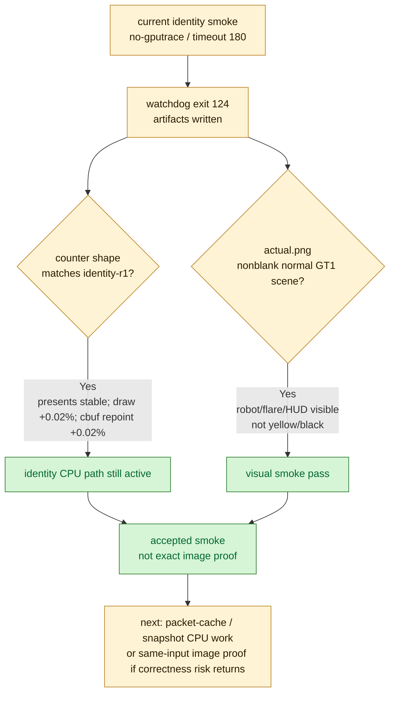

# Category Identity Current Smoke

**Question / hypothesis.** [state-churn-encode-encode-phase.05](state-churn-encode-encode-phase.05.md) accepted
category identity cbuf repoint as a CPU win, but cbuf reuse can affect rendered
constants. Before treating the path as current working state, run a fresh
supervised GT1 smoke and inspect whether the scene still renders normally.

**Method.**

```bash
bash scripts/tools/run_3dmark05_perf_probe.sh \
  --suffix argbuf-cbuf-identity-current-smoke-r1 \
  --frame 50 \
  --no-gputrace \
  --no-encoder-breakdown \
  --timeout 180
```

The wrapper used the expected no-gputrace timeout policy:
`runner_timeout_sec=180`, watchdog `180+45`, `session_locked=no`, and exited
with status `124` after writing postprocess artifacts. This is the known
3DMark05 final-frame hang path, not a failure to collect counters.

**Runtime shape versus identity-r1.**

| Metric | Identity-r1 | Current smoke | Delta |
|---|---:|---:|---:|
| `present_encoded` | 1,440 | 1,440 | 0 |
| `draw_calls` | 1,051,959 | 1,052,189 | +0.02% |
| `render_pass_begin` | 16,888 | 16,877 | -0.07% |
| `render_pass_tile_preservation_bytes` | 180,724,719,616 | 180,561,068,032 | -0.09% |
| `gpu_command_buffer_time_ms` | 4,337.239 | 4,309.279 | -0.64% |
| `completion_wait_ms` | 31,741.537 | 31,640.089 | -0.32% |

The shape is effectively the same no-gputrace workload as the accepted identity
run. This does not claim a GPU win; it shows the current checkout still reaches
the same measured GT1 path.

**Cbuf identity path stability.**

| Counter | Identity-r1 | Current smoke | Delta |
|---|---:|---:|---:|
| `argbuf_hybrid_bytes_per_encoder` | 460,962,488 | 461,535,120 | +0.12% |
| `transient_upload_bytes` | 461,083,364 | 461,655,996 | +0.12% |
| `encode_draw_cpu_ms` | 15,841.761 | 15,703.517 | -0.87% |
| `encode_draw_argbuf_setup_cpu_ms` | 3,373.195 | 3,366.144 | -0.21% |
| `encode_draw_argbuf_cbuf_update_cpu_ms` | 1,860.180 | 1,860.900 | +0.04% |
| `encode_draw_argbuf_cbuf_update_dirty_calls` | 451,596 | 452,013 | +0.09% |
| `encode_draw_argbuf_cbuf_cached_repoint_calls` | 1,701,351 | 1,701,725 | +0.02% |
| `encode_draw_argbuf_cbuf_cached_repoint_bytes` | 757,366,928 | 757,436,192 | +0.01% |
| `encode_draw_argbuf_cbuf_content_probe_cpu_ms` | 91.881 | 85.316 | -7.15% |

The identity mechanism is stable in the fresh run: repoint counts, bytes, dirty
calls, and cbuf update CPU are all within ordinary run noise.

**Visual smoke.** The run wrote
`experiments/output/app-d3d9-3dmark05-argbuf-cbuf-identity-current-smoke-r1/actual.png`
at `2048x1536`. Manual inspection shows a normal GT1 scene with the robot and
flare visible, HUD `FPS: 15`, `Time: 0:55.53`, `Frame: 852`. It is not the
previously observed all-yellow or black failure mode.

Cross-run image comparison against identity-r1 changed `75.90%` of full-frame
pixels (`SSIM=0.562391`) because the captured presented frame is at a different
GT1 time. Treat that comparison as a drift detector only; it is not an exact
correctness proof.



**Verdict.** Accepted smoke. Current HEAD still exercises the category identity
cbuf repoint path and produces a normal visible GT1 frame. This is stronger
than counter-only attribution, but weaker than same-input exact image proof.
Do not use it to claim final visual correctness for every frame.

**Next.** Continue CPU work on binding-packet cache or snapshot/state rebuild.
If a future cbuf change touches identity inputs again, pair the no-gputrace
counter smoke with either a same-input replay image proof or an explicit user
visual check of the GT1 scene.

**Related.** [state-churn-encode](../state-churn-encode.md) ·
[state-churn-encode-encode-phase.05](state-churn-encode-encode-phase.05.md) · [present-pacing](../present-pacing.md).
