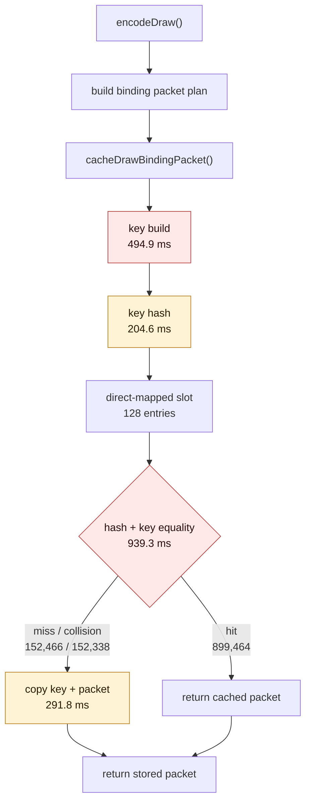

# Binding Packet Cache Split Attribution

**Question / hypothesis.** After category identity cbuf repoint removed the
largest argbuf payload amplifier, the remaining named encode child was
`encode_draw_binding_packet_cache_cpu_ms`. Split `cacheDrawBindingPacket()` into
key construction, hash, probe/equality, store/copy, and hit/miss/collision
counters to decide whether the next implementation bet should be cache
capacity, key comparison, or upstream plan construction.

**Method.**

```bash
bash scripts/tools/run_3dmark05_perf_probe.sh \
  --suffix binding-packet-cache-split-r1 \
  --frame 50 \
  --no-gputrace \
  --no-encoder-breakdown \
  --timeout 180
```

The wrapper used the expected supervised no-gputrace timeout path. It exited
with watchdog status `124` after writing postprocess artifacts; this is the
known 3DMark05 final-frame hang path when the summary artifacts are present.
`actual.png` is a normal GT1 frame with the robot, flare, and HUD visible
(`FPS: 15`, `Time: 0:55.28`, `Frame: 849`), not the previous all-yellow or
black failure mode.

**Runtime shape versus current identity smoke.**

| Metric | Identity smoke | Packet-cache split | Delta |
|---|---:|---:|---:|
| `present_encoded` | 1,440 | 1,440 | 0 |
| `draw_calls` | 1,052,189 | 1,051,930 | -0.02% |
| `render_pass_begin` | 16,877 | 16,881 | +0.02% |
| `render_pass_tile_preservation_bytes` | 180,561,068,032 | 180,789,350,400 | +0.13% |
| `gpu_command_buffer_time_ms` | 4,309.279 | 4,298.067 | -0.26% |
| `completion_wait_ms` | 31,640.089 | 31,393.623 | -0.78% |

The workload shape is stable enough for CPU attribution. It does not prove a
GPU or fps win.

**Cache split.**

| Bucket | Value | Share of `encode_draw_binding_packet_cache_cpu_ms` |
|---|---:|---:|
| `encode_draw_binding_packet_cache_cpu_ms` | 2,236.297 ms | 100.00% |
| `encode_draw_binding_packet_cache_key_cpu_ms` | 494.861 ms | 22.13% |
| `encode_draw_binding_packet_cache_hash_cpu_ms` | 204.645 ms | 9.15% |
| `encode_draw_binding_packet_cache_probe_cpu_ms` | 939.345 ms | 42.00% |
| `encode_draw_binding_packet_cache_store_cpu_ms` | 291.775 ms | 13.05% |
| Timer/parent remainder | 305.671 ms | 13.67% |

The largest local owner is probe/equality, followed by key construction. Store
cost is real but smaller than the hit-side probe cost.

**Hit shape.**

| Counter | Value |
|---|---:|
| `encode_draw_binding_packet_cache_hits` | 899,464 |
| `encode_draw_binding_packet_cache_misses` | 152,466 |
| `encode_draw_binding_packet_cache_collisions` | 152,338 |
| Hit rate | 85.51% |
| Miss rate | 14.49% |
| Collision share of misses | 99.92% |

The direct-mapped 128-entry cache is not cold: most calls hit. Nearly every
miss is a collision, so associativity or capacity could help misses, but that
is probably secondary unless it also reduces the probe/store path measurably.

**Instrumentation caveat.** The split timers are attribution-only. Compared
with the current identity smoke, the timer-instrumented run raised
`encode_draw_cpu_ms` by `626.519ms` (`+3.99%`) and raised
`encode_draw_binding_packet_cache_cpu_ms` by `386.619ms` (`+20.90%`). Do not
interpret those parent regressions as production behavior.



**Verdict.** Accepted attribution. The next binding-packet implementation bet
should first reduce full key equality/probe and key construction cost, for
example with a compact per-packet identity/signature checked before full array
equality or carried forward from the plan. Keep exact key equality as the
correctness fallback. Cache associativity/capacity is a valid secondary
experiment because misses are almost all collisions, but the high hit rate and
larger probe bucket mean "make the cache bigger" is not the first proof target.

**Next.**

1. Add compact identity fields to `DrawBindingPacketPlan` or
   `DrawBindingPacketKey` so cache hits compare counts/hash/signature before
   full key equality.
2. Measure 2-way or 4-way associativity only after the identity path shows how
   much miss/store cost remains.
3. Stay on no-gputrace CPU A/Bs until `encode_draw_binding_packet_cache_cpu_ms`
   moves without visual regression; this CPU path does not justify Xcode budget
   by itself.

**Related.** [state-churn-encode](index.md) ·
[state-churn-encode-encode-phase.05](state-churn-encode-encode-phase.05.md) ·
[state-churn-encode-encode-phase.06](state-churn-encode-encode-phase.06.md) · [present-pacing](../present-pacing/index.md).
