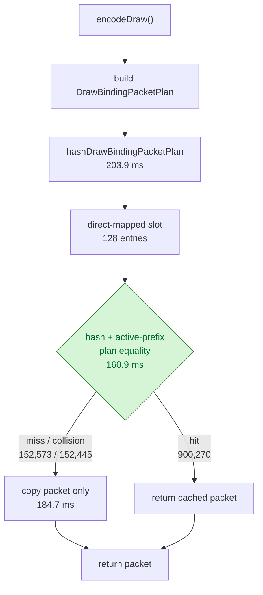

# Binding Packet Plan-Direct Cache

**Question / hypothesis.** [[state-churn-encode-encode-phase.07]] showed the
binding-packet cache was paying twice: first to build/copy a separate
`DrawBindingPacketKey`, then to compare that full key on the hot hit path.
Remove the extra key object from the cache lookup and hash/probe the already
built `DrawBindingPacketPlan` directly. Preserve exactness by comparing active
texture/sampler/stream lists and active sampler-state entries only.

**Implementation.**

- `cacheDrawBindingPacket()` now computes `hashDrawBindingPacketPlan(packet)`
  and stores only `{hash, packet}` in each cache entry.
- Plan equality compares list counts, raster state, active stream bindings, and
  active sampler-state prefixes. It avoids default equality on fixed-capacity
  arrays, which used to compare inactive sampler entries.
- `DrawBindingPacketKey` remains for tests and diagnostics, with matching
  active-prefix equality and a test that plan hash equals canonical key hash.

**Method.**

```bash
bash scripts/tools/run_3dmark05_perf_probe.sh \
  --suffix binding-packet-plan-direct-r1 \
  --frame 50 \
  --no-gputrace \
  --no-encoder-breakdown \
  --timeout 180
```

The wrapper exited through the expected watchdog status `124` after writing
postprocess artifacts. `actual.png` is a normal GT1 frame with the robot, flare,
and HUD visible (`FPS: 15`, `Time: 0:55.33`, `Frame: 853`).

**Runtime shape versus current identity smoke.**

| Metric | Identity smoke | Plan-direct | Delta |
|---|---:|---:|---:|
| `present_encoded` | 1,440 | 1,440 | 0 |
| `draw_calls` | 1,052,189 | 1,052,843 | +0.06% |
| `render_pass_begin` | 16,877 | 16,895 | +0.11% |
| `render_pass_tile_preservation_bytes` | 180,561,068,032 | 180,734,390,272 | +0.10% |
| `gpu_command_buffer_time_ms` | 4,309.279 | 4,297.915 | -0.26% |
| `completion_wait_ms` | 31,640.089 | 32,087.046 | +1.41% |

The run shape is stable for a no-gputrace CPU A/B. This is not a GPU/fps proof.

**CPU result versus current identity smoke.**

| Counter | Identity smoke | Plan-direct | Delta |
|---|---:|---:|---:|
| `encode_draw_cpu_ms` | 15,703.517 | 14,541.767 | -1,161.750 (-7.40%) |
| `encode_draw_binding_packet_cpu_ms` | 3,516.716 | 2,427.821 | -1,088.895 (-30.96%) |
| `encode_draw_binding_packet_cache_cpu_ms` | 1,849.678 | 789.020 | -1,060.658 (-57.34%) |
| `encode_draw_binding_packet_plan_cpu_ms` | 928.252 | 912.918 | -15.334 (-1.65%) |
| `d3d9_snapshot_draw_submission_cpu_ms` | 19,677.597 | 19,674.853 | -2.744 (-0.01%) |
| `argbuf_hybrid_bytes_per_encoder` | 461,535,120 | 461,614,512 | +0.02% |
| `transient_upload_bytes` | 461,655,996 | 461,735,388 | +0.02% |

The win is localized to the binding-packet cache path. Snapshot cost and argbuf
payload shape stay flat.

**Bucket movement versus split attribution run.**

| Counter | Split attribution | Plan-direct | Delta |
|---|---:|---:|---:|
| `encode_draw_binding_packet_cache_cpu_ms` | 2,236.297 | 789.020 | -1,447.277 (-64.72%) |
| `encode_draw_binding_packet_cache_key_cpu_ms` | 494.861 | 0.000 | -494.861 (-100.00%) |
| `encode_draw_binding_packet_cache_probe_cpu_ms` | 939.345 | 160.861 | -778.484 (-82.88%) |
| `encode_draw_binding_packet_cache_store_cpu_ms` | 291.775 | 184.650 | -107.125 (-36.71%) |
| `encode_draw_binding_packet_cache_hash_cpu_ms` | 204.645 | 203.907 | -0.738 (-0.36%) |
| `encode_draw_binding_packet_cache_hits` | 899,464 | 900,270 | +0.09% |
| `encode_draw_binding_packet_cache_misses` | 152,466 | 152,573 | +0.07% |
| `encode_draw_binding_packet_cache_collisions` | 152,338 | 152,445 | +0.07% |

The split attribution run carried extra timers, so this table should be read as
bucket movement, not as a clean product A/B. It still shows the intended
mechanism: key construction disappears, probe/equality drops sharply, and the
hit/miss shape remains effectively unchanged.



**Verdict.** Accepted CPU win. The plan-direct cache removes the key-build
bucket, cuts binding-packet cache CPU by `57.34%` versus current identity smoke,
and cuts total `encode_draw_cpu_ms` by `7.40%` without changing the visible GT1
smoke frame. It does not claim a GPU or vsync-on fps improvement.

**Next.** Binding-packet cache is now below `0.8s` over the 1,440-present run.
Further work here is lower priority than D3D9 snapshot/state rebuild
(`~19.7s`), argbuf setup (`~3.38s`), and stream/texture bind CPU. Cache
associativity can still be tested later because misses remain mostly direct-map
collisions, but it should not displace the larger CPU owners.

**Related.** [[state-churn-encode]] ·
[[state-churn-encode-encode-phase.07]] · [[present-pacing]].
