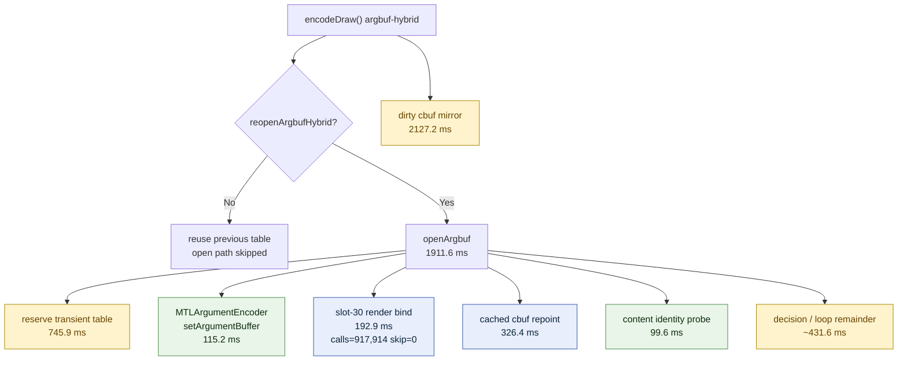

# Argbuf Open Subphase Split

**Question / hypothesis.** After [snapshot-cache-snapshot.09](../snapshot-cache/snapshot-cache-snapshot.09.md), backend
`encode_draw_cpu_ms` is again the larger CPU bucket. `encode_draw_argbuf_setup`
is a top child, but it is an umbrella over the per-draw argument-buffer table
open/repoint path and the dirty cbuf mirror. Split `encode_draw_argbuf_open`
enough to determine whether the local owner is transient allocation,
`MTLArgumentEncoder.setArgumentBuffer`, render-encoder slot-30 rebinding, or
the remaining cache/repoint decision code.

**Implementation.**

- Added `encode_draw_argbuf_open_reserve_cpu_ms` around
  `CommandQueue::reserveTransientBuffer()` inside `openArgbuf()`.
- Added `encode_draw_argbuf_open_set_argument_buffer_cpu_ms` around
  `MTLArgumentEncoder.setArgumentBuffer`.
- Added `encode_draw_argbuf_table_bind_cpu_ms`,
  `encode_draw_argbuf_table_bind_calls`, and
  `encode_draw_argbuf_table_bind_skipped` around the render encoder
  `setVertexBuffer` / `setFragmentBuffer` slot-30 table bind.
- Extended `summarize_3dmark05_perf.py` and `assert_perf_counters.py` so the
  new counters are required and visible in future probe summaries.

**Method.**

```bash
bash scripts/tools/run_3dmark05_perf_probe.sh \
  --suffix argbuf-open-split-r1 \
  --frame 50 \
  --no-gputrace \
  --no-encoder-breakdown \
  --timeout 180
```

The run hit the expected watchdog status `124` after writing artifacts.
`actual.png` is a normal visible GT1 frame with the robot, flare, and HUD
visible (`FPS: 15`, `Time: 0:55.84`, `Frame: 1005`).

**Run-shape caveat.** The attribution run reached `1680` presents versus
`1740` in [snapshot-cache-snapshot.09](../snapshot-cache/snapshot-cache-snapshot.09.md). Use the new child counters as local
shape attribution, not as a performance A/B. Normalized values are included
only to keep the per-present scale readable.

| Counter | Value | Per present | Reading |
|---|---:|---:|---|
| `present_encoded` | 1,680 | - | fewer than snapshot.09 |
| `draw_calls` | 1,236,429 | 735.970 | stable draw density |
| `encode_draw_cpu_ms` | 17,593.130 | 10.472 ms | not an A/B win |
| `encode_draw_argbuf_setup_cpu_ms` | 4,259.704 | 2.536 ms | umbrella owner |
| `encode_draw_argbuf_open_cpu_ms` | 1,911.626 | 1.138 ms | table open/repoint path |
| `encode_draw_argbuf_open_reserve_cpu_ms` | 745.942 | 0.444 ms | transient table reservation is material |
| `encode_draw_argbuf_open_set_argument_buffer_cpu_ms` | 115.192 | 0.069 ms | Metal argument-encoder retarget is not the owner |
| `encode_draw_argbuf_table_bind_cpu_ms` | 192.913 | 0.115 ms | slot-30 render bind is secondary |
| `encode_draw_argbuf_table_bind_calls` | 917,914 | 546.377 | table is rebound for most draw submissions |
| `encode_draw_argbuf_table_bind_skipped` | 0 | 0.000 | shadow skip cannot hit with fresh per-draw offsets |
| `encode_draw_argbuf_cbuf_update_cpu_ms` | 2,127.215 | 1.266 ms | dirty mirror remains larger than open |
| `encode_draw_argbuf_cbuf_cached_repoint_cpu_ms` | 326.434 | 0.194 ms | cached cbuf repoint is a visible open child |
| `encode_draw_argbuf_cbuf_content_probe_cpu_ms` | 99.576 | 0.059 ms | identity probe is small |

The measured open remainder after reserve, `setArgumentBuffer`, slot bind,
cached repoint, and content probe is about `431.6ms` over the run. That
remainder is mostly cache decision/loop/bookkeeping around per-category
repoint/dirty forcing. It is not explained by Metal argument-encoder retarget
alone.



**Verdict.** Accepted attribution. `encode_draw_argbuf_open_cpu_ms` is not
primarily `MTLArgumentEncoder.setArgumentBuffer`; the larger open-side costs
are transient table reservation, unavoidable fresh-table slot rebinding, and
cache/repoint decision work. The table-bind shadow skip is currently ineffective
by construction because each reopened argbuf has a fresh table offset.

**Next.** Do not extend render-encoder bind shadowing for slot 30; it has
`0` hits under the fresh-table design. The next argbuf work should test a
cheaper table allocation/open strategy, narrower cache/repoint decision work,
or a more structural constants-only path that reduces how often fresh tables
are needed. Any such change needs a visual smoke at minimum because the current
fresh table exists to avoid last-write-wins descriptor corruption.

**Related.** [state-churn-encode](../state-churn-encode.md) ·
[state-churn-encode-encode-phase.08](state-churn-encode-encode-phase.08.md) · [snapshot-cache-snapshot.09](../snapshot-cache/snapshot-cache-snapshot.09.md) ·
[present-pacing](../present-pacing.md).
