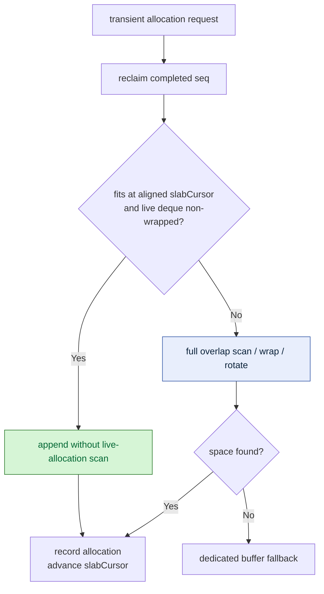
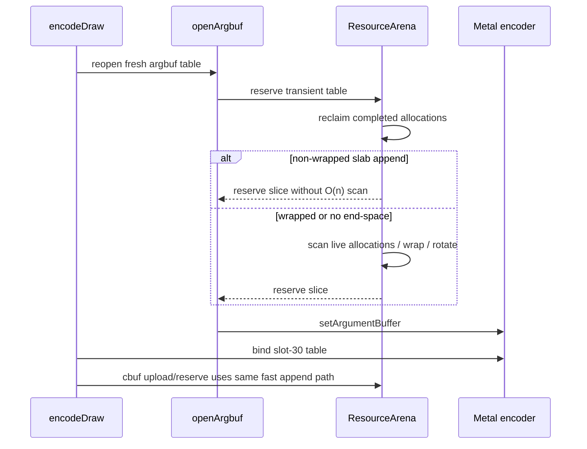

# Transient Arena Fast Append

> **Outdated — every artifact this leaf cites in `source:` is gone from disk.** The numbers below cannot be re-derived or re-checked. Kept as history; do not cite it as current evidence.

**Question / hypothesis.** [state-churn-encode-encode-phase.09](state-churn-encode-encode-phase.09.md) showed that
`encode_draw_argbuf_open_cpu_ms` is not dominated by
`MTLArgumentEncoder.setArgumentBuffer`; the larger local owner is transient table
reservation plus the fresh-table open path. The transient arena is a bump-ring
allocator, but the hot append path still scanned every live allocation via
`canPlace()` before reserving space. Test whether skipping that O(n) overlap scan
in the common non-wrapped append state reduces argbuf-open CPU without changing
the GT1 workload shape.

**Implementation.**

- `ResourceArena::uploadBuffer()`, `uploadBufferBatch()`, and
  `reserveBuffer()` now use a fast append predicate before the full overlap
  scan.
- The fast path is only allowed when `offset + alignedSize <= slabCapacity_` and
  the live allocation deque is either empty or non-wrapped
  (`front().offset <= back().offset`).
- Wrapped ring states, capacity misses, slab rotation, and dedicated fallback
  keep the existing `canPlace()` scan.



The correctness assumption is local to the arena: in a non-wrapped live deque,
`slabCursor_` is already past every live allocation, so appending cannot overlap.
Once the ring wraps, older high-offset allocations and newer low-offset
allocations can coexist; that path still uses the old scan.

**Method.**

```bash
bash scripts/tools/run_3dmark05_perf_probe.sh \
  --suffix argbuf-reserve-fastappend-r1 \
  --frame 50 \
  --no-gputrace \
  --no-encoder-breakdown \
  --timeout 180
```

The run hit the expected watchdog status `124` after writing artifacts.
`actual.png` is a normal visible GT1 frame with the robot, flare, and HUD
visible (`FPS: 17`, `Time: 0:55.82`, `Frame: 1008`).

**Run shape.** This is a stronger A/B than the previous attribution step because
both runs reached `present_encoded=1680`. Draw density, pass density, tile
preservation, and GPU command-buffer time stayed flat enough to attribute the CPU
movement to the implementation change rather than a different scene slice.

| Counter | Before open split | After fast append | Delta | Reading |
|---|---:|---:|---:|---|
| `present_encoded` | 1,680 | 1,680 | 0 | same run length |
| `draw_calls` | 1,236,429 | 1,235,709 | -0.06% | stable workload |
| `gpu_command_buffer_time_ms` | 5,186.980 | 5,170.639 | -0.32% | no GPU claim |
| `completion_wait_ms` | 37,938.495 | 38,206.488 | +0.71% | pacing flat/noisy |
| `transient_upload_cpu_ms` | 961.534 | 223.304 | -76.78% | scan cost removed from hot upload/reserve path |
| `encode_draw_cpu_ms` | 17,593.130 | 16,911.650 | -3.87% | accepted CPU win |
| `encode_draw_argbuf_setup_cpu_ms` | 4,259.704 | 3,564.075 | -16.33% | argbuf umbrella reduced |
| `encode_draw_argbuf_open_cpu_ms` | 1,911.626 | 1,559.334 | -18.43% | table open/reserve path reduced |
| `encode_draw_argbuf_open_reserve_cpu_ms` | 745.942 | 358.422 | -51.95% | direct target |
| `encode_draw_argbuf_cbuf_update_cpu_ms` | 2,127.215 | 1,779.695 | -16.34% | same arena fast path helps cbuf writes too |
| `encode_draw_argbuf_table_bind_calls` | 917,914 | 917,754 | -0.02% | table-open frequency unchanged |
| `encode_draw_argbuf_table_bind_skipped` | 0 | 0 | n/a | slot-30 shadowing still not useful |



**Verdict.** Accepted CPU win. The fast append path cuts the direct reservation
subphase by `387.520ms` (`-51.95%`) and reduces total `encode_draw_cpu_ms` by
`681.480ms` (`-3.87%`) in a same-present no-gputrace A/B. It also explains why
`transient_upload_cpu_ms` falls sharply: both argbuf table reservation and cbuf
write staging go through the same arena path.

This does not prove higher vsync-on fps. GPU command-buffer time is flat and
`completion_wait_ms` remains display-sync paced/noisy. The value is still real:
it removes an unnecessary CPU scan from the hot backend encode path without
changing table-open frequency or descriptor semantics.

**Next.** The remaining argbuf cost is no longer a simple arena-reserve scan.
Continue with cbuf upload/build/repoint decision work, texture/stream binding
cost, or command issue cost. Slot-30 bind shadowing remains a poor target while
`encode_draw_argbuf_table_bind_skipped=0`.

**Related.** [state-churn-encode](index.md) ·
[state-churn-encode-encode-phase.09](state-churn-encode-encode-phase.09.md) · [present-pacing](../present-pacing/index.md).
