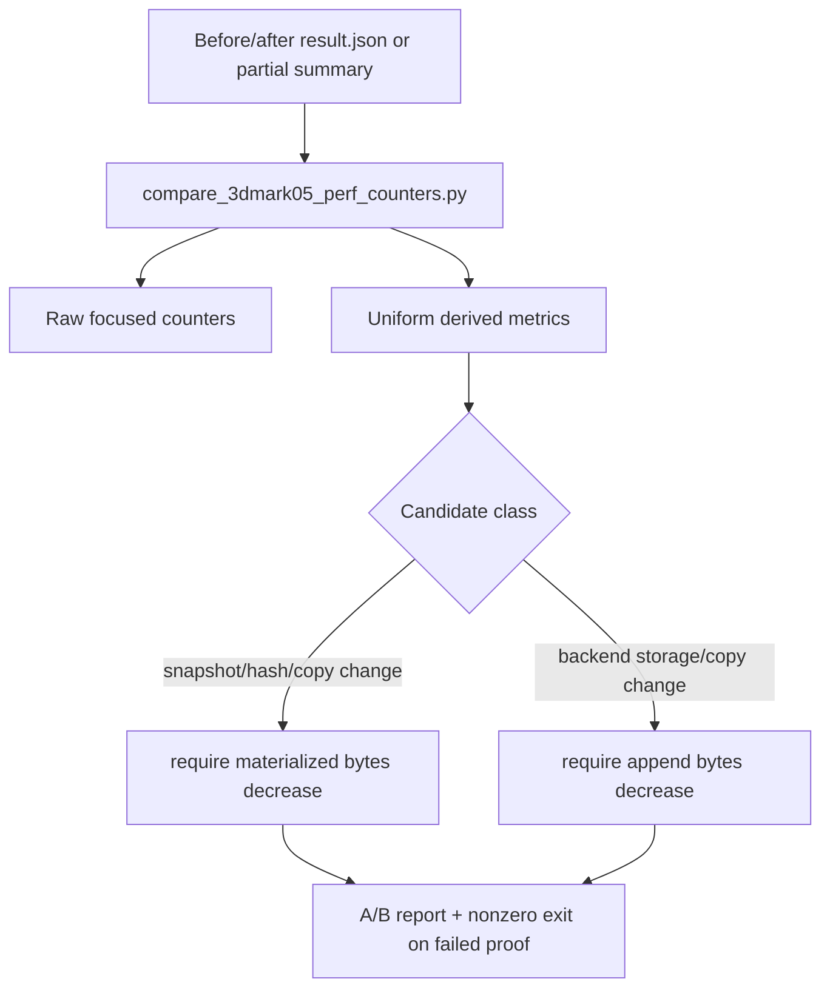

# Encode Phase 100 - Uniform Payload Compare Gates

**Question.** Phase 98 adds the non-timer
`draw_uniform_payload_append_bytes` counter and phase 99 summarizes the
frontend materialized width vs backend append width. Can the run-level A/B
comparison enforce that split, so future candidates prove which side moved?

**Implementation.**

`scripts/tools/compare_3dmark05_perf_counters.py` now adds the uniform split to
both the focused counter set and `Derived Metrics`:

| Metric | Meaning |
|---|---|
| `uniform_materialized_bytes_per_present` | frontend uniform snapshot copy width per encoded present |
| `uniform_append_bytes_per_present` | backend unique uniform payload append/storage width per encoded present |
| `uniform_append_bytes_per_append` | `DrawUniformPayloadRecord` width check |
| `uniform_append_records_per_materialized_snapshot` | storage dedup ratio after frontend materialization |
| `uniform_append_bytes_share_of_materialized_bytes` | whether backend storage width is still comparable to frontend copy width |
| `uniform_snapshot_elision_share` | whether same-generation uniform snapshot elision is active |

Two optional gates make the split enforceable:

| Gate | Required movement |
|---|---|
| `--require-uniform-materialized-bytes-decrease` | `d3d9_snapshot_uniform_materialized_bytes` must decrease |
| `--require-uniform-append-bytes-decrease` | `draw_uniform_payload_append_bytes` must decrease |

**Decision.** Accepted compare tooling. This is not a new runtime sample and
does not claim a new FPS owner. It closes the proof surface for the next
uniform storage/hash/copy-width candidate: a patch can no longer hide behind a
single combined CPU bucket if only one side of the materialize/append split
moved.

**Runtime status.** Xcode/3DMark05 capture remains externally blocked at this
point. `run_3dmark05_perf_probe.sh --xcode-attach-preflight-only` reports
Developer Mode disabled, so no `.gputrace` or new 120s scout artifact was
created for this phase.

**Verification.**

- `python3 -m pytest tests/scripts/test_compare_3dmark05_perf_counters.py -q`
- `python3 -m pytest tests/scripts/test_summarize_3dmark05_perf.py -q`
- `git diff --check -- scripts/tools/compare_3dmark05_perf_counters.py tests/scripts/test_compare_3dmark05_perf_counters.py`

**Related.** [state-churn-encode](index.md) ·
[state-churn-encode-encode-phase.99](state-churn-encode-encode-phase.99.md) ·
[state-churn-encode-encode-phase.98](state-churn-encode-encode-phase.98.md) ·
[state-churn-encode-encode-phase.92](state-churn-encode-encode-phase.92.md).
