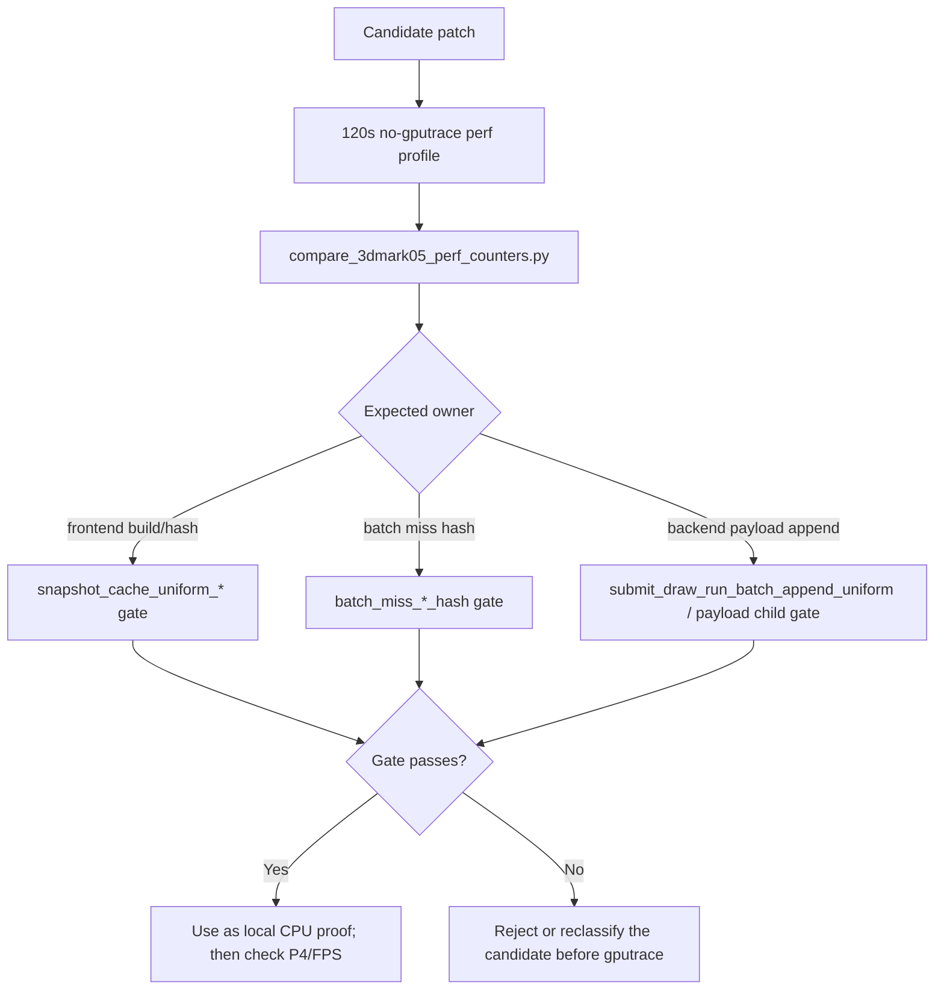

# Encode Phase 101 - Uniform Owner Compare Gates

**Question.** Phase 100 gates uniform byte-width movement, but the current
residual owner is a mix of frontend uniform build/hash/copy and backend uniform
append/lookup/copy CPU. Can the same A/B tooling require the named CPU child to
move, instead of only proving that materialized or appended bytes changed?

**Implementation.**

`compare_3dmark05_perf_counters.py` now reports per-present derived metrics for
the narrow uniform owners:

| Metric | Owner |
|---|---|
| `snapshot_cache_uniform_build_cpu_ms_per_present` | frontend uniform refresh/build aggregate |
| `snapshot_cache_uniform_hash_cpu_ms_per_present` | frontend uniform hash aggregate |
| `snapshot_cache_batch_miss_uniform_build_cpu_ms_per_present` | binding-agnostic batch-miss uniform build |
| `snapshot_cache_batch_miss_uniform_hash_cpu_ms_per_present` | batch-miss uniform hash subtotal |
| `snapshot_cache_batch_miss_vs_const_hash_cpu_ms_per_present` | batch-miss VS constant hash |
| `snapshot_cache_batch_miss_ps_const_hash_cpu_ms_per_present` | batch-miss PS constant hash |
| `snapshot_cache_batch_miss_nonconst_hash_cpu_ms_per_present` | batch-miss non-constant payload hash |
| `snapshot_uniform_copy_cpu_ms_per_present` | final owned uniform snapshot copy |
| `submit_draw_run_batch_append_uniform_cpu_ms_per_present` | backend uniform SoA append path |
| `draw_uniform_payload_lookup_cpu_ms_per_present` | backend uniform payload dedup lookup |
| `draw_uniform_payload_append_copy_cpu_ms_per_present` | backend payload append-copy child |

The report also includes batch-miss hash-share derived metrics so a patch that
only shifts work between VS, PS, and non-constant hashing stays visible.

The wrapper and finalizer pass through matching gates via
`--compare-baseline-output`, for both no-gputrace scouts and post-Xcode
finalization:

```sh
bash scripts/tools/run_3dmark05_perf_probe.sh \
  --suffix uniform-candidate-r1 \
  --frame 60 \
  --no-gputrace \
  --timeout 120 \
  --compare-baseline-output experiments/output/<baseline> \
  --require-snapshot-cache-uniform-hash-cpu-per-present-decrease \
  --require-batch-miss-vs-const-hash-cpu-per-present-decrease \
  --require-submit-draw-run-batch-append-uniform-cpu-per-present-decrease
```



**Decision.** Accepted compare tooling. This phase does not add runtime
instrumentation and does not claim a new FPS owner. It tightens the next
uniform/hash/storage experiment: a candidate must move the child it names, and
then still prove whether P4 overlap, completion wait, or frame sampling moved.

**Runtime status.** No new 3DMark05 run was created for this tooling-only
phase. `.gputrace` capture remains gated by the Xcode attach/Developer Mode
preflight before another Xcode-counter sample can be trusted.

**Verification.**

- `python3 -m pytest tests/scripts/test_compare_3dmark05_perf_counters.py -q`
- `python3 -m pytest tests/scripts/test_3dmark05_probe_scripts.py -q`
- `bash -n scripts/tools/run_3dmark05_perf_probe.sh scripts/tools/finalize_3dmark05_perf_probe.sh`
- `python3 -m py_compile scripts/tools/compare_3dmark05_perf_counters.py tests/scripts/test_compare_3dmark05_perf_counters.py tests/scripts/test_3dmark05_probe_scripts.py`
- `meson test -C build-arm64-nowine dxmt9-perf-docs-source-audit`

**Related.** [state-churn-encode](../state-churn-encode.md) ·
[state-churn-encode-encode-phase.100](state-churn-encode-encode-phase.100.md) ·
[state-churn-encode-encode-phase.99](state-churn-encode-encode-phase.99.md) ·
[state-churn-encode-encode-phase.92](state-churn-encode-encode-phase.92.md).
