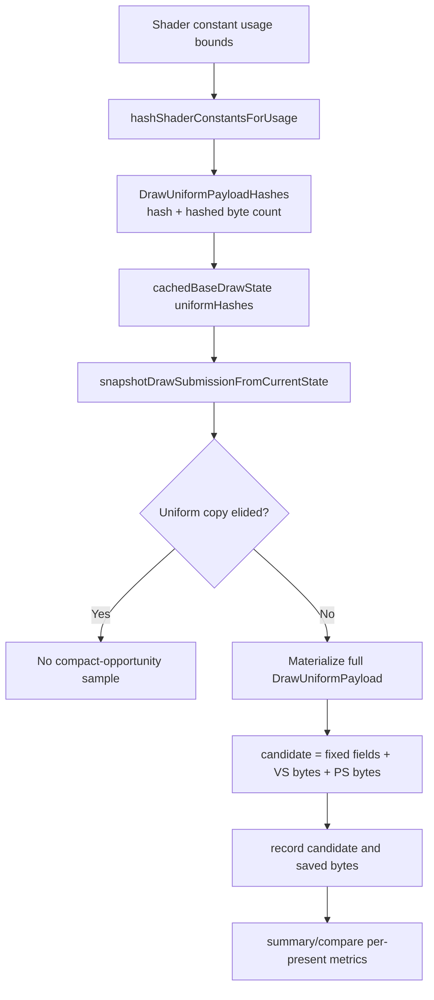

# Encode Phase 102 - Uniform Compact-Copy Opportunity Counters

**Question.** The current draw submission path can elide full uniform payload
copies only when the previous submission has the same state lane and uniform
generation. For materialized submissions, `DrawUniformPayload` remains a full
owned snapshot. Before changing that carrier, how much byte traffic is a
conservative usage-live compact layout allowed to remove?

**Implementation.**

`DrawUniformPayloadHashes` now also carries the byte count used to hash VS and
PS shader constants. Reused shader-constant hashes reuse those byte counts, so
cache-hit and refresh paths keep the same accounting.

When a submission materializes a full uniform payload, the frontend records:

| Counter | Meaning |
|---|---|
| `d3d9_snapshot_uniform_materialized_compact_candidate_bytes` | fixed non-shader uniform fields plus usage-live VS/PS constant bytes |
| `d3d9_snapshot_uniform_materialized_compact_saved_bytes` | full `DrawUniformPayload` bytes minus the conservative candidate bytes |

The summary and compare tools report per-present candidate/saved bytes and
candidate/saved share of materialized bytes. The wrapper/finalizer pass through
`--require-current-uniform-compact-saved-bytes-present` to reject standalone
scouts where the post-run `uniform_compact_saved_bytes_per_present`
opportunity is zero. The before/after comparison gate remains
`--require-uniform-compact-saved-bytes-present` with `--compare-baseline-output`.



**Decision.** Accepted instrumentation only. The counter is a sizing probe for a
future compact or interned uniform payload carrier; it does not alter the
runtime payload ABI or backend storage.

**Runtime status.** A 2026-06-15 no-gputrace scout completed after rebuilding
and restaging the current PE/unix binaries:

```sh
bash scripts/tools/run_3dmark05_perf_probe.sh \
  --suffix compact-uniform-opportunity-current \
  --frame 60 --no-gputrace --no-encoder-breakdown --timeout 120 \
  --wait-unlocked-sec 1 --wait-unlocked-interval-sec 1
```

Artifact: `experiments/output/app-d3d9-3dmark05-compact-uniform-opportunity-current/3dmark05-perf-summary.md`.

The current-run gate was added after this scout and passed against the same
artifact:

```sh
python3 scripts/tools/summarize_3dmark05_perf.py \
  experiments/output/app-d3d9-3dmark05-compact-uniform-opportunity-current \
  --require-uniform-compact-saved-bytes-present \
  --output /tmp/dxmt9-current-uniform-gate-summary.md
```

Future standalone scouts should run the wrapper with
`--require-current-uniform-compact-saved-bytes-present`.

| Metric | Value |
|---|---:|
| `present_encoded` | `1,826` |
| `process_elapsed_sec` | `122.045` |
| inferred presents/sec | `14.96` |
| `d3d9_snapshot_uniform_materialized_bytes` | `9,168,527,360` |
| `d3d9_snapshot_uniform_materialized_compact_candidate_bytes` | `2,630,261,456` |
| `d3d9_snapshot_uniform_materialized_compact_saved_bytes` | `6,538,265,904` |
| `uniform_materialized_bytes_per_present` | `5,021,099.321` |
| `uniform_compact_candidate_bytes_per_present` | `1,440,449.866` |
| `uniform_compact_saved_bytes_per_present` | `3,580,649.455` |
| `uniform_compact_saved_share_of_materialized_bytes` | `71.31%` |
| `completion_wait_ms` | `51,002.367` |
| `completion_wait_ms_per_present` | `27.93` |

The opportunity is large enough to keep a compact or interned uniform payload
carrier on the CPU-copy roadmap: a conservative usage-live carrier would avoid
about 6.54 GB (6.09 GiB) of materialized uniform snapshot bytes in this run. The next
implementation should still be gated by phase 101 CPU-owner counters, because
this phase sizes byte traffic only; it does not prove which CPU child moves.
`--require-current-uniform-compact-saved-bytes-present` now gates standalone
scouts directly. `--require-uniform-compact-saved-bytes-present` remains a
compare/finalizer gate and needs `--compare-baseline-output`.

Xcode attach preflight still fails with Developer Mode disabled, so this phase
does not include `.gputrace` or Xcode encoder-counter proof.

**Verification.**

- `python3 -m pytest tests/scripts/test_summarize_3dmark05_perf.py -q`
- `python3 -m pytest tests/scripts/test_compare_3dmark05_perf_counters.py -q`
- `meson test -C build-arm64-nowine dxmt9-perf-docs-source-audit`

**Related.** [state-churn-encode](../state-churn-encode.md) ·
[state-churn-encode-encode-phase.101](state-churn-encode-encode-phase.101.md) ·
[state-churn-encode-encode-phase.100](state-churn-encode-encode-phase.100.md) ·
[state-churn-encode-encode-phase.99](state-churn-encode-encode-phase.99.md).
