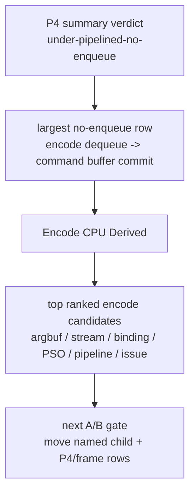

# State-Churn Encode 103 - Encode CPU Summary Ranking

## Question

[[present-pacing-summary-triage.40]] added a standalone P4/P2/P3 summary and
the current scout in [[present-pacing-summary-triage-current.41]] named
`encode dequeue -> command buffer commit` as the largest exposed p50 no-enqueue
row. Can the same single-run summary immediately show which encode child should
be inspected next, without re-reading the full run counter table?

## Change

`summarize_3dmark05_perf.py` now emits an `Encode CPU Derived` block after the
P4 summary. The block reports:

| Row | Purpose |
|---|---|
| `encode_chunk_cpu_ms_per_present` | Total backend encode-worker CPU per present |
| `encode_draw_cpu_ms_per_present` | Per-draw encode CPU per present |
| `encode_slot_pso_prefetch_cpu_ms_per_present` | Slot-level PSO/depth prefetch CPU per present |
| `encode_draw_share_of_encode_chunk` | How much of encode-worker CPU is in draw encoding |
| Encode candidate ranking | Top coarse/child encode counters sorted by total CPU |

The ranking intentionally mixes parent and child counters. It is a triage view,
not an additive flame graph:

## Test Coverage

`tests/scripts/test_summarize_3dmark05_perf.py` extends the synthetic
`write_markdown()` fixture with encode child counters and asserts:

- the new section is emitted;
- `encode_draw_share_of_encode_chunk` is formatted as a percent;
- candidate rows sort by total CPU;
- slot-level PSO prefetch reports `n/a` for draw-share;
- the largest encode-stage verdict names the top counter and per-present cost.

## Decision

Accepted as summary tooling. It does not claim a new optimization or a new FPS
baseline. Its job is to keep the next no-gputrace or sidecar scout auditable:
when P4 still exposes backend encode, the report should immediately show
whether the current top local owner is argbuf setup, stream bind, binding
packet construction, encode-slot PSO prefetch, pipeline lookup, draw issue, or
another named child.

Promotion rule is unchanged: reducing one encode row is only an average-FPS
claim when the same low-overhead run also moves completion wait, producer
overlap, no-enqueue stage deltas, or frame sampling.

**Related.** [[present-pacing-summary-triage.40]] ·
[[present-pacing-summary-triage-current.41]] · [[state-churn-encode]].
