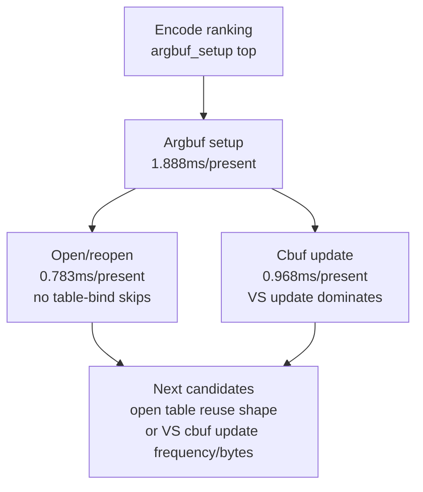

# State-Churn Encode 104 - Argbuf CPU Summary Ranking

## Question

[state-churn-encode-encode-phase.103](state-churn-encode-encode-phase.103.md) ranks `encode_draw_argbuf_setup_cpu_ms`
as the current top encode candidate. Can the summary split that parent enough
to choose the next focused A/B without manually scanning the full run counter
table?

## Change

`summarize_3dmark05_perf.py` now emits an `Argbuf CPU Derived` block after
`Encode CPU Derived`. It reports:

| Row | Purpose |
|---|---|
| `argbuf_setup_cpu_ms_per_present` | Total Stage 2 argbuf setup cost per present |
| `argbuf_open_cpu_ms_per_present` | Fresh descriptor-table reservation / open cost |
| `argbuf_cbuf_update_cpu_ms_per_present` | Dirty cbuf mirror/update cost |
| `argbuf_open_share_of_setup` | How much setup is open/reopen work |
| `argbuf_cbuf_update_share_of_setup` | How much setup is cbuf update work |
| Argbuf candidate ranking | Top setup/open/cbuf child counters sorted by total CPU |
| Argbuf mechanism counters | Skip/dirty/write/probe shares that explain the cost shape |

The latest low-overhead scout
`app-d3d9-3dmark05-encode-summary-current` shows the current argbuf shape:

| Counter | ms/present |
|---|---:|
| `encode_draw_argbuf_setup_cpu_ms` | `1.888` |
| `encode_draw_argbuf_cbuf_update_cpu_ms` | `0.968` |
| `encode_draw_argbuf_open_cpu_ms` | `0.783` |
| `encode_draw_argbuf_reopen_post_cpu_ms` | `0.356` |
| `encode_draw_argbuf_open_call_cpu_ms` | `0.337` |
| `encode_draw_argbuf_cbuf_update_vs_cpu_ms` | `0.529` |
| `encode_draw_argbuf_cbuf_update_ps_cpu_ms` | `0.224` |

The mechanism counters explain why this remains a structural owner:

| Counter | Current value |
|---|---:|
| `encode_draw_argbuf_table_bind_skipped` / calls | `0 / 988,876` |
| `encode_draw_argbuf_cbuf_update_dirty_calls` / calls | `988,876 / 1,332,067` |
| `encode_draw_argbuf_cbuf_reopen_no_dirty_hash_mismatch` | `967,651` |
| `encode_draw_argbuf_cbuf_cached_repoint_calls` | `1,730,121` |
| `encode_draw_argbuf_cbuf_content_probe_vs_hits` / calls | `149,628 / 967,651` |
| `encode_draw_argbuf_cbuf_content_probe_ps_hits` / calls | `646,599 / 967,651` |
| `encode_draw_argbuf_cbuf_content_probe_ffp_ps_hits` / calls | `933,894 / 967,651` |

## Test Coverage

`tests/scripts/test_summarize_3dmark05_perf.py` extends the synthetic summary
fixture with argbuf open, table-bind, cbuf-update, and content-probe counters.
The test asserts parent shares, sorted candidate rows, mechanism ratios, and the
largest-row verdict.

## Decision

Accepted as summary tooling. The current measured owner is not a single leaf:
`argbuf_setup` splits into fresh table open/reopen and dirty cbuf update. The
next code candidate should reduce one of those named rows, then a low-overhead
120s scout must show the same P4/frame gates moving before claiming an
average-FPS fix.

**Related.** [state-churn-encode-encode-phase.103](state-churn-encode-encode-phase.103.md) ·
[present-pacing-summary-triage-current.41](../present-pacing/present-pacing-summary-triage-current.41.md) · [state-churn-encode](../state-churn-encode.md).
