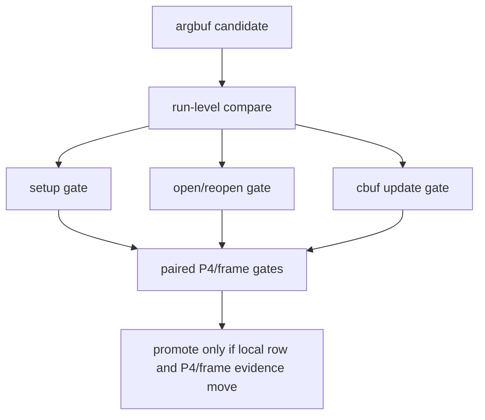

# State-Churn Encode 105 - Argbuf CPU Compare Gates

## Question

After state-churn-encode-encode-phase.104 shows `argbuf_setup` is the top
encode row, how should the next A/B prove that it moved the intended owner
instead of only shifting noise into another CPU bucket?

## Change

`compare_3dmark05_perf_counters.py` now derives and can gate these per-present
metrics:

| Metric | Gate |
|---|---|
| `argbuf_setup_cpu_ms_per_present` | `--require-argbuf-setup-cpu-per-present-decrease` |
| `argbuf_open_cpu_ms_per_present` | `--require-argbuf-open-cpu-per-present-decrease` |
| `argbuf_cbuf_update_cpu_ms_per_present` | `--require-argbuf-cbuf-update-cpu-per-present-decrease` |
| `argbuf_cbuf_update_vs_cpu_ms_per_present` | `--require-argbuf-cbuf-update-vs-cpu-per-present-decrease` |

The derived report also exposes `argbuf_open_share_of_setup_pct` and
`argbuf_cbuf_update_share_of_setup_pct` so a candidate can be checked for
bucket shifting.

## Test Coverage

`tests/scripts/test_compare_3dmark05_perf_counters.py` now checks:

- derived argbuf rows appear in the markdown report;
- all four argbuf gates pass when the candidate lowers per-present cost;
- all four gates fail when cost stays flat or regresses.

## Decision

Accepted as compare tooling. Future argbuf work should pair one of these gates
with the existing serial/P4 gates. A local reduction of `argbuf_setup`,
`argbuf_open`, or `argbuf_cbuf_update` is useful cleanup, but it is not an
average-FPS fix until frame sampling, completion wait, or no-enqueue stage
shape also moves.

**Related.** state-churn-encode-encode-phase.104 ·
[state-churn-encode](index.md).
