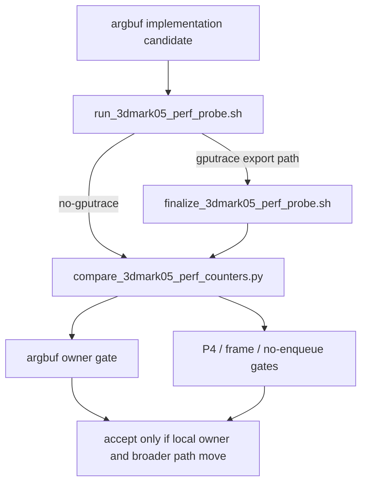

# State-Churn Encode 106 - Argbuf Gate Probe Pass-Through

## Question

[[state-churn-encode-encode-phase.105]] added run-level argbuf compare gates to
`compare_3dmark05_perf_counters.py`. Can the normal 3DMark05 probe wrappers use
those gates directly, so the next argbuf A/B is reproducible without hand-running
the compare script?

## Change

`run_3dmark05_perf_probe.sh` and `finalize_3dmark05_perf_probe.sh` now accept and
forward the four argbuf owner gates:

| Gate | Owner |
|---|---|
| `--require-argbuf-setup-cpu-per-present-decrease` | Full Stage 2 argbuf setup |
| `--require-argbuf-open-cpu-per-present-decrease` | Fresh table open/reopen |
| `--require-argbuf-cbuf-update-cpu-per-present-decrease` | Dirty cbuf update |
| `--require-argbuf-cbuf-update-vs-cpu-per-present-decrease` | VS dirty cbuf update |

The gates participate in the existing run-level baseline requirement. A
no-gputrace wrapper run needs `--compare-baseline-output`; an Xcode finalization
run needs `--baseline-output` when any of these gates is requested.

## Test Coverage

`tests/scripts/test_3dmark05_probe_scripts.py` now checks:

- no-gputrace wrapper dry-run forwards argbuf gates to `counter_compare_cmd`;
- gputrace wrapper dry-run forwards argbuf gates to the finalizer command;
- finalizer dry-run forwards argbuf gates to `perf_compare_cmd`.

## Decision

Accepted as probe tooling. The next argbuf code change can be verified with a
single wrapper invocation that gates the intended local owner and the existing
P4/frame shape, instead of treating `argbuf_setup` movement as an informal
manual comparison.

**Related.** [[state-churn-encode-encode-phase.104]] ·
[[state-churn-encode-encode-phase.105]] · [[state-churn-encode]].
