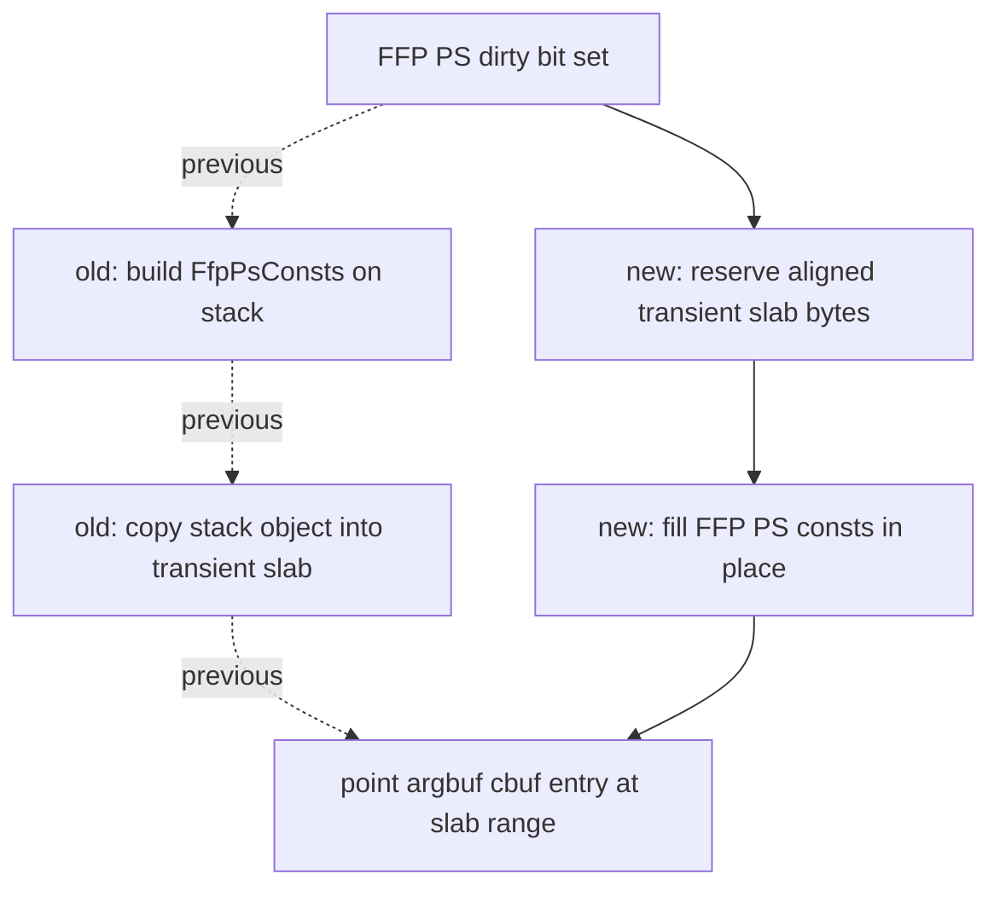

# State-Churn Encode 107 - FFP PS Argbuf Cbuf Direct Build

## Question

[state-churn-encode-encode-phase.104](state-churn-encode-encode-phase.104.md) ranks dirty argbuf cbuf update as a
current encode owner. VS and programmable PS dirty updates already build their
upload bytes directly into the queue transient slab. Can the FFP PS dirty-update
lane use the same storage policy instead of building a stack `FfpPsConsts` and
then copying it into the slab?

## Change

`state::buildFfpPsConstsUploadBytes()` now fills an aligned byte span with the
same contents as `state::buildFfpPsConsts()`. The argbuf dirty-update path uses
that builder through `buildAndPointEntryBytes()`, matching the existing direct
build policy for dirty VS and programmable PS constant uploads.



The scope is deliberately narrow:

| Lane | Current policy after this change |
|---|---|
| Dirty VS | Direct build into transient slab |
| Dirty programmable PS | Direct build into transient slab |
| Dirty FFP PS | Direct build into transient slab |
| Initial full argbuf population | Still stack value plus copy |
| Dirty FFP VS | Still stack value plus copy |

## Verification

`dxmt9-backend-key-descriptor-spec` now checks that
`buildFfpPsConstsUploadBytes()` is byte-identical to `buildFfpPsConsts()` for
texture factor, alpha-test, fog, stage constant, and bump-env fields.

This is not yet a runtime performance proof. It is a bounded hot-path cleanup
that removes one stack-object materialization and memcpy from the dirty FFP PS
argbuf lane. The next no-gputrace A/B should use the phase106 gate plumbing and
require at least:

```sh
bash scripts/tools/run_3dmark05_perf_probe.sh \
  --suffix ffp-ps-argbuf-direct-build \
  --frame 60 \
  --no-gputrace \
  --timeout 120 \
  --compare-baseline-output experiments/output/<baseline>/result.json \
  --require-argbuf-cbuf-update-cpu-per-present-decrease
```

If the summary exposes an FFP PS-specific cbuf-update gate later, prefer that
narrower gate. Until then, judge this patch as local encode cleanup, not as a
claim that the broader P4/no-enqueue frame limit moved.

## Decision

Accepted as CPU cleanup with runtime proof pending. The change aligns the FFP PS
dirty-update lane with the existing direct-build policy and keeps byte identity
covered by a native test. It does not address the larger owners by itself:
fresh argbuf table open/reopen, VS dirty cbuf update frequency, PE/unix
submission cadence, and completion/no-enqueue overlap remain open.

**Related.** [state-churn-encode-encode-phase.104](state-churn-encode-encode-phase.104.md) ·
[state-churn-encode-encode-phase.105](state-churn-encode-encode-phase.105.md) ·
[state-churn-encode-encode-phase.106](state-churn-encode-encode-phase.106.md) · [state-churn-encode](index.md).
