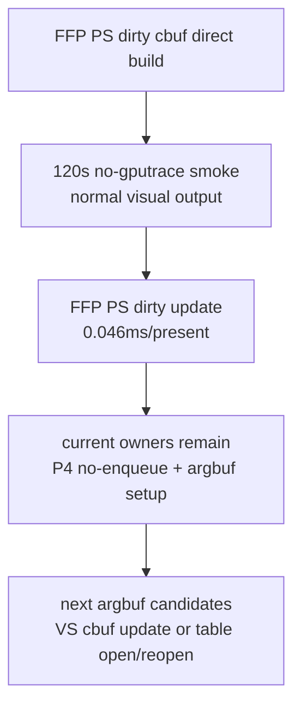

# State-Churn Encode 108 - FFP PS Direct Build Current Scout

## Question

After [state-churn-encode-encode-phase.107](state-churn-encode-encode-phase.107.md) changes the dirty FFP PS argbuf
cbuf update to build directly into transient storage, does the current 3DMark05
GT1 run still render normally, and is the changed lane large enough to remain a
credible FPS owner?

## Method

The run used the standard 120s no-gputrace wrapper path after rebuilding the
staged Wine lanes:

```sh
bash scripts/tools/run_3dmark05_perf_probe.sh \
  --suffix ffp-ps-direct-build-current \
  --frame 60 \
  --no-gputrace \
  --no-encoder-breakdown \
  --frame-sampling \
  --timeout 120 \
  --wait-unlocked-sec 1 \
  --wait-unlocked-interval-sec 1
```

The run timeout-finalized successfully:

| Field | Value |
|---|---:|
| `status` | `pass` |
| `timed_out` | `true` |
| `returncode` | `143` |
| `present_encoded` | `1,800` |

`actual.png` is not a black frame. It shows the expected GT1 action scene with
large bloom, muzzle flashes, tracer lines, sparks/particles, and scene geometry
visible.

## Result

The current bottleneck shape did not change class:

| Metric | Value |
|---|---:|
| `sampled_avg_fps` | `17.002` |
| `gpu_command_buffer_time_ms_per_present` | `3.151` |
| `completion_wait_ms_per_present` | `27.078` |
| `completion_wait_without_enqueue_ms_per_present` | `27.028` |
| `completion_wait_overlap_share` | `0.184%` |
| `commit_chunk_replay_cpu_ms_per_present` | `8.198` |
| `encode_chunk_cpu_ms_per_present` | `10.804` |
| `encode_draw_cpu_ms_per_present` | `8.840` |

Argbuf is still the largest local encode row:

| Metric | Value |
|---|---:|
| `argbuf_setup_cpu_ms_per_present` | `1.901` |
| `argbuf_cbuf_update_cpu_ms_per_present` | `0.976` |
| `argbuf_open_cpu_ms_per_present` | `0.784` |
| `argbuf_cbuf_update_vs_cpu_ms_per_present` | `0.534` |
| `argbuf_cbuf_update_ps_cpu_ms_per_present` | `0.226` |
| `argbuf_cbuf_update_ffp_ps_cpu_ms_per_present` | `0.046` |
| `argbuf_cbuf_update_ffp_ps_calls` | `55,073` |
| `argbuf_cbuf_update_ffp_ps_bytes` | `21,148,032` |

Correctness counters remain clean:

| Counter | Value |
|---|---:|
| `draw_skipped_no_pipeline` | `0` |
| `gpu_command_buffer_errors` | `0` |
| `render_split_hazard` | `0` |



## Decision

Accepted as runtime smoke, rejected as an FPS owner. The direct-build lane is
correct enough for this run and removes avoidable stack-copy work, but the whole
FFP PS dirty-update row is only about `0.046ms/present`. The remaining argbuf
work is dominated by VS dirty cbuf update and table open/reopen, while average
FPS remains governed by the completion/no-enqueue pacing shape.

This run is not an A/B proof because `experiments/output` had been cleaned and
there was no current baseline `result.json` for the phase106 compare gates. Use
this artifact as the current-head scout; future argbuf candidates should gate
`argbuf_cbuf_update`, `argbuf_cbuf_update_vs`, or `argbuf_open` against a fresh
baseline.

**Related.** [state-churn-encode-encode-phase.104](state-churn-encode-encode-phase.104.md) ·
[state-churn-encode-encode-phase.107](state-churn-encode-encode-phase.107.md) · [state-churn-encode](index.md).
