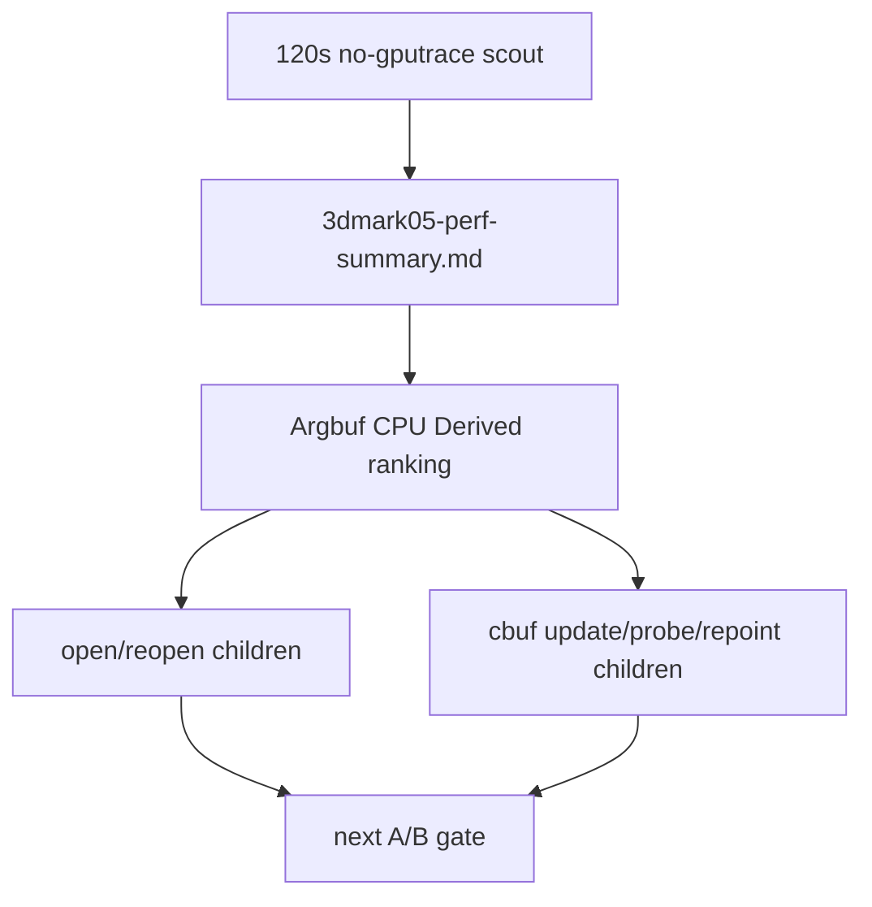

# State-Churn Encode 109 - Argbuf Reopen Probe Ranking Coverage

## Question

The current encode triage has narrowed `encode_draw_argbuf_setup_cpu_ms` into
table open/reopen and cbuf update children. Does the standalone summary rank the
new reopen/post and cbuf probe children so a 120s scout can pick the next owner
without manually scanning raw counters?

## Change

`summarize_3dmark05_perf.py` now includes these counters in the `Argbuf CPU
Derived` candidate ranking:

| Scope | Counter |
|---|---|
| open | `encode_draw_argbuf_reopen_table_probe_cpu_ms` |
| open | `encode_draw_argbuf_reopen_table_shadow_store_cpu_ms` |
| open | `encode_draw_argbuf_reopen_byte_account_cpu_ms` |
| open | `encode_draw_argbuf_reopen_cbuf_cache_probe_cpu_ms` |
| open | `encode_draw_argbuf_reopen_cbuf_dirty_scan_cpu_ms` |
| open | `encode_draw_argbuf_reopen_cbuf_force_dirty_cpu_ms` |
| cbuf | `encode_draw_argbuf_cbuf_cached_repoint_cpu_ms` |
| cbuf | `encode_draw_argbuf_cbuf_content_probe_cpu_ms` |

The test fixture now proves that cached-repoint and content-probe totals appear
as ranked candidates alongside the existing `setup`, `open`, `open_call`, and
`cbuf_update` rows. It also keeps the hit-share rows for the same path, so the
summary can distinguish a high-hit repoint lane from a low-hit probe lane.

## Decision

Accepted as summary tooling. This does not claim a new runtime win; it prevents
the next argbuf probe from hiding important reopen/post work under the aggregate
`argbuf_open` row. The next measured run should use the standard 120s timeout
path and read this ranking before choosing whether to target table open/reopen,
cached repoint, content probe, or dirty VS cbuf update.

**Related.** [state-churn-encode-encode-phase.104](state-churn-encode-encode-phase.104.md) ·
[state-churn-encode-encode-phase.108](state-churn-encode-encode-phase.108.md) · [state-churn-encode](../state-churn-encode.md).
